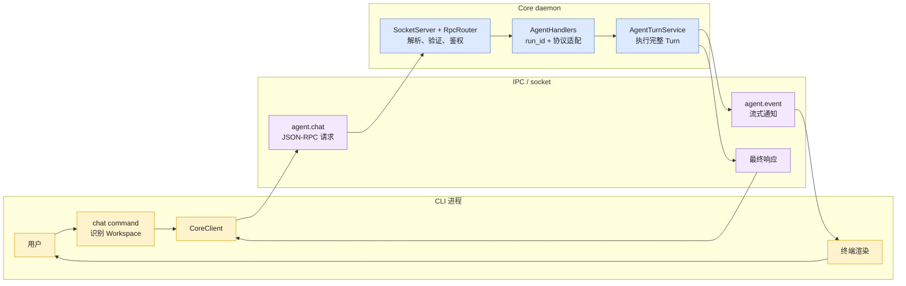
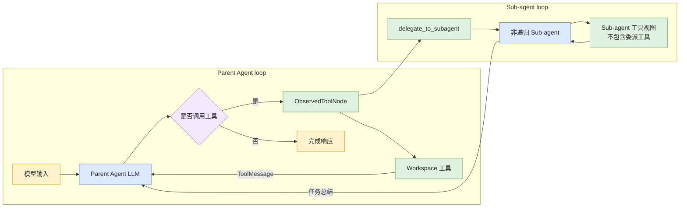
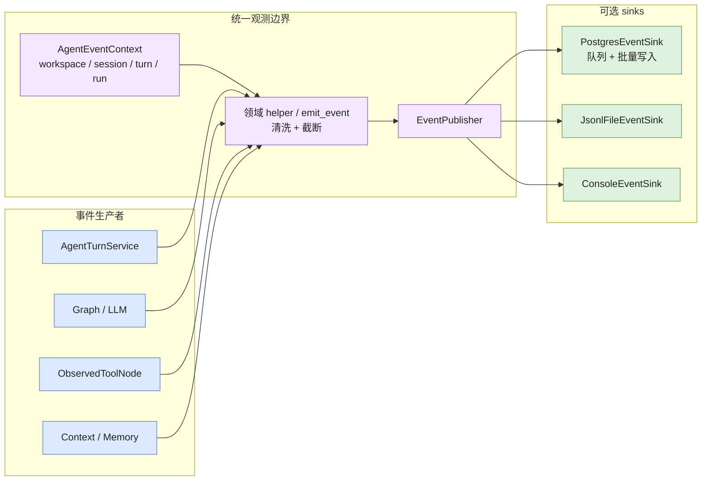

# Agent 执行架构与扩展指南

> Session 短期上下文、完整消息归档、长期记忆提取与加载机制见
> [`memory-management.md`](memory-management.md)。

## 目标

本项目使用 LangGraph 作为循环引擎，同时在循环外建立稳定的应用层边界：

```text
CoreApp
  -> AgentHandlers
      -> AgentTurnService
          -> AgentRunContext + RunLimits
          -> WorkspaceRuntimeRegistry
              -> ModelProvider
              -> ToolRegistry
              -> LangGraph
          -> ContextManager + MemoryStore
          -> EventPublisher
```

这些抽象用于解决不同问题：

- LangGraph：决定 Agent 节点和工具节点何时继续或停止。
- `AgentTurnService`：编排一次完整 turn 的加载、执行和保存。
- `AgentRunContext`：描述一次运行的身份与限制。
- `ModelProvider`：集中创建不同用途的 LLM。
- `ToolRegistry`：集中声明工具能力、受众和风险等级。
- `EventPublisher`：将观测事件广播到持久化或调试 sink。

## 一次请求的数据流

```text
CLI 识别 Workspace
  -> JSON-RPC agent.chat
  -> AgentHandlers 生成 run_id
  -> AgentTurnService 解析 Workspace / Session
  -> 获取 Session UUID 锁
  -> 加载 turn_index、短期上下文和 Workspace 记忆
  -> 创建 AgentRunContext
  -> 执行 WorkspaceRuntime.graph
       agent node -> ModelProvider 创建的父 Agent LLM
       tools node -> ToolRegistry 生成的父 Agent 工具视图
       tools_condition -> 继续或结束
  -> 保存完整消息和短期上下文
  -> 按策略提取长期记忆
  -> 返回 stop_reason、tool_call_count 和运行身份
```

同一 Session 通过内部 UUID 锁串行执行。不同 Session 和不同 Workspace 可以并行。
同步 LangGraph、工具和数据库链路运行在专用 `agent-turn` executor 中，最大并发由
`CORE_AGENT_WORKERS` 控制。RPC Handler 只等待异步服务接口，不直接管理线程池。

## 代码级程序流转

本节按一次 `learn-agent chat --session default "读取项目结构"` 的真实调用顺序说明程序如何
流转。重点不是组件“有什么”，而是一个函数收到什么参数、调用哪个函数、在哪个执行环境运行，
以及产生什么副作用。

### 调用链总表

| 顺序 | 函数 | 执行位置 | 主要职责 |
|---:|---|---|---|
| 1 | `chat_once()` | CLI 主线程 | 识别 Workspace，构造 `agent.chat` 参数 |
| 2 | `CoreClient.request()` | CLI 主线程 | 建立 TCP 连接，发送 JSON-RPC，持续读取通知和最终响应 |
| 3 | `SocketServer._handle_connection()` | Core asyncio loop | 读取一条 NDJSON frame，并交给 Router |
| 4 | `RpcRouter.dispatch()` | Core asyncio loop | 验证协议、参数、方法和 token |
| 5 | `AgentHandlers.chat()` | Core asyncio loop | 创建 `run_id`，建立 worker 到 socket 的事件桥 |
| 6 | `AgentTurnService.run_turn()` | Core asyncio loop | 获取并发 slot，提交同步 Turn 到专用 executor |
| 7 | `AgentTurnService._run_turn_sync()` | `agent-turn` worker | 消费内部事件流，形成最终结果 |
| 8 | `AgentTurnService.stream_turn()` | `agent-turn` worker | 解析 Workspace/Session，获取 Session UUID 锁 |
| 9 | `AgentTurnService._stream_locked_turn()` | `agent-turn` worker | 加载上下文、执行 Graph、持久化结果 |
| 10 | `stream_graph_events()` | `agent-turn` worker | 将 LangGraph stream 转换为稳定事件协议 |
| 11 | `agent_node()` / `ObservedToolNode` | `agent-turn` worker | 调用 LLM，或执行模型请求的工具 |
| 12 | `on_event()` | `agent-turn` worker | 将流事件投递回 Core asyncio loop |
| 13 | `SocketRequestContext.send_notification()` | Core asyncio loop | 将 `agent.event` 通知写入 TCP |
| 14 | `CoreClient.request()` | CLI 主线程 | 匹配 `request_id`，渲染流事件，读取最终响应 |

### 第一阶段：CLI 构造请求

入口位于 `src/cli/commands/chat.py`：

```python
chat_once(client, session_name, message, workspace)
```

参数语义：

| 参数 | 来源 | 功能 |
|---|---|---|
| `client` | `CoreClient(config)` | 保存 Core 地址、连接超时和用户级 runtime 路径 |
| `session_name` | `--session`，默认 `default` | Workspace 内可读名称，不是数据库内部 UUID |
| `message` | CLI 位置参数或交互输入 | 当前用户请求 |
| `workspace` | `--workspace`，默认当前目录 | 显式 Workspace 起点，可为空 |

`chat_once()` 首先调用：

```python
workspace_root = discover_workspace_root(workspace)
```

`discover_workspace_root()` 从起点向父目录查找最近的 `.git`；找到后使用 Git 根目录，否则使用
起点目录。随后调用：

```python
client.request(
    "agent.chat",
    {
        "workspace_root": str(workspace_root),
        "session_name": session_name,
        "message": message,
    },
    on_event=render_agent_event,
)
```

`CoreClient.request()` 在 `src/cli/client.py` 中完成以下动作：

1. 生成只用于 JSON-RPC 关联的 `request_id`。
2. 从用户级 runtime 目录读取 daemon token。
3. 构造 JSON-RPC 2.0 请求，并把 token 放入 `params.auth_token`。
4. 使用 `socket.create_connection()` 建立单请求单连接 TCP。
5. 写入一行 UTF-8 JSON，换行符是 NDJSON frame 边界。
6. 循环读取服务端消息：
   - `method == "agent.event"`：交给 `on_event` 渲染。
   - `id == request_id`：这是最终成功或错误响应，结束请求。
   - 其他 `id`：忽略。

这里有两个不同 ID：

| ID | 创建位置 | 生命周期 | 用途 |
|---|---|---|---|
| `request_id` | `CoreClient.request()` | 一次 JSON-RPC 请求 | 匹配通知与最终响应 |
| `run_id` | `AgentHandlers.chat()` | 一次 Agent Turn | 串联事件、日志与执行结果 |

### 第二阶段：Transport、验证与路由

Core 的 TCP 入口是 `SocketServer._handle_connection()`：

```python
raw = await read_ndjson(reader, self.max_message_bytes)
response = await self.router.dispatch(raw, context)
await context.send_response(response)
```

这一层只处理连接和 frame，不理解 Agent。`SocketRequestContext` 提供：

- `request_id`：当前请求 ID，供通知关联。
- `send_notification()`：Handler 执行期间主动发送通知。
- `send_response()`：发送最终响应。
- `request_close()`：要求最终响应后关闭连接。

`RpcRouter.dispatch()` 按固定顺序执行：

```text
JsonRpcRequest.model_validate(raw)
  -> 查找 method 注册
  -> ChatParams.model_validate(request.params)
  -> verify_token()
  -> await AgentHandlers.chat(params, context)
  -> JsonRpcSuccess
```

`ChatParams` 是 Core 接受 `agent.chat` 的安全边界：

```python
workspace_root: str       # 1..4000 字符
session_name: str         # 1..200 字符，默认 default
message: str              # 1..200000 字符
auth_token: str           # 必填
```

在 Pydantic 参数验证和 token 验证成功前，Router 不会调用 Agent、工具或 shutdown handler。

### 第三阶段：Handler 建立异步与同步边界

`AgentHandlers.chat()` 位于 `src/core/handlers/agent.py`。它做两件事：

1. 创建 `run_id = uuid4().hex`。
2. 创建 `on_event(item)` 回调，把 worker 线程产生的事件送回 Core asyncio loop。

调用关系：

```python
return await self.agent_service.run_turn(
    params.workspace_root,
    params.session_name,
    params.message,
    on_event,
    run_id=run_id,
)
```

`AgentTurnService.run_turn()` 是异步外观，但当前 Agent 链路是同步的。它先获取
`asyncio.Semaphore`，再把 `_run_turn_sync()` 提交到专用 `ThreadPoolExecutor`：

```text
Core asyncio loop
  -> await semaphore.acquire()
  -> executor.submit(_run_turn_sync)
  -> await asyncio.wrap_future(worker_future)
```

参数功能：

| 参数 | 功能 |
|---|---|
| `workspace_root` | 确定本轮允许访问的文件、Skill、命令和记忆范围 |
| `session_name` | 在 Workspace 内解析或创建 Session UUID |
| `user_input` | 当前用户输入，进入上下文和记忆检索 |
| `on_event` | worker 线程调用的流事件回调 |
| `run_id` | 本轮观测身份；未传入时 Service 自行生成 |

信号量限制已提交和正在执行的 Turn 总数，避免默认 executor 形成无界排队。worker 完成后，
done callback 在 Core loop 中释放 slot。

### 第四阶段：解析身份并建立并发边界

worker 首先进入 `_run_turn_sync()`，它消费 `stream_turn()` 产生的事件：

```python
for item in self.stream_turn(...):
    on_event(item)
    # done 更新最终 result；error 更新错误结果
```

`stream_turn()` 的顺序是：

```text
去除输入首尾空白并拒绝空消息
  -> WorkspaceRepository.resolve(workspace_root)
  -> WorkspaceRepository.resolve_session(workspace, session_name)
  -> SessionLockRegistry.get(session.session_id)
  -> 检查模型配置
  -> 进入真实 Turn 或诊断路径
```

身份对象的职责：

| 对象 | 关键字段 | 作用 |
|---|---|---|
| `WorkspaceContext` | `workspace_id`, `root` | 确定隔离边界 |
| `SessionContext` | `session_id`, `session_name`, `workspace` | 确定会话归属 |
| `AgentRunContext` | `run_id`, `session`, `turn_index`, `limits` | 确定一次真实执行的身份和限制 |

Session 锁使用内部 `session_id`，不是 `session_name`。因此：

- 同一 Session 的“加载状态 → 执行 → 保存状态”严格串行。
- 不同 Workspace 都可拥有名为 `default` 的 Session，并可并行执行。
- 不同 Session 也可并行，但总并发受 `CORE_AGENT_WORKERS` 限制。

### 第五阶段：创建或复用 WorkspaceRuntime

模型配置有效时，`stream_turn()` 调用：

```python
runtime = self.runtime_registry.get(workspace)
```

`WorkspaceRuntimeRegistry.get()` 按 `workspace_id` 缓存 Runtime。缓存未命中时，
`WorkspaceRuntimeFactory.create()` 执行：

```text
create_workspace_toolset(workspace, model_provider)
  -> 创建绑定 workspace.root 的文件、Skill、总结和命令工具
  -> 注册 ToolSpec
  -> 生成 Sub-agent 工具视图
  -> 创建 delegate_to_subagent
  -> 生成 Parent Agent 工具视图
  -> freeze ToolRegistry

create_parent_graph(parent_tools, skill_manifest, model_provider)
  -> 创建绑定工具的 Parent LLM
  -> 注册 agent 节点和 tools 节点
  -> 编译 LangGraph
```

`WorkspaceRuntime` 在多轮之间复用，但其中的工具和 Graph 永久绑定到创建时的
`WorkspaceContext`。一次请求不能通过修改全局变量把 Runtime 切换到另一个目录。

### 第六阶段：准备真实 Turn 输入

`_stream_locked_turn()` 在 Session 锁内执行：

```python
state, turn_index = store.load_session(session)
current_turn = turn_index + 1
run_context = AgentRunContext(..., turn_index=current_turn, ...)
```

这里的持久化 `turn_index` 表示最后完成的 Turn；只有本轮成功完成后，Session 才保存为
`current_turn`。

随后加载长期记忆：

```python
store.retrieve_for_turn(
    workspace_id,
    user_input,
    new_session=turn_index == 0,
)
```

- `new_session=True`：合并 bootstrap memory 和相关记忆。
- `new_session=False`：只加载相关记忆。
- 查询始终携带 `workspace_id`。

`AgentContextManager.build_input_messages()` 按顺序构造 Graph 输入：

```text
可选的 Session summary SystemMessage
  -> 可选的长期记忆 SystemMessage
  -> 最近 RECENT_MESSAGE_LIMIT 条原始消息
  -> 当前 HumanMessage
```

这些输入中，summary 和长期记忆是合成上下文，只用于本轮模型输入，不应再次归档为用户历史。

### 第七阶段：LangGraph AgentLoop

`create_parent_graph()` 在 `src/core/agent/graph.py` 中定义循环：

```text
START
  -> agent_node
       -> LLM 无 tool_calls -> END
       -> LLM 有 tool_calls -> tools
  -> ObservedToolNode
       -> 追加 ToolMessage
  -> agent_node
```

`agent_node(state)` 接收 LangGraph `MessagesState`，把系统提示词放在最前面，然后调用：

```python
llm_with_tools.invoke(llm_messages)
```

返回值必须是：

```python
{"messages": [response]}
```

LangGraph 的 messages reducer 会把新响应追加到状态，而不是替换整个历史。

`ObservedToolNode` 继承 LangGraph `ToolNode`。模型输出的每个 `tool_call` 会按名称匹配
Workspace 工具，执行前后统一记录：

```text
tool_started
  -> execute(request)
  -> tool_finished 或 tool_failed
```

工具函数本身不需要手写通用调用边界 Hook。工具内部只记录自身特有的领域事件。

### 第八阶段：把 Graph stream 转换为稳定事件

`_stream_locked_turn()` 不直接消费 LangGraph 原始 stream，而是调用：

```python
stream_graph_events(graph, input_messages, run_context)
```

适配器使用：

```python
app.stream(
    inputs,
    config={"recursion_limit": limits.max_graph_steps},
    stream_mode=["messages", "values"],
)
```

两种 LangGraph stream mode 的用途：

| mode | 内容 | 转换结果 |
|---|---|---|
| `messages` | LLM 增量 `AIMessageChunk` | `token` |
| `values` | 当前完整 Graph 状态快照 | `step`、工具计数和最终消息 |

适配器对外只产生四种稳定事件：

| 事件 | 含义 |
|---|---|
| `token` | 可立即渲染的模型文本增量 |
| `step` | Agent 开始、工具请求、工具结果或完整 Agent 消息 |
| `error` | Graph、步骤限制或工具调用限制导致本轮失败 |
| `done` | Graph 正常结束，携带完整最终 messages |

`max_graph_steps` 通过 LangGraph `recursion_limit` 实施；`max_tool_calls` 由适配器累计
新消息中的 `tool_calls` 实施。达到限制时返回结构化 `error`，不继续持久化失败 Turn。

### 第九阶段：流事件返回 CLI

worker 每产生一个事件，`_run_turn_sync()` 就调用 `on_event(item)`。该回调仍运行在 worker
线程，不能直接操作 asyncio socket，因此 `AgentHandlers.chat()` 使用：

```python
asyncio.run_coroutine_threadsafe(
    context.send_notification(notification),
    loop,
)
```

通知格式：

```json
{
  "method": "agent.event",
  "params": {
    "request_id": "用于匹配当前 CLI 请求",
    "run_id": "用于追踪当前 Agent Turn",
    "event": "token | step | error | done",
    "data": {}
  }
}
```

若客户端断线，第一次通知失败会记录 `stream_notification_failed`，后续停止发送通知，但 worker
继续尝试完成执行和持久化。客户端退出不会主动中断 Core Turn，但其他执行或数据库异常仍可能
导致本轮失败。

### 第十阶段：成功完成后的持久化

只有收到 `done` 时，`_stream_locked_turn()` 才执行成功持久化：

```python
final_messages = item["data"]["messages"]
turn_messages = final_messages[len(input_messages) - 1:]
source_ids = store.archive_turn_messages(session, current_turn, turn_messages)
state = context_manager.update_after_turn(state, final_messages, memory_context=memory_text)
store.save_session(session, state, current_turn)
_handle_extraction(..., turn_messages, source_ids)
```

`len(input_messages) - 1` 的含义是：Graph 输入最后一条是当前用户消息，因此从该位置切片，
可以保留本轮用户消息和 Graph 新增消息，同时排除旧历史、summary 与长期记忆合成消息。

持久化顺序和副作用：

| 顺序 | 调用 | 数据库结果 |
|---:|---|---|
| 1 | `archive_turn_messages()` | 向 `agent_messages` 写入本轮完整消息，返回消息 ID |
| 2 | `update_after_turn()` | 在内存中计算新的 summary 和 recent messages |
| 3 | `save_session()` | 更新 `agent_sessions` 的有限上下文和 `turn_index` |
| 4 | `_handle_extraction()` | 根据策略跳过、同步或后台提取长期记忆 |

长期记忆提取在消息归档之后运行，因此 `agent_memory_sources.message_id` 引用的是已经提交的
消息。周期性或大内容提取可进入单独的 `agent-memory` executor；用户明确要求“记住”时同步
执行，使保存结果在本轮完成前可知。

当前消息归档与 Session 更新仍是两个事务。如果归档成功而 Session 更新失败，可能出现部分提交；
该问题记录在 `memory-management.md` 的 Turn Unit of Work 后续方案中。

### 第十一阶段：最终响应与资源恢复

成功时 `_stream_locked_turn()` 产生最终 `done`：

```python
{
    "run_id": run_id,
    "status": "ok",
    "workspace_id": "...",
    "session_id": "...",
    "session_name": "...",
    "stop_reason": "completed",
    "tool_call_count": 3,
}
```

`_run_turn_sync()` 将其转换为 Handler 的最终 result。`RpcRouter.dispatch()` 包装为
`JsonRpcSuccess`，`SocketServer` 写回连接，CLI 收到与 `request_id` 匹配的响应后结束读取。

无论成功或失败，`_stream_locked_turn()` 的 `finally` 都会：

```text
恢复进入本轮前的事件上下文
  -> 关闭本轮 MemoryStore facade
  -> 释放 Session UUID 锁
  -> worker future 完成
  -> 释放并发 semaphore slot
```

### 失败路径速查

| 失败位置 | 转换方式 | 是否继续业务执行 |
|---|---|---|
| NDJSON/JSON 无效 | Parse Error，关闭当前连接 | 否 |
| JSON-RPC 或参数无效 | 标准 JSON-RPC error | 否 |
| token 错误 | Unauthorized | 否 |
| LLM 未配置 | 进入无状态 diagnostic path | 不执行 Graph |
| Graph recursion limit | `error(graph_step_limit)` | 不持久化失败 Turn |
| 工具调用数超限 | `error(tool_call_limit)` | 不持久化失败 Turn |
| LLM、Graph 或 Turn 异常 | `error` + 观测事件 | 不持久化失败 Turn |
| CLI 流通知断线 | 停止通知并记录事件 | Core Turn 继续 |
| 后台记忆提取失败 | `memory_failed` 事件 | 已完成 Turn 不回滚 |

### 完整数据流动示意图

完整数据流按阅读层次拆为三张图。先理解进程间边界，再下钻 Core 内部 Turn，最后查看
Agent 循环。每张图只描述一个层次，避免将所有实现细节堆叠在同一画布中。

#### 1. 端到端进程总览

这张图回答：用户输入如何进入 daemon，执行结果如何回到 CLI。



#### 2. Core 内单轮 Turn

这张图回答：一次经过验证的请求，在 Core 中如何完成准备、执行和持久化。

```mermaid
flowchart LR
    subgraph Prepare["阶段一：准备"]
        direction TB
        Resolve["解析 Workspace<br/>与 Session"]
        Lock["获取 Session UUID 锁"]
        Load["加载短期上下文<br/>与 Workspace 记忆"]
        Build["构造 AgentRunContext<br/>与模型输入"]
        Resolve --> Lock --> Load --> Build
    end

    subgraph Execute["阶段二：执行"]
        direction TB
        Slot["获取并发 slot"]
        Worker["agent-turn worker"]
        Graph["执行 WorkspaceRuntime.graph"]
        Slot --> Worker --> Graph
    end

    subgraph Persist["阶段三：持久化"]
        direction TB
        Messages["归档完整本轮消息"]
        Context["更新 summary<br/>与 recent_messages"]
        Memory["按策略提取长期记忆"]
        Done["返回 stop_reason<br/>与 tool_call_count"]
        Messages --> Context --> Memory --> Done
    end

    DB[("PostgreSQL")]
    Build --> Slot
    Graph --> Messages
    Resolve <--> DB
    Load <--> DB
    Messages --> DB
    Context --> DB
    Memory --> DB

    classDef prepare fill:#fff3cd,stroke:#d6a100,color:#222;
    classDef execute fill:#dce9ff,stroke:#5b85c5,color:#222;
    classDef persist fill:#dff2df,stroke:#629b62,color:#222;
    classDef store fill:#f3e8ff,stroke:#8b5fbf,color:#222;
    class Resolve,Lock,Load,Build prepare;
    class Slot,Worker,Graph execute;
    class Messages,Context,Memory,Done persist;
    class DB store;
```



#### 3. Parent Agent 与 Sub-agent 调用链

这张图回答：LangGraph 如何循环调用 LLM、工具和非递归 Sub-agent。



三张图共同表达的关键边界：

- `AgentHandlers` 和 `SocketServer` 运行在 Core asyncio 事件循环中。
- `WorkspaceRepository`、Memory、LangGraph、LLM 和工具执行位于专用 `agent-turn` worker。
- worker 通过 `on_event` 回调和 `asyncio.run_coroutine_threadsafe()` 将流式通知送回事件循环。
- 完整消息、压缩上下文和长期记忆都写入 PostgreSQL，但用途和生命周期不同。
- 客户端断线后，流式通知停止；已经进入 worker 的 turn 仍继续执行并完成持久化。

## AgentRunContext 与 RunLimits

`AgentRunContext` 是一次运行的规范身份：

```python
AgentRunContext(
    run_id=...,
    session=SessionContext(...),
    turn_index=...,
    limits=RunLimits(...),
)
```

它只保存身份和控制信息，不保存完整消息历史，避免成为巨型可变上下文。

当前限制：

- `max_graph_steps`：限制 LangGraph 总步骤。
- `max_tool_calls`：限制父 Agent 单轮产生的工具调用数量。
- `max_subagent_steps`：限制每次子 Agent graph 的步骤数。

当前停止原因：

- `completed`
- `graph_step_limit`
- `tool_call_limit`
- `graph_error`
- `turn_error`

新增限制时，应先扩展 `RunLimits` 和停止原因，再在循环适配层实现，不能散落读取全局配置。

## ModelProvider

所有 LLM 创建集中在 `src/core/llm/provider.py`。业务模块只声明用途：

```text
parent_agent
subagent
context_summary
memory_extraction
file_summary
```

当前实现为 `OpenAICompatibleProvider`，底层使用 `ChatOpenAI` 连接兼容接口。

### 无 LLM 配置诊断路径

`OpenAICompatibleProvider.configuration_status()` 只检查本地配置，不发起网络请求。
`AgentTurnService` 在创建 Workspace Runtime 和 LangGraph 前检查该状态：

```text
agent.chat
  -> 解析 Workspace / Session
  -> 获取 Session 锁
  -> 检查 LLM 配置
       ├── 已配置：创建/复用 Workspace Runtime，进入 LangGraph
       └── 未配置：执行 diagnostic turn
             -> 读取 Session，验证数据库链路
             -> 不归档消息，不更新 Session 对话状态
             -> 不递增 turn_index
             -> 流式返回 token + done(llm_not_configured)
```

诊断路径故意不创建 Graph、不调用工具、不提取长期记忆，也不触发需要 LLM 的上下文总结。重复
调用不会消耗业务轮次，首次真实 LLM Turn 仍会加载 bootstrap memory。它用于在没有模型密钥时
验证 CLI/Core、RPC、Workspace、Session、数据库和事件通道。诊断请求发布
`diagnostic_started/diagnostic_finished`，不会发布会被业务 Turn 统计消费的
`turn_started/turn_finished`。

维护规则：

1. 业务模块不得直接实例化 `ChatOpenAI`。
2. 新增 LLM 工作负载时必须增加或复用 `LlmPurpose`。
3. 模型重试、超时、供应商切换和用量统计应在 Provider 层实现。
4. 测试通过注入 Fake Provider，不能依赖真实模型。

未来可以按用途配置不同模型，但不应让调用方理解供应商参数。

## ToolRegistry

`ToolRegistry` 保存 `ToolSpec`：

```text
name
tool
audiences
risk
description
```

当前受众：

- `parent`
- `subagent`

当前风险等级：

- `read_only`
- `controlled_execution`
- `delegation`

`create_workspace_toolset()` 注册 Workspace 绑定工具，再由 Registry 生成父 Agent 和子
Agent 工具视图。构建完成后 Registry 会冻结，运行期间不能改变 Workspace 能力集合。
新增工具时不应直接修改多个工具列表，而应注册一条 `ToolSpec`。

Registry 当前只描述和筛选能力，不负责执行工具。工具执行继续由 LangGraph
`ObservedToolNode` 完成。

未来可基于风险等级增加审批策略或只读运行模式。

## EventPublisher 与流式事件

项目保留两条事件通道，它们不能混为一体：

### 观测事件

```text
emit_event
  -> EventPublisher
      -> PostgresEventSink
      -> JsonlFileEventSink
      -> ConsoleEventSink
```

观测事件用于日志、审计和诊断。subscriber 失败不会改变 Agent 业务结果。
每个 turn 和后台任务结束时都会恢复进入任务前的事件上下文，避免线程复用导致身份泄漏。
`CoreApp` 可以注入自定义 `EventPublisher`；未注入时，事件模块根据配置惰性创建默认
sink-backed publisher。

### 请求流式事件

```text
LangGraph stream
  -> stream_graph_events
  -> AgentHandlers
  -> JSON-RPC agent.event
  -> CLI renderer
```

流式事件用于当前请求的即时交互。客户端断开不会取消 Core 中已经开始的 turn。

两条通道可以共享事件命名约定，但可靠性、生命周期和数据量不同，因此不使用同一个
总线对象。

### Agent 调用链与事件通道图

事件通道不再与完整业务调用链画在同一张图中。请求流式事件和观测事件具有不同消费者、
生命周期和可靠性语义，因此分别展示。

#### 1. 请求流式事件通道

这张图回答：当前 Turn 的 token 和步骤如何实时显示到 CLI。

```mermaid
flowchart LR
    subgraph Worker["agent-turn worker"]
        direction TB
        Graph["LangGraph stream"]
        Adapter["stream_graph_events<br/>token / step / error / done"]
        Callback["on_event callback"]
        Graph --> Adapter --> Callback
    end

    subgraph IPC["Core asyncio / IPC"]
        direction TB
        Handler["AgentHandlers"]
        Notification["agent.event<br/>携带 request_id + run_id"]
        Socket["SocketServer"]
        Callback --> Handler --> Notification --> Socket
    end

    subgraph CLI["CLI 进程"]
        direction TB
        Client["CoreClient"]
        Render["render_agent_event"]
        User["用户终端"]
        Client --> Render --> User
    end

    Socket -->|"NDJSON 通知"| Client

    classDef worker fill:#dce9ff,stroke:#5b85c5,color:#222;
    classDef ipc fill:#f3e8ff,stroke:#8b5fbf,color:#222;
    classDef cli fill:#fff3cd,stroke:#d6a100,color:#222;
    class Graph,Adapter,Callback worker;
    class Handler,Notification,Socket ipc;
    class Client,Render,User cli;
```



客户端断线时，通知发送停止并记录一次 `stream_notification_failed`；已经开始的 Turn 不会取消。

#### 2. Hook 观测事件通道

这张图回答：审计和诊断事件如何从业务模块进入不同 sink。



两条事件通道的关键约束：

1. `stream_graph_events()` 生成面向当前客户端的轻量流式事件；它不负责写入事件数据库。
2. `emit_event()` 和领域 helper 生成观测事件，经清洗和截断后由 `EventPublisher` 广播。
3. `PostgresEventSink` 默认可通过内存队列批量写入 `agent_events`；队列或 sink 失败只记录调试信息，不中断 Agent。
4. 两条事件通道都携带 `run_id`，但只有请求流式通道依赖当前 TCP 连接。

### 图中组件与代码位置

| 图中组件 | 主要实现 |
|---|---|
| CLI chat / workspace 识别 | `src/cli/commands/chat.py`、`src/cli/workspace.py` |
| CoreClient / NDJSON 请求读取 | `src/cli/client.py` |
| SocketServer / RequestContext | `src/core/transport/socket_server.py` |
| JSON-RPC 验证与路由 | `src/core/bus/router.py`、`src/ipc/models.py` |
| Agent RPC 适配与流式回调 | `src/core/handlers/agent.py` |
| Turn 编排、线程池与 Session 锁 | `src/core/agent/service.py` |
| Workspace runtime 构建与缓存 | `src/core/workspace/runtime.py` |
| Parent Agent graph | `src/core/agent/graph.py` |
| 流式事件适配与运行限制 | `src/core/streaming/events.py` |
| 工具注册、筛选与边界观测 | `src/core/tools/registry.py`、`src/core/tools/observed.py` |
| 非递归 Sub-agent | `src/core/subagent/graph.py` |
| 短期上下文与压缩 | `src/core/context/manager.py` |
| Session、消息与长期记忆 | `src/core/memory/store.py`、`src/core/memory/repositories.py` |
| 观测事件入口与上下文 | `src/core/hooks/events.py` |
| EventPublisher 与 sinks | `src/core/hooks/publisher.py`、`src/core/hooks/sinks.py` |

## 与常见 AgentRunner / AgentLoop 设计的关系

常见设计中的组件与本项目映射如下：

| 常见组件 | 本项目 |
|---|---|
| ExecutionContext | `AgentRunContext`、`SessionContext`、`AgentContextState` |
| AgentRunner | `AgentTurnService` |
| AgentLoop | LangGraph `StateGraph` |
| Provider | `ModelProvider` |
| ToolRegistry | `ToolRegistry` + Workspace tool factories |
| EventBus | `EventPublisher` + JSON-RPC 流式通道 |

项目不手写 `AgentLoop`，因为 LangGraph 已经提供状态传递、条件边、工具循环和递归限制。
`AgentTurnService` 也不承担 daemon、RPC 或数据库 schema 生命周期，以保持职责边界。

## 扩展流程

### 增加新的模型用途

1. 在 `LlmPurpose` 增加用途。
2. 通过构造参数接收 `ModelProvider`。
3. 调用 `provider.create_chat_model()`。
4. 增加 Fake Provider 测试。

### 增加工具

1. 实现 Workspace 绑定的工具 factory。
2. 在 `create_workspace_toolset()` 注册 `ToolSpec`。
3. 明确受众和风险等级。
4. 增加路径安全、受众筛选和工具边界事件测试。

### 增加运行限制

1. 扩展 `RunLimits`。
2. 扩展 `StopReason`。
3. 在 `stream_graph_events()` 或对应执行边界实施。
4. 将停止原因返回 RPC，并写入观测事件。

### 增加事件消费者

1. 实现 `EventSink.emit()`。
2. 由 `SinkEventPublisher` 组合。
3. sink 必须自行处理缓冲、重试和关闭。
4. sink 失败不得抛入 Agent 业务链。

## 当前边界与后续方向

当前仍未实现：

- 运行中任务取消和超时中断。
- 全异步 LangGraph、工具和 psycopg Repository。
- Token 预算和成本预算。
- 子 Agent 工具调用次数独立限制。
- 按用途配置不同模型和重试策略。
- ToolRegistry 动态插件发现和审批策略。
- WorkspaceRuntime 缓存淘汰。
- 类型化 JSON-RPC 流事件数据模型。

后续优先级建议：

1. 为 `ModelProvider` 增加按用途的配置与统一重试。
2. 增加可取消的 `AgentRun` 生命周期对象。
3. 为 ToolRegistry 增加风险策略与人工审批边界。
4. 为流式事件增加严格数据模型和断线恢复。
