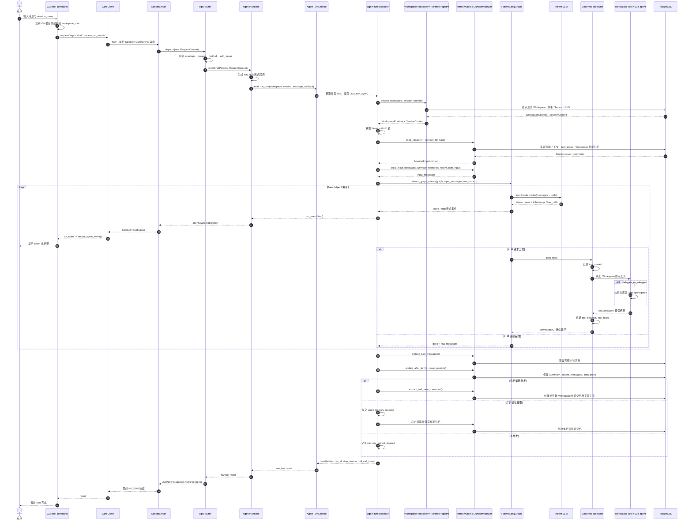

# Agent 执行架构与扩展指南

## 目标

本项目使用 LangGraph 作为循环引擎，同时在循环外建立稳定的应用层边界：

```text
CoreApp
  -> AgentHandlers
      -> AgentTurnService
          -> AgentRunContext + RunLimits
          -> WorkspaceRuntimeRegistry
              -> ModelProvider
              -> ToolRegistry
              -> LangGraph
          -> ContextManager + MemoryStore
          -> EventPublisher
```

这些抽象用于解决不同问题：

- LangGraph：决定 Agent 节点和工具节点何时继续或停止。
- `AgentTurnService`：编排一次完整 turn 的加载、执行和保存。
- `AgentRunContext`：描述一次运行的身份与限制。
- `ModelProvider`：集中创建不同用途的 LLM。
- `ToolRegistry`：集中声明工具能力、受众和风险等级。
- `EventPublisher`：将观测事件广播到持久化或调试 sink。

## 一次请求的数据流

```text
CLI 识别 Workspace
  -> JSON-RPC agent.chat
  -> AgentHandlers 生成 run_id
  -> AgentTurnService 解析 Workspace / Session
  -> 获取 Session UUID 锁
  -> 加载 turn_index、短期上下文和 Workspace 记忆
  -> 创建 AgentRunContext
  -> 执行 WorkspaceRuntime.graph
       agent node -> ModelProvider 创建的父 Agent LLM
       tools node -> ToolRegistry 生成的父 Agent 工具视图
       tools_condition -> 继续或结束
  -> 保存完整消息和短期上下文
  -> 按策略提取长期记忆
  -> 返回 stop_reason、tool_call_count 和运行身份
```

同一 Session 通过内部 UUID 锁串行执行。不同 Session 和不同 Workspace 可以并行。
同步 LangGraph、工具和数据库链路运行在专用 `agent-turn` executor 中，最大并发由
`CORE_AGENT_WORKERS` 控制。RPC Handler 只等待异步服务接口，不直接管理线程池。

### 完整数据流动示意图

下面的时序图描述一次 `agent.chat` 从用户输入到最终响应的完整路径。实线表示调用或数据写入，
虚线表示返回值、流式通知或执行结果。



需要注意：

- `AgentHandlers` 和 `SocketServer` 运行在 Core asyncio 事件循环中。
- `WorkspaceRepository`、Memory、LangGraph、LLM 和工具执行位于专用 `agent-turn` worker。
- worker 通过 `on_event` 回调和 `asyncio.run_coroutine_threadsafe()` 将流式通知送回事件循环。
- 完整消息、压缩上下文和长期记忆都写入 PostgreSQL，但用途和生命周期不同。
- 客户端断线后，流式通知停止；已经进入 worker 的 turn 仍继续执行并完成持久化。

## AgentRunContext 与 RunLimits

`AgentRunContext` 是一次运行的规范身份：

```python
AgentRunContext(
    run_id=...,
    session=SessionContext(...),
    turn_index=...,
    limits=RunLimits(...),
)
```

它只保存身份和控制信息，不保存完整消息历史，避免成为巨型可变上下文。

当前限制：

- `max_graph_steps`：限制 LangGraph 总步骤。
- `max_tool_calls`：限制父 Agent 单轮产生的工具调用数量。
- `max_subagent_steps`：限制每次子 Agent graph 的步骤数。

当前停止原因：

- `completed`
- `graph_step_limit`
- `tool_call_limit`
- `graph_error`
- `turn_error`

新增限制时，应先扩展 `RunLimits` 和停止原因，再在循环适配层实现，不能散落读取全局配置。

## ModelProvider

所有 LLM 创建集中在 `src/core/llm/provider.py`。业务模块只声明用途：

```text
parent_agent
subagent
context_summary
memory_extraction
file_summary
```

当前实现为 `OpenAICompatibleProvider`，底层使用 `ChatOpenAI` 连接兼容接口。

维护规则：

1. 业务模块不得直接实例化 `ChatOpenAI`。
2. 新增 LLM 工作负载时必须增加或复用 `LlmPurpose`。
3. 模型重试、超时、供应商切换和用量统计应在 Provider 层实现。
4. 测试通过注入 Fake Provider，不能依赖真实模型。

未来可以按用途配置不同模型，但不应让调用方理解供应商参数。

## ToolRegistry

`ToolRegistry` 保存 `ToolSpec`：

```text
name
tool
audiences
risk
description
```

当前受众：

- `parent`
- `subagent`

当前风险等级：

- `read_only`
- `controlled_execution`
- `delegation`

`create_workspace_toolset()` 注册 Workspace 绑定工具，再由 Registry 生成父 Agent 和子
Agent 工具视图。构建完成后 Registry 会冻结，运行期间不能改变 Workspace 能力集合。
新增工具时不应直接修改多个工具列表，而应注册一条 `ToolSpec`。

Registry 当前只描述和筛选能力，不负责执行工具。工具执行继续由 LangGraph
`ObservedToolNode` 完成。

未来可基于风险等级增加审批策略或只读运行模式。

## EventPublisher 与流式事件

项目保留两条事件通道，它们不能混为一体：

### 观测事件

```text
emit_event
  -> EventPublisher
      -> PostgresEventSink
      -> JsonlFileEventSink
      -> ConsoleEventSink
```

观测事件用于日志、审计和诊断。subscriber 失败不会改变 Agent 业务结果。
每个 turn 和后台任务结束时都会恢复进入任务前的事件上下文，避免线程复用导致身份泄漏。
`CoreApp` 可以注入自定义 `EventPublisher`；未注入时，事件模块根据配置惰性创建默认
sink-backed publisher。

### 请求流式事件

```text
LangGraph stream
  -> stream_graph_events
  -> AgentHandlers
  -> JSON-RPC agent.event
  -> CLI renderer
```

流式事件用于当前请求的即时交互。客户端断开不会取消 Core 中已经开始的 turn。

两条通道可以共享事件命名约定，但可靠性、生命周期和数据量不同，因此不使用同一个
总线对象。

### Agent 调用链与事件通道图

下图同时展示业务调用链、请求流式通道和观测事件通道。三条路径需要分别理解：

- **业务调用链**决定 Agent 实际做什么，以及结果如何持久化。
- **请求流式通道**只服务当前 `agent.chat` 请求，目标是即时显示。
- **观测事件通道**服务日志、审计和诊断，sink 失败不得改变业务结果。

```mermaid
flowchart LR
    subgraph CLI["CLI 进程"]
        User["用户输入"]
        Chat["commands.chat"]
        Client["CoreClient"]
        Render["render_agent_event"]
        User --> Chat --> Client
        Render --> User
    end

    subgraph Transport["Core asyncio / RPC 边界"]
        Socket["SocketServer"]
        Router["RpcRouter<br/>协议验证 + 鉴权 + 路由"]
        Handler["AgentHandlers<br/>run_id + on_event callback"]
        Client -->|"agent.chat<br/>TCP + NDJSON"| Socket
        Socket --> Router --> Handler
    end

    subgraph Turn["Agent turn 应用层"]
        Service["AgentTurnService"]
        Slots["并发 slot + agent-turn executor"]
        SessionLock["Session UUID 锁"]
        RunContext["AgentRunContext + RunLimits"]
        Context["AgentContextManager"]
        Memory["PostgresMemoryStore"]
        Runtime["WorkspaceRuntimeRegistry"]

        Handler -->|"await run_turn()"| Service
        Service --> Slots --> SessionLock
        SessionLock --> RunContext
        SessionLock --> Context
        SessionLock --> Memory
        SessionLock --> Runtime
    end

    subgraph Loop["Workspace 绑定的 Agent 调用链"]
        Graph["Parent LangGraph"]
        AgentNode["agent node"]
        ParentLLM["ModelProvider<br/>Parent LLM"]
        Condition{"tools_condition"}
        Done["graph done"]
        ToolNode["ObservedToolNode"]
        Registry["ToolRegistry<br/>Parent tool view"]
        WorkspaceTools["Workspace tools<br/>file / skill / command / weather"]
        Delegate["delegate_to_subagent"]
        SubGraph["非递归 Sub-agent graph"]
        SubLLM["Sub-agent LLM"]
        SubTools["Sub-agent tool view"]

        Runtime --> Graph
        Registry --> ToolNode
        Graph --> AgentNode --> ParentLLM --> Condition
        Condition -->|"tool_calls"| ToolNode
        ToolNode --> WorkspaceTools
        ToolNode --> Delegate --> SubGraph
        SubGraph --> SubLLM
        SubGraph --> SubTools
        WorkspaceTools -->|"ToolMessage"| Graph
        SubGraph -->|"总结结果"| Graph
        Condition -->|"完成"| Done
    end

    subgraph Persistence["业务持久化"]
        DB[("PostgreSQL<br/>workspaces / sessions / messages / memories")]
        Memory -->|"读取与保存"| DB
        Context -->|"summary + recent_messages"| Memory
        Done -->|"final messages"| Memory
    end

    subgraph Stream["请求流式通道：当前客户端"]
        StreamAdapter["stream_graph_events<br/>token / step / error / done"]
        Callback["on_event callback"]
        Notification["agent.event notification"]

        Graph --> StreamAdapter
        Done --> StreamAdapter
        StreamAdapter --> Callback
        Callback --> Handler
        Handler --> Notification --> Socket
        Socket -->|"当前 request_id"| Client
        Client --> Render
    end

    subgraph Observe["观测事件通道：审计与诊断"]
        Producers["事件生产者<br/>Service / Graph / ToolNode / Context / Memory"]
        EventContext["AgentEventContext<br/>workspace_id / session_id / turn_index / run_id"]
        Emit["emit_event / domain helpers<br/>sanitize + truncate"]
        Publisher["EventPublisher"]
        PgSink["PostgresEventSink<br/>内存队列 + 批量 writer"]
        FileSink["JsonlFileEventSink"]
        ConsoleSink["ConsoleEventSink"]
        EventsDB[("PostgreSQL agent_events")]
        Jsonl[("JSONL file")]
        Console[("debug console")]

        Producers --> Emit
        EventContext --> Emit
        Emit --> Publisher
        Publisher --> PgSink --> EventsDB
        Publisher --> FileSink --> Jsonl
        Publisher --> ConsoleSink --> Console
    end

    Service -.->|"turn / memory 事件"| Producers
    Handler -.->|"notification failure 事件"| Producers
    Graph -.->|"LLM / limit / graph 事件"| Producers
    ToolNode -.->|"tool 边界事件"| Producers
    Context -.->|"summary 事件"| Producers
    Memory -.->|"memory 事件"| Producers
```



图中的关键约束：

1. `ToolRegistry` 负责声明和筛选工具，真正执行发生在 `ObservedToolNode`。
2. 父 Agent 可以调用 `delegate_to_subagent`，但子 Agent 的工具视图中没有委派工具，因此不能递归创建子 Agent。
3. `stream_graph_events()` 生成面向客户端的轻量流式事件；它不负责写入事件数据库。
4. `emit_event()` 和领域 helper 生成观测事件，经清洗和截断后由 `EventPublisher` 广播。
5. `PostgresEventSink` 默认可通过内存队列批量写入 `agent_events`；队列或 sink 失败只记录调试信息，不中断 Agent。
6. 两条事件通道都携带 `run_id`，但只有请求流式通道依赖当前 TCP 连接。

### 图中组件与代码位置

| 图中组件 | 主要实现 |
|---|---|
| CLI chat / workspace 识别 | `src/cli/commands/chat.py`、`src/cli/workspace.py` |
| CoreClient / NDJSON 请求读取 | `src/cli/client.py` |
| SocketServer / RequestContext | `src/core/transport/socket_server.py` |
| JSON-RPC 验证与路由 | `src/core/bus/router.py`、`src/ipc/models.py` |
| Agent RPC 适配与流式回调 | `src/core/handlers/agent.py` |
| Turn 编排、线程池与 Session 锁 | `src/core/agent/service.py` |
| Workspace runtime 构建与缓存 | `src/core/workspace/runtime.py` |
| Parent Agent graph | `src/core/agent/graph.py` |
| 流式事件适配与运行限制 | `src/core/streaming/events.py` |
| 工具注册、筛选与边界观测 | `src/core/tools/registry.py`、`src/core/tools/observed.py` |
| 非递归 Sub-agent | `src/core/subagent/graph.py` |
| 短期上下文与压缩 | `src/core/context/manager.py` |
| Session、消息与长期记忆 | `src/core/memory/store.py`、`src/core/memory/repositories.py` |
| 观测事件入口与上下文 | `src/core/hooks/events.py` |
| EventPublisher 与 sinks | `src/core/hooks/publisher.py`、`src/core/hooks/sinks.py` |

## 与常见 AgentRunner / AgentLoop 设计的关系

常见设计中的组件与本项目映射如下：

| 常见组件 | 本项目 |
|---|---|
| ExecutionContext | `AgentRunContext`、`SessionContext`、`AgentContextState` |
| AgentRunner | `AgentTurnService` |
| AgentLoop | LangGraph `StateGraph` |
| Provider | `ModelProvider` |
| ToolRegistry | `ToolRegistry` + Workspace tool factories |
| EventBus | `EventPublisher` + JSON-RPC 流式通道 |

项目不手写 `AgentLoop`，因为 LangGraph 已经提供状态传递、条件边、工具循环和递归限制。
`AgentTurnService` 也不承担 daemon、RPC 或数据库 schema 生命周期，以保持职责边界。

## 扩展流程

### 增加新的模型用途

1. 在 `LlmPurpose` 增加用途。
2. 通过构造参数接收 `ModelProvider`。
3. 调用 `provider.create_chat_model()`。
4. 增加 Fake Provider 测试。

### 增加工具

1. 实现 Workspace 绑定的工具 factory。
2. 在 `create_workspace_toolset()` 注册 `ToolSpec`。
3. 明确受众和风险等级。
4. 增加路径安全、受众筛选和工具边界事件测试。

### 增加运行限制

1. 扩展 `RunLimits`。
2. 扩展 `StopReason`。
3. 在 `stream_graph_events()` 或对应执行边界实施。
4. 将停止原因返回 RPC，并写入观测事件。

### 增加事件消费者

1. 实现 `EventSink.emit()`。
2. 由 `SinkEventPublisher` 组合。
3. sink 必须自行处理缓冲、重试和关闭。
4. sink 失败不得抛入 Agent 业务链。

## 当前边界与后续方向

当前仍未实现：

- 运行中任务取消和超时中断。
- 全异步 LangGraph、工具和 psycopg Repository。
- Token 预算和成本预算。
- 子 Agent 工具调用次数独立限制。
- 按用途配置不同模型和重试策略。
- ToolRegistry 动态插件发现和审批策略。
- WorkspaceRuntime 缓存淘汰。
- 类型化 JSON-RPC 流事件数据模型。

后续优先级建议：

1. 为 `ModelProvider` 增加按用途的配置与统一重试。
2. 增加可取消的 `AgentRun` 生命周期对象。
3. 为 ToolRegistry 增加风险策略与人工审批边界。
4. 为流式事件增加严格数据模型和断线恢复。
