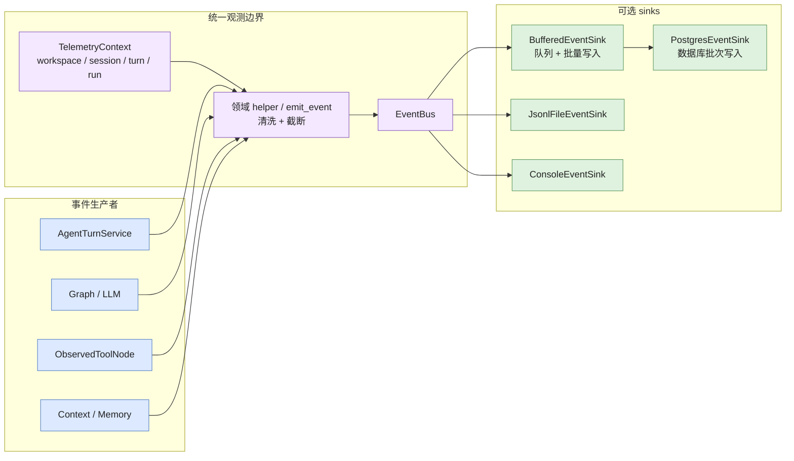

# Agent 执行架构与扩展指南

> 文档状态：Current
> 权威范围：Agent Turn、Execution、Slice、Graph、工具和事件调用链
> 维护触发：Agent 编排、预算、图结构或执行生命周期变化

> Session 短期上下文、完整消息归档、长期记忆提取与加载机制见
> [`/docs/architecture/memory-management.md`](/docs/architecture/memory-management.md)。
>
> 两条事件通道、Telemetry 生命周期和 Sink 可靠性见
> [`/docs/architecture/event-system.md`](/docs/architecture/event-system.md)。
>
> 用户延迟、后台处理边界与非功能验收方案见
> [`/docs/quality/non-functional-requirements.md`](/docs/quality/non-functional-requirements.md) 和
> [`/docs/quality/non-functional-testing.md`](/docs/quality/non-functional-testing.md)。
>
> Turn 最小提交、后台维护和跨 SQLite 恢复协调见
> [`/docs/architecture/response-finalization-and-checkpoint-consistency.md`](/docs/architecture/response-finalization-and-checkpoint-consistency.md)。
> 数据库表、事务边界和一致性术语见
> [`/docs/architecture/database-state-and-consistency.md`](/docs/architecture/database-state-and-consistency.md)。

## 本文负责

本文只解释一次 Agent 前台执行如何流转：

- `agent.chat` 到 `AgentTurnService` 的调用链。
- Execution、Slice、预算、暂停、恢复和错误分支。
- LangGraph、ModelProvider、ToolRegistry、ObservedToolNode 如何协作。
- Agent 执行期间产生哪些内部事件，如何传递给 CLI/TUI。

## 本文不负责

本文不定义以下模块的权威细节：

- 数据库表、事务、Outbox、CAS、checkpoint 清理和后台维护队列。这些属于
  [本地数据库设计与一致性机制](/docs/architecture/database-state-and-consistency.md) 和
  [最终响应、后台维护与 Checkpoint 一致性](/docs/architecture/response-finalization-and-checkpoint-consistency.md)。
- 外部 RPC 参数、错误码和流式通知字段。这些属于 `/docs/api/`。
- Core 进程级组合根、Transport 启停和 DI 装配。这些属于
  [CoreApp 与 Transport 架构](/docs/architecture/core-architecture.md)。

## 目标

本项目使用 LangGraph 作为循环引擎，同时在循环外建立稳定的应用层边界：

```text
CoreApp
  -> AgentHandlers
      -> AgentTurnService
          -> AgentRunContext + RunLimits
          -> TurnExecutionLoop
              -> SliceExecutionService
              -> TurnLoopErrorHandler
              -> TurnLoopPauseHandler
              -> TurnRunObserver
          -> WorkspaceRuntimeRegistry
              -> ModelProvider
              -> ToolRegistry
              -> LangGraph
          -> TurnCoordinator
              -> TurnFinalizer
              -> CompletedTurnCommitter
          -> MaintenanceScheduler + RecoveryCoordinator
          -> EventBus
```

这些抽象用于解决不同问题：

- LangGraph：决定 Agent 节点和工具节点何时继续或停止。
- `AgentTurnService`：编排一次完整 turn 的加载、执行和保存。
- `TurnExecutionLoop`：执行一个 foreground turn 内的 Slice 循环、预算判断和继续/停止分支。
- `SliceExecutionService`：执行单个 Slice，并把 LangGraph 输出转换为稳定的内部流事件。
- `TurnLoopErrorHandler`：处理 Slice 错误、服务商终止错误和兜底异常，负责相应 Execution 状态更新和用户可见错误事件。
- `TurnLoopPauseHandler`：处理预算耗尽后的暂停摘要、Execution 状态更新和暂停事件。
- `TurnRunObserver`：集中发送 foreground run 的 Telemetry 和 Trace，不参与业务决策。
- `AgentRunContext`：描述一次运行的身份与限制。
- `ModelProvider`：集中创建不同用途的 LLM。
- `ToolRegistry`：集中声明工具能力、受众和风险等级。
- `EventBus`：将 Telemetry 观测事件广播到持久化或调试 sink。

## 一次请求的数据流

```text
CLI 识别 Workspace
  -> JSON-RPC agent.chat
  -> AgentHandlers 生成 run_id
  -> AgentTurnService 解析 Workspace / Session
  -> 获取 Session UUID 锁
  -> 加载 turn_index、短期上下文和 Workspace 记忆
  -> 创建 AgentRunContext
  -> 执行 WorkspaceRuntime.graph
       agent node -> ModelProvider 创建的父 Agent LLM
       tools node -> ToolRegistry 生成的父 Agent 工具视图
       tools_condition -> 继续或结束
  -> 调用 TurnFinalizer 完成本轮最小提交
  -> 返回 stop_reason、tool_call_count 和运行身份
  -> 后台维护系统处理摘要、记忆提取和 checkpoint 清理
```

同一 Session 通过内部 UUID 锁串行执行。不同 Session 和不同 Workspace 可以并行。
同步 LangGraph、工具和数据库链路运行在专用 `agent-turn` executor 中，最大并发由
`CORE_AGENT_WORKERS` 控制。RPC Handler 只等待异步服务接口，不直接管理线程池。

## 代码级程序流转

完整的函数、参数、执行线程和失败路径说明已拆分到
[Agent 执行函数级调用链](/docs/architecture/agent-execution-call-chain.md)。

本篇只保留高层执行关系：

```text
CLI / TUI
  -> Transport / Router / Handler
  -> AgentAsyncTurnRunner
  -> AgentSyncTurnRunner
  -> AgentTurnService
  -> TurnExecutionLoop
  -> SliceExecutionService
  -> LangGraph / ToolNode
  -> TurnFinalizer
  -> 流式事件与最终响应
```

## AgentRunContext 与 RunLimits

`AgentRunContext` 是一次运行的规范身份：

```python
AgentRunContext(
    run_id=...,
    session=SessionContext(...),
    turn_index=...,
    limits=RunLimits(...),
)
```

它只保存身份和控制信息，不保存完整消息历史，避免成为巨型可变上下文。

当前限制：

- `max_graph_steps`：限制 LangGraph 总步骤。
- `max_tool_calls`：限制父 Agent 单轮产生的工具调用数量。
- `max_subagent_steps`：限制每次子 Agent graph 的步骤数。

当前停止原因：

- `completed`
- `graph_step_limit`
- `tool_call_limit`
- `graph_error`
- `turn_error`

新增限制时，应先扩展 `RunLimits` 和停止原因，再在循环适配层实现，不能散落读取全局配置。

## ModelProvider

所有 LLM 创建集中在 `src/core/llm/provider.py`。业务模块只声明用途：

```text
parent_agent
subagent
context_summary
memory_extraction
file_summary
```

当前实现为 `OpenAICompatibleProvider`，底层使用 `ChatOpenAI` 连接兼容接口。

### 无 LLM 配置诊断路径

`OpenAICompatibleProvider.configuration_status()` 只检查本地配置，不发起网络请求。
`AgentTurnService` 在创建 Workspace Runtime 和 LangGraph 前检查该状态：

```text
agent.chat
  -> 解析 Workspace / Session
  -> 获取 Session 锁
  -> 检查 LLM 配置
       ├── 已配置：创建/复用 Workspace Runtime，进入 LangGraph
       └── 未配置：执行 diagnostic turn
             -> 读取 Session，验证数据库链路
             -> 不归档消息，不更新 Session 对话状态
             -> 不递增 turn_index
             -> 流式返回 token + done(llm_not_configured)
```

诊断路径故意不创建 Graph、不调用工具、不提取长期记忆，也不触发需要 LLM 的上下文总结。重复
调用不会消耗业务轮次，首次真实 LLM Turn 仍会加载 bootstrap memory。它用于在没有模型密钥时
验证 CLI/Core、RPC、Workspace、Session、数据库和事件通道。诊断请求发布
`diagnostic_started/diagnostic_finished`，不会发布会被业务 Turn 统计消费的
`turn_started/turn_finished`。

维护规则：

1. 业务模块不得直接实例化 `ChatOpenAI`。
2. 新增 LLM 工作负载时必须增加或复用 `LlmPurpose`。
3. 模型重试、超时、供应商切换和用量统计应在 Provider 层实现。
4. 测试通过注入 Fake Provider，不能依赖真实模型。

未来可以按用途配置不同模型，但不应让调用方理解供应商参数。

## ToolRegistry

`ToolRegistry` 保存 `ToolSpec`：

```text
name
tool
audiences
risk
description
```

当前受众：

- `parent`
- `subagent`

当前风险等级：

- `read_only`
- `controlled_execution`
- `delegation`

`create_workspace_toolset()` 注册 Workspace 绑定工具，再由 Registry 生成父 Agent 和子
Agent 工具视图。构建完成后 Registry 会冻结，运行期间不能改变 Workspace 能力集合。
新增工具时不应直接修改多个工具列表，而应注册一条 `ToolSpec`。

Registry 当前只描述和筛选能力，不负责执行工具。工具执行继续由 LangGraph
`ObservedToolNode` 完成。

未来可基于风险等级增加审批策略或只读运行模式。

## Telemetry 与请求流式事件

项目保留两条事件通道，它们不能混为一体：

### 观测事件

```text
emit_event
  -> EventBus
      -> BufferedEventSink
          -> PostgresEventSink
      -> JsonlFileEventSink
      -> ConsoleEventSink
```

观测事件用于日志、审计和诊断。subscriber 失败不会改变 Agent 业务结果。
每个 turn 和后台任务结束时都会恢复进入任务前的事件上下文，避免线程复用导致身份泄漏。
`CoreApp` 显式组装并安装 `EventBus`。业务模块不会因为首次发送事件而隐式创建数据库
连接或后台线程。

### 请求流式事件

```text
LangGraph stream
  -> stream_graph_events
  -> AgentHandlers
  -> JSON-RPC agent.event
  -> CLI renderer
```

流式事件用于当前请求的即时交互。客户端断开不会取消 Core 中已经开始的 turn。

两条通道可以共享事件命名约定，但可靠性、生命周期和数据量不同，因此不使用同一个
总线对象。

### Agent 调用链与事件通道图

事件通道不再与完整业务调用链画在同一张图中。请求流式事件和观测事件具有不同消费者、
生命周期和可靠性语义，因此分别展示。

#### 1. 请求流式事件通道

这张图回答：当前 Turn 的 token 和步骤如何实时显示到 CLI。

```mermaid
flowchart LR
    subgraph Worker["agent-turn worker"]
        direction TB
        Graph["LangGraph stream"]
        Adapter["stream_graph_events<br/>token / step / error / done"]
        Callback["on_event callback"]
        Graph --> Adapter --> Callback
    end

    subgraph IPC["Core asyncio / IPC"]
        direction TB
        Handler["AgentHandlers"]
        Notification["agent.event<br/>携带 request_id + run_id"]
        Socket["SocketServer"]
        Callback --> Handler --> Notification --> Socket
    end

    subgraph CLI["CLI 进程"]
        direction TB
        Client["CoreClient"]
        Render["render_agent_event"]
        User["用户终端"]
        Client --> Render --> User
    end

    Socket -->|"NDJSON 通知"| Client

    classDef worker fill:#dce9ff,stroke:#5b85c5,color:#222;
    classDef ipc fill:#f3e8ff,stroke:#8b5fbf,color:#222;
    classDef cli fill:#fff3cd,stroke:#d6a100,color:#222;
    class Graph,Adapter,Callback worker;
    class Handler,Notification,Socket ipc;
    class Client,Render,User cli;
```



客户端断线时，通知发送停止并记录一次 `stream_notification_failed`；已经开始的 Turn 不会取消。

#### 2. Telemetry 观测事件通道

这张图回答：审计和诊断事件如何从业务模块进入不同 sink。



两条事件通道的关键约束：

1. `stream_graph_events()` 生成面向当前客户端的轻量流式事件；它不负责写入事件数据库。
2. `emit_event()` 和领域 helper 生成观测事件，经清洗和截断后由 `EventBus` 广播。
3. `BufferedEventSink` 负责内存队列和批量提交，`PostgresEventSink` 只负责数据库写入；队列或 sink 失败只记录调试信息，不中断 Agent。
4. 两条事件通道都携带 `run_id`，但只有请求流式通道依赖当前 TCP 连接。

### 图中组件与代码位置

| 图中组件 | 主要实现 |
|---|---|
| CLI chat / workspace 识别 | `src/cli/commands/chat.py`、`src/cli/workspace.py` |
| CoreClient / NDJSON 请求读取 | `src/cli/client.py` |
| SocketServer / RequestContext | `src/core/transport/socket_server.py` |
| JSON-RPC 验证与路由 | `src/core/bus/router.py`、`src/ipc/models.py` |
| Agent RPC 适配与流式回调 | `src/core/handlers/agent.py` |
| Turn 编排、线程池与 Session 锁 | `src/core/agent/service.py` |
| Workspace runtime 构建与缓存 | `src/core/workspace/runtime.py` |
| Parent Agent graph | `src/core/agent/graph.py` |
| 流式事件适配与运行限制 | `src/core/streaming/events.py`、`message_events.py`、`failures.py` |
| 工具注册、筛选与边界观测 | `src/core/tools/registry.py`、`src/core/tools/observed.py` |
| 非递归 Sub-agent | `src/core/subagent/graph.py` |
| 短期上下文与压缩 | `src/core/context/manager.py` |
| Session、消息与长期记忆 | `src/core/state/store.py`、`src/core/state/` |
| 观测事件入口与上下文 | `src/core/telemetry/recorder.py`、`src/core/telemetry/context.py` |
| EventBus、组装与 sinks | `src/core/telemetry/bus.py`、`src/core/telemetry/factory.py`、`src/core/telemetry/sinks.py` |

## 与常见 AgentRunner / AgentLoop 设计的关系

常见设计中的组件与本项目映射如下：

| 常见组件 | 本项目 |
|---|---|
| ExecutionContext | `AgentRunContext`、`SessionContext`、`AgentContextState` |
| AgentRunner | `AgentTurnService` |
| AgentLoop | LangGraph `StateGraph` |
| Provider | `ModelProvider` |
| ToolRegistry | `ToolRegistry` + Workspace tool factories |
| EventBus | `EventBus` + JSON-RPC 流式通道 |

项目不手写 `AgentLoop`，因为 LangGraph 已经提供状态传递、条件边、工具循环和递归限制。
`AgentTurnService` 不实现 daemon、RPC 或数据库 schema 细节；它通过注入的 StateStore、Repository、
Finalizer 和 Scheduler 委托这些职责，并由 `CoreApp` 组合和触发生命周期。

## 扩展流程

### 增加新的模型用途

1. 在 `LlmPurpose` 增加用途。
2. 通过构造参数接收 `ModelProvider`。
3. 调用 `provider.create_chat_model()`。
4. 增加 Fake Provider 测试。

### 增加工具

1. 实现 Workspace 绑定的工具 factory。
2. 在 `create_workspace_toolset()` 注册 `ToolSpec`。
3. 明确受众和风险等级。
4. 增加路径安全、受众筛选和工具边界事件测试。

### 增加运行限制

1. 扩展 `RunLimits`。
2. 扩展 `StopReason`。
3. 在 `stream_graph_events()` 或对应执行边界实施。
4. 将停止原因返回 RPC，并写入观测事件。

### 增加事件消费者

1. 实现 `EventSink.emit()`。
2. 由 `EventBus` 组合。
3. sink 必须自行处理缓冲、重试和关闭。
4. sink 失败不得抛入 Agent 业务链。

## 当前边界与后续方向

当前仍未实现：

- 运行中任务取消和超时中断。
- 全异步 LangGraph、工具和 psycopg Repository。
- Token 预算和成本预算。
- 子 Agent 工具调用次数独立限制。
- 按用途配置不同模型和重试策略。
- ToolRegistry 动态插件发现和审批策略。
- WorkspaceRuntime 缓存淘汰。
- 类型化 JSON-RPC 流事件数据模型。

后续优先级建议：

1. 为 `ModelProvider` 增加按用途的配置与统一重试。
2. 增加可取消的 `AgentRun` 生命周期对象。
3. 为 ToolRegistry 增加风险策略与人工审批边界。
4. 为流式事件增加严格数据模型和断线恢复。
