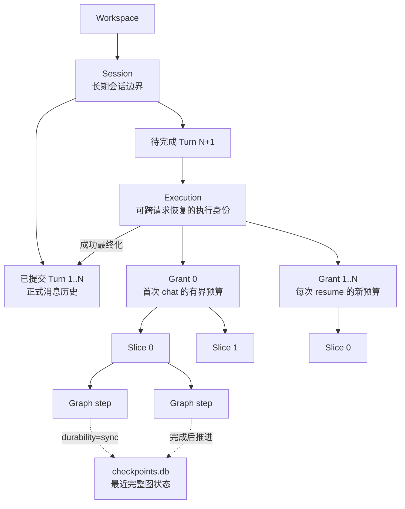

# Agent 执行架构

> 文档状态：Current
> 权威范围：Agent Turn、Execution、Slice、Graph、模型与工具的高层协作关系
> 维护触发：Agent 编排、预算、图结构或执行生命周期变化

> Session 短期上下文、完整消息归档、长期记忆提取与加载机制见
> [`/docs/architecture/memory-management.md`](/docs/architecture/memory-management.md)。
>
> 两条事件通道、Telemetry 生命周期和 Sink 可靠性见
> [`/docs/architecture/event-system.md`](/docs/architecture/event-system.md)。
>
> 用户延迟、后台处理边界与非功能验收方案见
> [`/docs/quality/non-functional-requirements.md`](/docs/quality/non-functional-requirements.md) 和
> [`/docs/quality/non-functional-testing.md`](/docs/quality/non-functional-testing.md)。
>
> Turn 最小提交、后台维护和跨 SQLite 恢复协调见
> [`/docs/architecture/response-finalization-and-checkpoint-consistency.md`](/docs/architecture/response-finalization-and-checkpoint-consistency.md)。
> 数据库表、事务边界和一致性术语见
> [`/docs/architecture/database-state-and-consistency.md`](/docs/architecture/database-state-and-consistency.md)。

## 本文负责

本文只解释一次 Agent 前台执行如何流转：

- `agent.chat` 到 `AgentTurnService` 的调用链。
- Execution、Slice、预算、暂停、恢复和错误分支。
- LangGraph、ModelProvider、ToolRegistry、`CheckpointedToolNode` 如何协作。
- Agent 执行如何接入请求流式事件与 Telemetry 边界。

## 本文不负责

本文不定义以下模块的权威细节：

- 数据库表、事务、Outbox、CAS、checkpoint 清理和后台维护队列。这些属于
  [本地数据库设计与一致性机制](/docs/architecture/database-state-and-consistency.md) 和
  [最终响应、后台维护与 Checkpoint 一致性](/docs/architecture/response-finalization-and-checkpoint-consistency.md)。
- 外部 RPC 参数、错误码和流式通知字段。这些属于 `/docs/api/`。
- Core 进程级组合根、Transport 启停和 DI 装配。这些属于
  [CoreApp 与 Transport 架构](/docs/architecture/core-architecture.md)。

## 目标

本项目使用 LangGraph 作为循环引擎，同时在循环外建立稳定的应用层边界：

```text
CoreApp
  -> AgentHandlers
      -> AgentTurnService
          -> AgentRunContext + RunLimits
          -> TurnExecutionLoop
              -> SliceExecutionService
              -> TurnLoopErrorHandler
              -> TurnLoopPauseHandler
              -> TurnRunObserver
          -> WorkspaceRuntimeRegistry
              -> ModelProvider
              -> ToolRegistry
              -> LangGraph
          -> TurnCoordinator
              -> TurnFinalizer
              -> CompletedTurnCommitter
          -> MaintenanceScheduler + RecoveryCoordinator
          -> EventBus
```

这些抽象用于解决不同问题：

- LangGraph：决定 Agent 节点和工具节点何时继续或停止。
- `AgentTurnService`：编排一次完整 turn 的加载、执行和保存。
- `TurnExecutionLoop`：执行一个 foreground turn 内的 Slice 循环、预算判断和继续/停止分支。
- `SliceExecutionService`：执行单个 Slice，并把 LangGraph 输出转换为稳定的内部流事件。
- `TurnLoopErrorHandler`：处理 Slice 错误、服务商终止错误和兜底异常，负责相应 Execution 状态更新和用户可见错误事件。
- `TurnLoopPauseHandler`：处理预算耗尽后的暂停摘要、Execution 状态更新和暂停事件。
- `TurnRunObserver`：集中发送 foreground run 的 Telemetry 和 Trace，不参与业务决策。
- `AgentRunContext`：描述一次运行的身份与限制。
- `ModelProvider`：集中创建不同用途的 LLM。
- `ToolRegistry`：集中声明工具能力、受众和风险等级。
- `EventBus`：将 Telemetry 观测事件广播到持久化或调试 sink。

<a id="execution-identity-map"></a>

## Session、Turn 与可恢复执行层级



- `Turn` 是最终成功提交的会话轮次；暂停中的工作仍属于待完成 Turn，不进入正式消息历史。
- `Execution` 是持久实体，可经历多次 `chat/resume/approval.resolve` 请求。
- `Grant` 是一次请求授予的逻辑预算批次，以 `grant_index` 表达，不是独立数据库表。
- `Slice` 是 Grant 内一次受图步数限制的执行片段，对应 `execution_slices` 记录；每个新 Grant 的
  `slice_index` 从 `0` 重新开始。
- checkpoint 的恢复粒度是最后一个完整 LangGraph step（superstep），不是整个 Slice。节点内尚未完成的
  流式草稿不会成为可恢复状态，恢复时会从最近完整 checkpoint 重新执行该节点。

因此，系统同时保留两类真相：`state.db` 记录 Execution/Turn 的业务生命周期，`checkpoints.db`
记录未完成图的可恢复计算状态。二者不能互相替代。

## 一次请求的数据流

```text
CLI 识别 Workspace
  -> JSON-RPC agent.chat
  -> AgentHandlers 生成 run_id
  -> AgentTurnService 解析 Workspace / Session
  -> 获取 Session UUID 锁
  -> 加载 turn_index、短期上下文和 Workspace 记忆
  -> 创建 AgentRunContext
  -> 执行 WorkspaceRuntime.graph
       agent node -> ModelProvider 创建的父 Agent LLM
       tools node -> ToolRegistry 生成的父 Agent 工具视图
       tools_condition -> 继续或结束
  -> 调用 TurnFinalizer 完成本轮最小提交
  -> 返回 stop_reason、tool_call_count 和运行身份
  -> 后台维护系统处理摘要、记忆提取和 checkpoint 清理
```

同一 Session 通过内部 UUID 锁串行执行。不同 Session 和不同 Workspace 可以并行。
同步 LangGraph、工具和数据库链路运行在专用 `agent-turn` executor 中，最大并发由
`CORE_AGENT_WORKERS` 控制。RPC Handler 只等待异步服务接口，不直接管理线程池。

## 代码级程序流转

完整的函数、参数、执行线程和失败路径说明已拆分到
[Agent 执行函数级调用链](/docs/architecture/agent-execution-call-chain.md)。

本篇只保留高层执行关系：

```text
CLI / TUI
  -> Transport / Router / Handler
  -> AgentAsyncTurnRunner
  -> AgentSyncTurnRunner
  -> AgentTurnService
  -> TurnExecutionLoop
  -> SliceExecutionService
  -> LangGraph / ToolNode
  -> TurnFinalizer
  -> 流式事件与最终响应
```

## AgentRunContext 与 RunLimits

`AgentRunContext` 是一次运行的规范身份：

```python
AgentRunContext(
    run_id=...,
    session=SessionContext(...),
    turn_index=...,
    limits=RunLimits(...),
)
```

它只保存身份和控制信息，不保存完整消息历史，避免成为巨型可变上下文。

当前限制：

- `max_graph_steps`：限制 LangGraph 总步骤。
- `max_tool_calls`：限制父 Agent 单轮产生的工具调用数量。
- `max_subagent_steps`：限制每次子 Agent graph 的步骤数。

当前停止原因：

- `completed`
- `graph_step_limit`
- `tool_call_limit`
- `graph_error`
- `turn_error`

新增限制时，应先扩展 `RunLimits` 和停止原因，再在循环适配层实现，不能散落读取全局配置。

## ModelProvider

所有 LLM 创建集中在 `src/core/llm/provider.py`。业务模块只声明用途：

```text
parent_agent
subagent
context_summary
memory_extraction
file_summary
```

当前默认实现为 `AnthropicProvider`，底层使用 `ChatAnthropic` 连接 Anthropic message/tool 格式。`OpenAICompatibleProvider` 仅保留为 legacy adapter。

### 无 LLM 配置诊断路径

`AnthropicProvider.configuration_status()` 只检查本地配置，不发起网络请求。
`AgentTurnService` 在创建 Workspace Runtime 和 LangGraph 前检查该状态：

```text
agent.chat
  -> 解析 Workspace / Session
  -> 获取 Session 锁
  -> 检查 LLM 配置
       ├── 已配置：创建/复用 Workspace Runtime，进入 LangGraph
       └── 未配置：执行 diagnostic turn
             -> 读取 Session，验证数据库链路
             -> 不归档消息，不更新 Session 对话状态
             -> 不递增 turn_index
             -> 流式返回 token + done(llm_not_configured)
```

诊断路径故意不创建 Graph、不调用工具、不提取长期记忆，也不触发需要 LLM 的上下文总结。重复
调用不会消耗业务轮次，首次真实 LLM Turn 仍会加载 bootstrap memory。它用于在没有模型密钥时
验证 CLI/Core、RPC、Workspace、Session、数据库和事件通道。诊断请求发布
`diagnostic_started/diagnostic_finished`，不会发布会被业务 Turn 统计消费的
`turn_started/turn_finished`。

维护规则：

1. 业务模块不得直接实例化 `ChatAnthropic`、Anthropic SDK、`ChatOpenAI` 或 OpenAI SDK。
2. 新增 LLM 工作负载时必须增加或复用 `LlmPurpose`。
3. 模型重试、超时、供应商切换和用量统计应在 Provider 层实现。
4. 测试通过注入 Fake Provider，不能依赖真实模型。

未来可以按用途配置不同模型，但不应让调用方理解供应商参数。

## ToolRegistry

`ToolRegistry` 保存 `ToolSpec`：

```text
name
tool
audiences
risk
effect
replay_policy
parallel_safe
description
```

当前受众：

- `parent`
- `subagent`

当前风险等级：

- `read_only`
- `controlled_execution`
- `delegation`

`create_workspace_toolset()` 注册 Workspace 绑定工具，再由 Registry 生成父 Agent 和子
Agent 工具视图。构建完成后 Registry 会冻结，运行期间不能改变 Workspace 能力集合。
新增工具时不应直接修改多个工具列表，而应注册一条 `ToolSpec`。

Registry 只描述和筛选能力，不负责执行工具。父 Agent 与子 Agent 均使用
`CheckpointedToolNode`：有副作用、需审批或受控的调用逐项执行并在每个 graph
superstep 后形成 checkpoint；只有显式声明 `parallel_safe` 的纯读取工具可以组成并行 wave。
`ObservedToolNode` 仍保留为底层兼容适配器，不是生产 Graph 的批处理边界。

工具开始执行前会写入 durable tool ledger，完成后先持久化精确 `ToolMessage`，再运行
非关键 PostHook 与 Telemetry。checkpoint 丢失时可以重放已保存结果，而不会重新执行副作用。
无法确认是否已经产生副作用的调用会暂停为 `tool_recovery_required`，由恢复 RPC 处理。

## 事件边界

Agent 执行会接入两条用途不同的通道：

```text
请求流式事件：Graph -> Agent Handler -> JSON-RPC notification -> CLI / TUI
观测事件：业务模块 -> EventBus -> Telemetry sinks
```

前者服务当前用户交互，依赖请求连接；后者用于诊断和审计，失败不得改变 Agent 业务结果。
Agent 执行层只发布稳定事件，不负责具体前端渲染、数据库写入或 sink 生命周期。

- 事件语义、可靠性与 sink 结构见[事件系统](/docs/architecture/event-system.md)；
- 对外 notification 字段和顺序见[流式事件参考](/docs/api/streaming-events.md)；
- 具体函数和代码位置见[Agent 执行函数级调用链](/docs/architecture/agent-execution-call-chain.md)。
## 与常见 AgentRunner / AgentLoop 设计的关系

常见设计中的组件与本项目映射如下：

| 常见组件 | 本项目 |
|---|---|
| ExecutionContext | `AgentRunContext`、`SessionContext`、`AgentContextState` |
| AgentRunner | `AgentTurnService` |
| AgentLoop | LangGraph `StateGraph` |
| Provider | `ModelProvider` |
| ToolRegistry | `ToolRegistry` + Workspace tool factories |
| EventBus | `EventBus` + JSON-RPC 流式通道 |

项目不手写 `AgentLoop`，因为 LangGraph 已经提供状态传递、条件边、工具循环和递归限制。
`AgentTurnService` 不实现 daemon、RPC 或数据库 schema 细节；它通过注入的 StateStore、Repository、
Finalizer 和 Scheduler 委托这些职责，并由 `CoreApp` 组合和触发生命周期。

## 扩展与能力边界

本篇不维护具体扩展步骤或未实现清单：

- 新增模型用途、工具、运行限制或事件消费者时，遵循
  [Agent Runtime 扩展指南](/docs/development/agent-runtime-extension.md)；
- 当前尚未支持的能力和优先级见
  [路线图与已知限制](/docs/product/roadmap-and-known-limitations.md)。

这样 Architecture 只维护已实现的运行结构，Development 维护变更方法，Product 维护能力状态。
