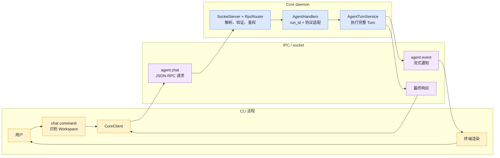
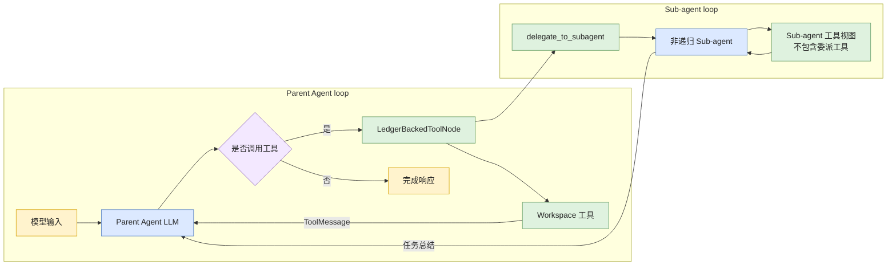

# Agent 执行函数级调用链

> 文档状态：Current
> 权威范围：一次 Agent 请求从 CLI 到 Core、Graph、事件写回和最终响应的函数级调用顺序
> 维护触发：CLI 请求入口、Transport、Handler、Agent worker、Graph stream 或最终响应调用链变化

本文从函数和执行线程角度解释一次 `agent.chat` 如何穿过系统。高层组件职责、预算模型、工具注册和
扩展方式见 [Agent 执行架构](/docs/architecture/agent-execution-architecture.md)。

## 本文负责

- 记录一次请求经过的关键函数、参数和执行位置。
- 区分 CLI 主线程、Core asyncio loop 和 `agent-turn` worker。
- 说明事件如何从 worker 返回前端。
- 提供成功路径和失败路径的代码级排障入口。

## 本文不负责

- 不定义 Agent 的高层架构和扩展策略；这些属于 Agent 执行架构。
- 不定义数据库表、事务和 checkpoint 一致性；这些属于 State 文档。
- 不定义 RPC 字段和事件 payload；这些属于 `/docs/api/`。

## 代码级程序流转

本节按一次 `learn-agent chat --session default "读取项目结构"` 的真实调用顺序说明程序如何
流转。重点不是组件“有什么”，而是一个函数收到什么参数、调用哪个函数、在哪个执行环境运行，
以及产生什么副作用。

### 调用链总表

| 顺序 | 函数 | 执行位置 | 主要职责 |
|---:|---|---|---|
| 1 | `chat_once()` | CLI 主线程 | 识别 Workspace，构造 `agent.chat` 参数 |
| 2 | `CoreClient.request()` | CLI 主线程 | 建立单请求连接，读取 notification 与最终响应 |
| 3 | `SocketServer._handle_connection()` | Core asyncio loop | 读取 NDJSON frame 并交给 Router |
| 4 | `RpcRouter.dispatch()` | Core asyncio loop | 验证协议、参数、方法和 token |
| 5 | `AgentHandlers.chat()` | Core asyncio loop | 创建 `run_id`、控制信号和 worker 到 socket 的事件桥 |
| 6 | `AgentTurnService.run_turn()` | Core asyncio loop | 委托异步 Runner，不直接执行同步 Agent 逻辑 |
| 7 | `AgentAsyncTurnRunner.run_turn()` | Core asyncio loop | 通过 `TurnWorkerExecutor` 获取 slot 并提交同步消费者 |
| 8 | `AgentSyncTurnRunner.run_turn()` | `agent-turn` worker | 消费内部事件流并聚合最终 RPC result |
| 9 | `AgentRequestStreamService.stream_turn()` | `agent-turn` worker | 解析身份、获取 Session 锁并创建 Execution |
| 10 | `RuntimeGraphResolver.graph_for_turn()` | `agent-turn` worker | 根据普通/goal 模式选择 Workspace Graph |
| 11 | `TurnExecutionLoop.stream_locked_turn()` | `agent-turn` worker | 准备上下文并控制有界 Slice 循环 |
| 12 | `SliceExecutionService.stream_slice()` | `agent-turn` worker | 启动 Slice，调用 Graph stream 并返回终态 |
| 13 | `stream_graph_events()` | `agent-turn` worker | 将 LangGraph stream 转换为稳定内部事件 |
| 14 | `agent_node()` / `LedgerBackedToolNode` | `agent-turn` worker | 调用模型，或执行由 Ledger 保护的模型工具批次 |
| 15 | `TurnCoordinator.finalize()` | `agent-turn` worker | 委托最小业务提交与维护任务入队 |
| 16 | `on_event()` | `agent-turn` worker | 将流事件投递回 Core asyncio loop |
| 17 | `SocketRequestContext.send_notification()` | Core asyncio loop | 将 `agent.event` 写入 TCP |
| 18 | `CoreClient.request()` | CLI 主线程 | 匹配 `request_id`、渲染事件并读取最终响应 |

### 第一阶段：CLI 构造请求

入口位于 `src/cli/commands/chat.py`：

```python
chat_once(client, session_name, message, workspace, goal_mode=...)
```

`discover_workspace_root()` 从显式起点或当前目录向上查找最近的 Git 根目录；非 Git 目录使用起点
本身。CLI 随后调用：

```python
client.request(
    "agent.chat",
    {
        "workspace_root": str(workspace_root),
        "session_name": session_name,
        "message": message,
        "goal_mode": goal_mode,
    },
    on_event=render_agent_event,
)
```

`CoreClient.request()`：

1. 生成 JSON-RPC `request_id` 并读取用户级 daemon token。
2. 建立单请求单连接 TCP，写入一行 UTF-8 JSON。
3. 持续读取 `agent.event` notification，交给 `on_event`。
4. 收到匹配 `request_id` 的最终响应后关闭本次请求。

`request_id` 关联传输请求，`run_id` 关联一次 Core Agent 运行；客户端不能指定诊断身份。
公开字段以 [RPC 方法参考](/docs/api/rpc-reference.md)为准。

### 第二阶段：Transport、验证与路由

`SocketServer._handle_connection()` 读取受大小限制的 NDJSON frame，创建 `SocketRequestContext`，
再调用 `RpcRouter.dispatch(raw, context)`。Transport 不理解 Agent 业务。

Router 按以下边界处理：

```text
JsonRpcRequest.model_validate(raw)
  -> 查找 method 注册
  -> 对应 Params.model_validate(request.params)
  -> verify_token()
  -> await handler(params, context)
  -> JsonRpcSuccess / JsonRpcError
```

参数与 token 验证成功前，不会调用 Agent、工具或 shutdown handler。具体字段和错误码分别由
[RPC 方法参考](/docs/api/rpc-reference.md)与[错误参考](/docs/api/error-reference.md)维护。

### 第三阶段：Handler 建立线程与事件边界

`AgentHandlers.chat()` 创建：

- `run_id`：当前 Agent 运行身份；
- `ExecutionControl`：跨线程协作信号，断线时要求当前 Slice 后暂停；
- `on_event`：把 worker 事件送回 Core asyncio loop 的回调。

随后调用 `await AgentTurnService.run_turn(...)`。Service 是稳定应用入口，但实际调度委托给：

```text
AgentTurnService.run_turn()
  -> AgentAsyncTurnRunner.run_turn()
  -> TurnWorkerExecutor.run(AgentSyncTurnRunner.run_turn, ...)
```

`TurnWorkerExecutor` 使用 `asyncio.Semaphore` 限制并发，复制当前 `ContextVar`，再提交到专用
`ThreadPoolExecutor`。worker 完成后由事件循环释放 slot；注入的外部 executor 不由 Service 关闭。

### 第四阶段：同步消费、身份解析与 Session 串行

`AgentSyncTurnRunner.run_turn()` 消费 `AgentRequestStreamService.stream_turn()` 产生的事件：

```python
for item in request_stream_service.stream_turn(...):
    if on_event:
        on_event(item)
    result.observe(item)
return result.build()
```

`AgentRequestStreamService.stream_turn()` 的顺序是：

```text
规范化输入并拒绝空消息
  -> workspace_repository.resolve(workspace_root)
  -> 检查同名 Session 是否已归档
  -> resolve_session(workspace, session_name)
  -> 获取 Session UUID 锁
  -> 检查模型配置
  -> execution_lifecycle.begin_turn(...)
  -> runtime_graph_resolver.graph_for_turn(...)
  -> turn_execution_loop.stream_locked_turn(...)
```

Session 锁使用内部 UUID，因此同一 Session 的加载、执行和保存串行；不同 Session 可并行，但仍受
worker slot 总数限制。Execution 已挂起时，服务返回结构化 pending 事件，不覆盖旧 Execution。

### 第五阶段：选择 Workspace Runtime 与 Graph

`RuntimeGraphResolver.graph_for_turn(workspace, goal_mode=...)` 隐藏 Runtime 缓存细节：

```text
runtime_registry.get(workspace)
  -> 所有模式返回同一个 runtime.graph
```

缓存未命中时，`WorkspaceRuntimeFactory` 创建 Workspace 绑定的 ToolRegistry、SkillStore、父 Agent
Graph 和子 Agent。工具路径始终绑定不可变 `WorkspaceContext`；请求不能通过修改全局变量切换目录。

任务规划工具始终对父 Agent 可见。Goal 模式由 `UserPromptSubmit` 生命周期向当前用户消息注入策略，不创建另一套工具 schema 或 System Prompt，因此不会因模式切换破坏 Anthropic 的稳定前缀缓存。

### 第六阶段：准备 Turn 输入并进入 Slice 循环

`TurnExecutionLoop.stream_locked_turn()` 创建本轮 State Store facade，并调用：

```python
prepared = turn_coordinator.prepare(
    store=store,
    session=session,
    user_input=user_input,
    run_id=run_id,
    limits=run_limits,
)
```

`ConversationContextLoader.prepare()` 通过存储 Port 加载已提交 Session 上下文、当前 Workspace 的
相关记忆，并返回不可变 `PreparedTurn`：

```text
state
current turn_index
AgentRunContext
input_messages
```

Graph 输入由已有摘要、Workspace 记忆、近期原始消息和当前 `HumanMessage` 组成。合成的摘要与记忆
只用于模型上下文，不重复归档为用户历史。

随后 `TurnExecutionLoop` 为本次 Execution 绑定预算和 ToolExecutionContext，并循环调用
`SliceExecutionService.stream_slice()`。每个 Slice 都有独立 `slice_id`；预算耗尽、客户端断线、
Graph 错误和正常完成分别交给 PauseHandler、ErrorHandler 或 Finalizer。
### 第七阶段：LangGraph AgentLoop

`create_parent_graph()` 在 `src/core/agent/graph.py` 中定义循环：

```text
START
  -> context_guard
  -> agent_node
       -> LLM 无 tool_calls -> END
       -> LLM 有 tool_calls -> tools
  -> LedgerBackedToolNode
       -> 副作用调用按顺序执行，安全读取可并行
       -> 每个结果先持久化到 Tool Ledger
       -> 中断恢复时重放已完成结果
       -> 整批追加 ToolMessage
  -> journal_tools
  -> context_guard
  -> agent_node
```

`agent_node(state)` 接收扩展的 `AgentGraphState`。`messages` 是下一次模型调用的活动窗口，
`turn_journal` 是当前 Turn 的完整追加日志；系统提示词和可选的 `working_summary` 只在调用边界注入：

```python
llm_with_tools.invoke(llm_messages)
```

返回值必须是：

```python
{"messages": [response], "turn_journal": [response]}
```

两个字段都使用 LangGraph 的 messages reducer。`context_guard` 只从活动 `messages` 移除已经闭合的旧工具周期，
不会修改 `turn_journal`；checkpoint 恢复和最终归档因此仍保留本 Turn 的完整记录。

`LedgerBackedToolNode` 建立在 `ObservedToolNode` 的单次调用适配能力之上。它按
`ToolSpec.effect`、`replay_policy` 和 `parallel_safe` 调度完整工具批次：副作用调用串行，
安全读取可并行。每个调用的精确 `ToolMessage` 先进入 Tool Ledger，整个批次完成后才一次性
返回 graph state。若审批、预算或进程故障使节点重启，已完成结果从 Ledger 重放，随后继续首个未完成调用。
每个调用仍会按名称匹配 Workspace 工具，并统一记录：

```text
tool_started
  -> execute(request)
  -> tool_finished 或 tool_failed
```

工具函数本身不需要手写通用调用边界 Hook。工具内部只记录自身特有的领域事件。
durable tool ledger 在工具实现前 claim 调用，在工具返回后先保存精确结果；若 daemon 在
两者之间退出，安全读取可重试，结构化写入可按资源摘要对账，未知副作用则要求人工恢复。

### 第八阶段：把 Graph stream 转换为稳定事件

`SliceExecutionService.stream_slice()` 不直接暴露 LangGraph 原始 stream，而是调用：

```python
stream_graph_events(graph, input_messages, run_context)
```

适配器使用：

```python
app.stream(
    inputs,
    config={"recursion_limit": limits.max_graph_steps},
    stream_mode=["messages", "values"],
)
```

两种 LangGraph stream mode 的用途：

| mode | 内容 | 转换结果 |
|---|---|---|
| `messages` | LLM 增量 `AIMessageChunk` | `token` |
| `values` | 当前完整 Graph 状态快照 | `step`、工具计数和最终消息 |

适配器对外只产生四种稳定事件：

| 事件 | 含义 |
|---|---|
| `token` | 可立即渲染的模型文本增量 |
| `step` | Agent 开始、工具请求、工具结果或完整 Agent 消息 |
| `error` | Graph、步骤限制或工具调用限制导致本轮失败 |
| `done` | Graph 正常结束，携带完整最终 messages |

`max_graph_steps` 通过 LangGraph `recursion_limit` 实施；`max_tool_calls` 由适配器累计
新消息中的 `tool_calls` 实施。达到限制时返回结构化 `error`，不继续持久化失败 Turn。

### 第九阶段：流事件返回 CLI

`AgentSyncTurnRunner` 每消费一个事件，就调用 `on_event(item)`。该回调仍运行在 worker
线程，不能直接操作 asyncio socket，因此 `AgentHandlers.chat()` 使用：

```python
asyncio.run_coroutine_threadsafe(
    context.send_notification(notification),
    loop,
)
```

通知格式：

```json
{
  "method": "agent.event",
  "params": {
    "request_id": "用于匹配当前 CLI 请求",
    "run_id": "用于追踪当前 Agent Turn",
    "event": "token | step | error | done",
    "data": {}
  }
}
```

若客户端断线，第一次通知失败会记录 `stream_notification_failed`，后续停止发送通知，但 worker
继续尝试完成执行和持久化。客户端退出不会主动中断 Core Turn，但其他执行或数据库异常仍可能
导致本轮失败。

### 第十阶段：成功完成后的持久化

只有收到 LangGraph `done` 时，`TurnCoordinator` 才调用 `TurnFinalizer`：

```python
finalization = turn_coordinator.finalize(
    store=store,
    session=session,
    turn_index=current_turn,
    previous_state=state,
    final_messages=item["data"]["messages"],
    execution=execution,
)
```

最小提交和派生维护边界：

| 顺序 | 调用 | 数据库结果 |
|---:|---|---|
| 1 | `build_fast_state()` | 纯计算近期消息，不调用摘要模型 |
| 2 | `CompletedTurnCommitter.commit()` | 同事务写入消息、Session、Execution 和维护任务 |
| 3 | 返回最终 `done` | CLI 可以恢复输入 |
| 4 | `MaintenanceScheduler` | 后台执行摘要、记忆和 checkpoint 清理 |

长期记忆 handler 只读取已提交消息，因此来源关系始终引用有效消息。用户明确要求“记住”时也
返回 `pending`；CLI 不会把尚未完成的后台提取表述为已经保存。

### 第十一阶段：最终响应与资源恢复

成功时 `TurnExecutionLoop.stream_locked_turn()` 产生最终 `done`：

```python
{
    "run_id": run_id,
    "status": "ok",
    "workspace_id": "...",
    "session_id": "...",
    "session_name": "...",
    "stop_reason": "completed",
    "tool_call_count": 3,
    "durability": "committed",
    "maintenance_status": "pending",
    "memory_status": "pending",
}
```

`TurnResultBuilder` 将事件流聚合为 Handler 的最终 result。`RpcRouter.dispatch()` 包装为
`JsonRpcSuccess`，`SocketServer` 写回连接，CLI 收到与 `request_id` 匹配的响应后结束读取。

无论成功或失败，`TurnExecutionLoop.stream_locked_turn()` 的 `finally` 都会：

```text
恢复进入本轮前的事件上下文
  -> 关闭本轮 StateStore facade
  -> 释放 Session UUID 锁
  -> worker future 完成
  -> 释放并发 semaphore slot
```

### 失败路径速查

| 失败位置 | 转换方式 | 是否继续业务执行 |
|---|---|---|
| NDJSON/JSON 无效 | Parse Error，关闭当前连接 | 否 |
| JSON-RPC 或参数无效 | 标准 JSON-RPC error | 否 |
| token 错误 | Unauthorized | 否 |
| LLM 未配置 | 进入无状态 diagnostic path | 不执行 Graph |
| Graph recursion limit | `error(graph_step_limit)` | 不持久化失败 Turn |
| 工具调用数超限 | `error(tool_call_limit)` | 不持久化失败 Turn |
| LLM、Graph 或 Turn 异常 | `error` + 观测事件 | 不持久化失败 Turn |
| CLI 流通知断线 | 停止通知并记录事件 | Core Turn 继续 |
| 后台记忆提取失败 | `memory_failed` 事件 | 已完成 Turn 不回滚 |

### 完整数据流动示意图

完整数据流按阅读层次拆为三张图。先理解进程间边界，再下钻 Core 内部 Turn，最后查看
Agent 循环。每张图只描述一个层次，避免将所有实现细节堆叠在同一画布中。

#### 1. 端到端进程总览

这张图回答：用户输入如何进入 daemon，执行结果如何回到 CLI。



#### 2. Core 内单轮 Turn

这张图回答：一次经过验证的请求，在 Core 中如何跨越异步调度、同步 worker、Session 一致性边界和
最小提交。

```mermaid
flowchart LR
    subgraph Schedule["阶段一：调度"]
        direction TB
        Async["AgentAsyncTurnRunner"]
        Slot["TurnWorkerExecutor<br/>获取并发 slot"]
        Worker["agent-turn worker<br/>AgentSyncTurnRunner"]
        Async --> Slot --> Worker
    end

    subgraph Prepare["阶段二：身份与上下文"]
        direction TB
        Request["AgentRequestStreamService"]
        Resolve["解析 Workspace / Session"]
        Lock["获取 Session UUID 锁"]
        Runtime["RuntimeGraphResolver"]
        Load["ConversationContextLoader<br/>上下文 + Workspace 记忆"]
        Request --> Resolve --> Lock --> Runtime --> Load
    end

    subgraph Execute["阶段三：有界执行"]
        direction TB
        Loop["TurnExecutionLoop"]
        Slice["SliceExecutionService"]
        Graph["LangGraph / LLM / Tool"]
        Loop --> Slice --> Graph
    end

    subgraph Persist["阶段四：最小提交与维护"]
        direction TB
        Commit["CompletedTurnCommitter<br/>StateUnitOfWork"]
        State["state.db<br/>消息 / Session / Execution"]
        Jobs["maintenance_jobs<br/>持久化 Outbox"]
        Done["返回 done"]
        Maintenance["MaintenanceScheduler"]
        Commit --> State --> Done
        Commit --> Jobs --> Maintenance
    end

    Worker --> Request
    Load --> Loop
    Graph --> Commit

    classDef schedule fill:#f3e8ff,stroke:#8b5fbf,color:#222;
    classDef prepare fill:#fff3cd,stroke:#d6a100,color:#222;
    classDef execute fill:#dce9ff,stroke:#5b85c5,color:#222;
    classDef persist fill:#dff2df,stroke:#629b62,color:#222;
    class Async,Slot,Worker schedule;
    class Request,Resolve,Lock,Runtime,Load prepare;
    class Loop,Slice,Graph execute;
    class Commit,State,Jobs,Done,Maintenance persist;
```


#### 3. Parent Agent 与 Sub-agent 调用链

这张图回答：LangGraph 如何循环调用 LLM、工具和非递归 Sub-agent。



三张图共同表达的关键边界：

- `AgentHandlers` 和 `SocketServer` 运行在 Core asyncio 事件循环中。
- `WorkspaceRepository`、Memory、LangGraph、LLM 和工具执行位于专用 `agent-turn` worker。
- worker 通过 `on_event` 回调和 `asyncio.run_coroutine_threadsafe()` 将流式通知送回事件循环。
- 完整消息和最小 Session 状态原子写入 `state.db`；摘要、长期记忆和 checkpoint 清理通过持久化维护任务完成。
- 客户端断线后停止通知；当前 Slice 可结束，若已完成则提交，若仍需后续 Slice 则保存为可恢复暂停。
