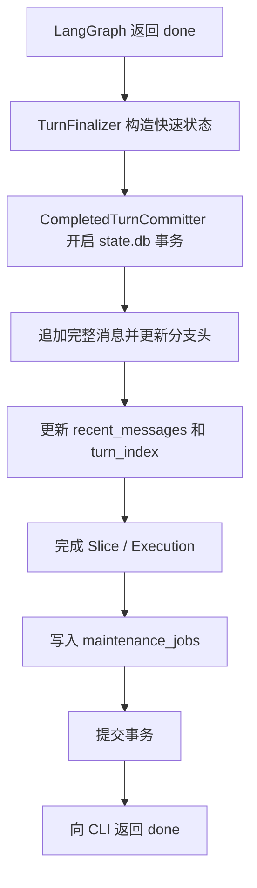
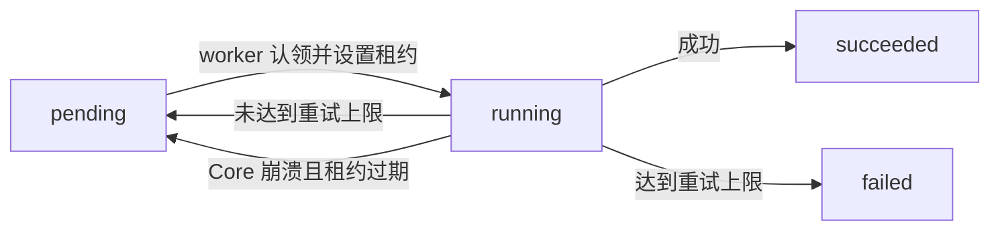

# 本地数据库设计与一致性机制

> 文档状态：Current
> 权威范围：本地数据库职责、Schema、事务边界和跨库一致性
> 维护触发：状态表、Schema migration、事务或恢复机制变化

本文说明当前项目为什么使用两个 SQLite 数据库、每张核心表负责什么、一次对话如何可靠提交，以及
Core 崩溃后如何恢复。阅读本文不要求预先了解数据库事务或分布式系统。

相关文档：

- [本地优先 Session 状态](/docs/architecture/local-first-session-state.md)：从 Session、消息和分支角度介绍数据模型。
- [最终响应、后台维护与 Checkpoint 一致性](/docs/architecture/response-finalization-and-checkpoint-consistency.md)：
  从一次请求的时间顺序介绍响应收尾。
- [记忆管理与加载机制](/docs/architecture/memory-management.md)：介绍短期上下文和长期记忆。
- [可恢复执行与预算控制](/docs/architecture/resumable-execution.md)：介绍 Execution、Grant、Slice 和 checkpoint。

## 本文负责

本文是本地状态层的权威说明，负责回答：

- 为什么 `state.db` 和 `checkpoints.db` 分离。
- Session、消息、Execution、记忆、维护任务和 checkpoint 的存储关系。
- 成功 Turn 为什么必须经过最小事务提交。
- Outbox、CAS、Saga、恢复协调器这些一致性概念在项目中如何落地。

## 本文不负责

本文不解释 Agent 如何决定下一步、工具如何执行、RPC 如何传输或 CLI 如何渲染。

工具审批的权威请求、作用域规则和审计记录保存在 `state.db`。LangGraph checkpoint 保存暂停位置；`tool_approval_requests` 保存用户需要理解和处理的业务事实。两者缺一不可：只有审批行而没有 checkpoint 时不能恢复执行，只有 checkpoint 而没有审批行时前端不能安全确认调用身份。详见 [Tool 安全、审批与 Hook 架构](/docs/architecture/tool-security-and-approval.md)。

- Agent 循环和工具调用见 [Agent 执行架构](/docs/architecture/agent-execution-architecture.md)。
- Core 进程生命周期见 [CoreApp 与 Transport 架构](/docs/architecture/core-architecture.md)。
- 对外 RPC 与事件字段见 `/docs/api/`。
- 设计选择的历史原因见 `/docs/decisions/`。

## 1. 先理解几个术语

### 1.1 业务事实

业务事实是系统已经确认发生、不能随意丢失的数据。例如：

- 用户和 AI 的完整消息。
- Session 已成功完成到第几轮，即 `turn_index`。
- 当前消息分支的头节点。
- 一次 Execution 已完成或仍可恢复。

摘要和长期记忆不是原始业务事实。它们是从完整消息计算出来的派生数据，失败后可以重试生成。

### 1.2 权威来源

权威来源表示发生数据冲突时应该相信哪一份数据。

当前项目规定：

```text
state.db 是 Session、消息、分支、长期记忆和 Execution 元数据的权威来源。
checkpoints.db 是 LangGraph 图执行断点的权威来源。
PostgreSQL 和 Telemetry 都不是普通对话状态的权威来源。
```

### 1.3 原子事务

原子事务可以理解为“全部成功，或者全部不发生”。

一次成功 Turn 需要同时保存消息、更新 Session、完成 Execution、写入后台任务。如果中间任一步失败，
整个 `state.db` 事务会回滚，Core 不会向客户端返回成功。这样不会产生“AI 已回答，但历史记录中没有
这轮消息”的半完成状态。

### 1.4 Unit of Work

Unit of Work，中文可理解为“工作单元”，用于把一次业务操作涉及的多个数据库修改放进同一个事务。

本项目中的 `CompletedTurnCommitter` 通过 `StateUnitOfWorkFactory` 执行一次成功 Turn 的 Unit of Work：

```text
CompletedTurnCommitter.commit()
  -> 追加完整消息
  -> 更新 Session 和分支头
  -> 完成 Slice / Execution
  -> 写入后台维护任务
  -> 一次性提交
```

`AgentServiceLifecycle` 也只通过 `StateInitializer` 请求 schema 初始化，具体由
`LocalStateDatabase` 实现，不再构造完整状态 facade。

`CompletedTurnCommitter` 只依赖 `src/core/ports/` 中的端口，不直接依赖 SQLite。当前 SQLite
实现位于 `src/core/adapters/sqlite/`。这样后续可以替换会话历史或维护队列实现，而不改 Turn 提交流程。

当前 adapter 拆分只改变依赖边界，不改变写入语义：

- `SQLiteConversationHistoryStore` 负责读取历史消息和重建近期上下文。
- `SQLiteSessionStore` 负责读取 Session 上下文，并在 Unit of Work 内委托 fast context 更新。
- `SQLiteSessionLifecycleStore` 负责 Session 身份查找、归档、硬删除、checkpoint thread 查询和近期历史重建；应用服务不直接访问 Workspace repository 或 SQLite 表。
- `SQLiteMemoryRetrievalStore` 负责长期记忆召回。
- 前台 `ConversationContextLoader` 直接依赖 Session 与 Memory 小端口，`TurnExecutionLoop` 不再为每轮创建 `LocalStateStore` 兼容 facade。
- `messages.raw` 的序列化、`messages.parent_message_id` 链接、分支头更新和 execution 关联仍由原 SQLite 写入路径保证。

也就是说，本轮拆分不会改变“成功 turn 必须先完整写入 `state.db` 才返回 done”的耐久性边界。未来如果替换会话历史后端，新后端必须通过同一组 contract tests 证明消息顺序、raw 结构和 turn 原子提交语义没有变化。

### 1.5 Transactional Outbox

Transactional Outbox，中文可理解为“与业务状态一起提交的待办箱”。

如果先提交对话，再把“稍后生成摘要”放进内存队列，Core 可能在两步之间崩溃，摘要任务会永久丢失。
当前实现把待办任务写入 `state.db.maintenance_jobs`，并与对话状态使用同一个事务提交：

```text
对话提交成功 <=> 后台待办也已经可靠保存
```

后台工作可以晚一点执行，但不会只存在于内存中。

### 1.6 CAS

CAS 是 Compare-And-Set 的缩写，中文可理解为“比较后再更新”。

后台摘要任务开始时会记住 Session 当时的 `active_context_window_id`。写回摘要时，SQL 会检查当前
active window 是否仍然与开始时相同：

```text
如果仍相同：说明没有更新的摘要窗口抢先写入，可以创建下一代窗口。
如果不相同：说明当前任务已经过时，放弃写入。
```

因此，较慢的旧摘要任务不能覆盖较新的摘要结果。这里比较的是上下文窗口血统，而不是时间戳。

时间戳适合审计“某次写入大约何时发生”，不适合判断“这份摘要是否基于最新业务状态”。系统时间可能
调整，多个任务也可能落在同一时间精度内；`context_windows.previous_window_id` 和
`sessions.active_context_window_id` 则直接表达摘要演进关系。

### 1.7 Saga / 恢复协调器

Saga 是一种跨多个独立存储协调业务流程的方法。它不假装多个数据库可以共享一个事务，而是：

1. 在权威数据库中记录当前状态。
2. 将跨库操作设计为可重复执行的幂等操作。
3. 启动时检查中间状态并继续补偿或修复。

本项目的 `ExecutionRecoveryCoordinator` 就是恢复协调器。它在 Core 启动时对照 `state.db` 中的
Execution 状态和 `checkpoints.db` 中的真实 checkpoint，修复崩溃留下的中间状态。

### 1.8 最终一致

最终一致表示两个数据库在短时间内可能不一致，但恢复协调器和后台任务会让它们最终收敛。

例如，Turn 已经完成，但旧 checkpoint 尚未删除。这不会改变对话已经成功的事实；后台清理任务稍后
删除 checkpoint，并把 `checkpoint_state` 更新为 `cleaned`。

## 2. 为什么使用两个 SQLite 数据库

默认数据目录由 `src/config/paths.py` 决定，可以通过 `LEARN_AGENT_STATE_DIR` 覆盖：

```text
learn-agent/state/
  state.db
  checkpoints.db
  artifacts/
  telemetry/
```

两个数据库的职责不同：

| 数据库 | 拥有者 | 保存内容 | 主要用途 |
|---|---|---|---|
| `state.db` | 本项目业务代码 | Session、消息、分支、记忆、Execution、维护任务 | 回答“用户的对话和任务现在是什么状态” |
| `checkpoints.db` | LangGraph `SqliteSaver` | 图节点执行断点 | 回答“未完成的图应该从哪里继续” |

不把 checkpoint 表直接并入 `state.db`，原因是：

- LangGraph Checkpointer 有自己的表结构、连接和提交边界。
- 即使物理上使用同一个文件，只要使用不同连接和事务，也不会自动成为一个原子事务。
- 自研 Checkpointer 会增加与 LangGraph 升级兼容的长期维护成本。

因此当前选择是：保留清晰的职责边界，并用 Saga 恢复协调两个数据库。

### 2.1 三种“同步”不要混为一谈

项目中存在三类常被统称为“同步”的机制，但它们解决的问题不同：

| 场景 | 机制 | 一致性结果 | 为什么这样选择 |
|---|---|---|---|
| `state.db` 内保存一次 Turn | 单个 SQLite 原子事务 | 提交时立即一致 | 所有修改由项目控制，可以放进同一事务 |
| `state.db` 与 `checkpoints.db` 协调 | Saga、状态记录、幂等补偿和启动对账 | 最终一致 | LangGraph Checkpointer 有独立事务，无法共享原子提交 |
| 未来把本地状态复制到 PostgreSQL | `projection_outbox` 驱动的异步投影 | 延迟副本 | 远程数据库不能重新进入普通对话关键路径 |

因此，“同步到 PostgreSQL”不等于“对话已可靠保存”。对话是否可靠，以 `state.db` 最小事务是否提交
成功为准；PostgreSQL 即使暂时不可用，也不应阻止普通对话。

## 3. 本地状态数据所有权

`state.db` 保存 Workspace、Session、Message、Execution、Memory 和 Maintenance Job 等业务事实。
`checkpoints.db` 只保存 LangGraph 图执行断点。

完整表关系、字段职责、外键、索引和 Session 删除语义统一维护在
[本地状态数据库 Schema 参考](/docs/reference/local-state-schema.md)。

架构层只依赖这些数据所有权结论，不在本文复制字段清单。
## 4. SQLite 连接与事务机制

### 4.1 WAL

WAL 是 Write-Ahead Logging 的缩写，可理解为“先把变更追加到日志，再合并进主数据库文件”。

WAL 允许读取和短写事务更好地并行，但 SQLite 仍然只有一个写者。它降低锁竞争，不会消除锁竞争。
如果文件系统不支持 WAL，项目会降级为 DELETE journal 模式。

### 4.2 `BEGIN IMMEDIATE`

写事务通过 `BEGIN IMMEDIATE` 开始。它会在事务开始时获取写入资格，而不是执行到一半才发现无法写入。
这样失败位置更可预测，也避免事务完成一半后长期等待锁。

### 4.3 `busy_timeout`

如果另一个短事务正在写入，连接最多等待配置的 `busy_timeout`。它用于吸收短暂竞争，不应被理解为
无限等待。后台 handler 不得持有写事务执行 LLM 调用或文件删除等慢操作。

## 5. 一次成功 Turn 如何提交

### 5.1 响应前必须完成的工作



这里的“快速状态”只保留已有摘要和最近消息，不调用摘要 LLM。

### 5.2 为什么 `done` 必须等待这次提交

如果先返回 `done` 再保存消息，Core 在两者之间崩溃时，用户已经看到回答，但历史记录会丢失。因此
最小提交是有意保留的 durability barrier，即“耐久性屏障”：

```text
只有回答已可靠写入 state.db，Core 才能声明本轮成功。
```

### 5.3 为什么摘要和记忆不在事务中执行

摘要和记忆提取需要调用 LLM，耗时和失败概率都远高于本地短事务。它们又可以从完整消息重新生成，
因此适合写成持久化后台任务。这样既不丢任务，也不会让用户等待慢维护操作。

## 6. 后台维护如何可靠执行



### 6.1 租约

租约表示 worker 只在一段时间内拥有任务，而不是永久拥有。如果 Core 在任务执行中崩溃，租约过期后，
下次启动的 worker 可以重新认领该任务。

### 6.2 幂等

幂等表示同一操作执行多次，最终结果与执行一次相同。例如：

- checkpoint 删除允许重复尝试。
- 摘要使用 CAS，过时任务不会覆盖新结果。
- `dedupe_key` 防止同一 Turn 的同类任务重复入队。

没有幂等性，租约恢复和重试可能制造重复数据。

### 6.3 指数退避

任务失败后不会立刻高频重试。等待时间按尝试次数增长，并设置上限。这称为指数退避，用于避免数据库
或模型服务故障时形成持续重试压力。

## 7. 两个 SQLite 数据库如何最终一致

两个数据库不能共享一个事务，因此需要明确处理所有可能的崩溃位置。

| 崩溃时状态 | 启动时判断 | 恢复动作 |
|---|---|---|
| Execution 为 `running`，checkpoint 存在 | 工作可能执行了一部分 | 改为 `paused_recovery`，允许用户恢复 |
| Execution 为活动状态，checkpoint 不存在 | 无法确定图执行位置 | 改为 `unrecoverable_checkpoint`，禁止自动恢复 |
| Execution 已 `completed/discarded`，checkpoint 未清理 | 业务已经结束，只剩清理 | 补建或重试 `checkpoint_cleanup` 任务 |
| checkpoint 已删除，但状态尚未更新 | 清理任务重复执行 | 再次删除并更新为 `cleaned`，结果不变 |

恢复协调器只负责让状态收敛，不会把不可恢复任务伪装成可恢复，也不会因为 checkpoint 清理失败而
撤销已经成功提交的对话。

## 8. Schema 初始化与迁移

`LocalStateDatabase.initialize()` 在 Core 接受请求前执行：

1. 读取 `schema.sql`，使用 `CREATE TABLE IF NOT EXISTS` 创建缺失结构。
2. 在 `local_schema_migrations` 记录基础版本。
3. 执行 `apply_local_migrations()` 中的加法迁移。
4. 任一步失败则回滚整个初始化事务。

当前迁移策略只做加法修改，例如增加字段或表，不删除已有 Session 数据。迁移函数必须可重复执行。

如果数据库版本高于当前代码支持的版本，Core 会拒绝启动。原因是旧代码可能无法理解新结构，继续写入
反而可能损坏数据。

`migrations.py` 中动态拼接的表名、列名和声明全部来自代码内静态常量，不接受用户输入；业务值仍应
通过 SQL 参数绑定传入。

## 9. 当前一致性保证与边界

### 已保证

- 成功返回的 Turn 已完整写入 `state.db`。
- 消息、Session、Execution 和维护任务要么一起提交，要么一起回滚。
- 同一 Session 的 Turn 使用 Session UUID 锁串行执行。
- 后台摘要不会用旧结果覆盖新摘要。
- Core 重启后可以重新认领过期维护任务。
- Core 启动时会对账 Execution 与 checkpoint。
- Workspace 复合外键和查询条件保护主要 Session 数据关系；`memory_sources` 消息侧仍需进一步加固。

### 未保证

- `state.db` 与 `checkpoints.db` 不具备跨库原子事务，只能最终一致。
- SQLite 不适合作为多机器、多 Core 实例的高并发协调数据库。
- 当前维护队列只有一个 worker，慢任务可能造成后台积压。
- 长任务租约尚不续期；未来支持多个 Core 实例前需要增加租约心跳。
- 成功维护任务尚未自动清理，长期运行需要保留策略。
- PostgreSQL 投影 worker 尚未实现，`projection_outbox` 只是预留入口。
- `memory_sources` 消息侧尚未使用 `workspace_id + message_id` 复合外键，当前依赖应用层传入同一
  Workspace 的来源消息。

## 10. 代码与测试入口

| 关注点 | 代码 |
|---|---|
| Schema 与索引 | `src/core/state/schema.sql` |
| 连接、WAL 和事务 | `src/core/state/database.py` |
| 加法迁移 | `src/core/state/migrations.py` |
| Session、消息和记忆 | `src/core/state/store.py` |
| Execution 状态 | `src/core/state/executions.py` |
| Execution 只读查询 | `src/core/state/execution_queries.py` |
| Execution checkpoint 恢复状态 | `src/core/state/execution_checkpoints.py` |
| Execution Slice 与预算计数 | `src/core/state/execution_slices.py` |
| LangGraph checkpoint | `src/core/state/checkpoints.py` |
| PostgreSQL 到本地状态迁移编排 | `src/core/state/migration.py` |
| 迁移前源库计数检查 | `src/core/state/migration_inspector.py` |
| 迁移后源库清理 | `src/core/state/migration_pruner.py` |
| 最小 Turn 提交 | `src/core/finalization/committer.py` |
| 后台任务仓储与调度 | `src/core/maintenance/repository.py`、`scheduler.py` |
| 恢复协调器 | `src/core/maintenance/recovery.py` |

关键测试：

- `tests/integration/test_finalization_and_maintenance.py`：原子提交、任务租约/重试、CAS、Schema 迁移和恢复对账。
- `tests/integration/test_local_state.py`：Session、Execution、Slice 和 checkpoint 恢复。
- `tests/optional/test_memory_store.py`：真实 PostgreSQL 下的 Workspace 隔离、记忆来源和 Session 状态。
