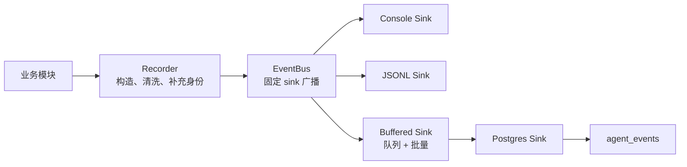

# Event 系统设计与维护指南

> 文档状态：Current
> 权威范围：Telemetry Event、EventBus、Recorder 和 Sink 设计
> 维护触发：Telemetry 模型、订阅、缓冲或 Sink 生命周期变化

> 本文解释领域 Telemetry Event。跨 IPC、Agent、LLM 和 Tool 的统一排障时间线见
> [`/docs/architecture/system-tracing.md`](/docs/architecture/system-tracing.md)。Trace 不替代 Telemetry，Telemetry 也不是业务状态的
> 权威来源。

本文只解释事件系统。Agent 的完整执行链见
[`/docs/architecture/agent-execution-architecture.md`](/docs/architecture/agent-execution-architecture.md)。
延迟、故障隔离和性能验收要求见
[`/docs/quality/non-functional-requirements.md`](/docs/quality/non-functional-requirements.md) 与
[`/docs/quality/non-functional-testing.md`](/docs/quality/non-functional-testing.md)。

## 1. 为什么项目有两条事件通道

项目中的“事件”有两种不同用途，不能由同一条总线承担：

| 通道 | 用途 | 消费者 | 生命周期 | 是否持久化 |
|---|---|---|---|---|
| Response Event | 实时展示当前请求的 token、step、error、done | 当前 CLI 客户端 | 单次 JSON-RPC 请求 | 否 |
| Telemetry Event | 审计、诊断、性能分析和故障排查 | PostgreSQL、JSONL、控制台 | Core 进程 | 可配置 |

客户端断开后，Response Event 停止发送，但已经开始的 Agent Turn 继续执行并产生
Telemetry Event。

## 2. 一条 Telemetry Event 如何流转

以工具调用开始事件为例：

```text
ObservedToolNode
  -> record_tool_started(...)
  -> emit_event(...)
  -> 读取当前 TelemetryContext
  -> 清洗和截断 payload
  -> 创建 TelemetryEvent
  -> EventBus.publish(...)
  -> BufferedEventSink
  -> PostgresEventSink.emit_batch(...)
  -> agent_events 表
```

对应代码：

| 步骤 | 实现 |
|---|---|
| 工具边界记录 | `src/core/tools/observed.py` |
| 领域事件 payload | `src/core/telemetry/domain.py` |
| 事件创建与发布 | `src/core/telemetry/recorder.py` |
| 身份传播 | `src/core/telemetry/context.py` |
| 广播与失败隔离 | `src/core/telemetry/bus.py` |
| 缓冲及持久化 | `src/core/telemetry/sinks.py` |
| 进程级组装 | `src/core/telemetry/factory.py`、`src/core/app.py` |



## 3. 组件职责

### TelemetryContext

`TelemetryContext` 描述事件属于哪一次执行：

| 字段 | 含义 |
|---|---|
| `workspace_id` | 事件所属 Workspace |
| `session_id` | 事件所属 Session |
| `turn_index` | Session 中的 Turn 序号 |
| `run_id` | 单次运行 ID |

上下文通过 `ContextVar` 传播。进入 Turn 或后台任务时绑定，离开时必须使用 token 恢复，
避免线程复用导致身份泄漏。

### TelemetryEvent

所有观测事件使用统一信封：

| 字段 | 含义 |
|---|---|
| `event_type` | 稳定的事件名称，例如 `tool_started` |
| `source` | 产生事件的模块 |
| `message` | 面向排障人员的简短说明 |
| `payload` | 已清洗、已截断的结构化详情 |
| `level` | `info` 或 `error` 等级 |
| `duration_ms` | 可选耗时 |
| `created_at` | UTC 创建时间 |

统一信封避免为每种事件建立大量模型类。重复出现且需要固定 payload 结构的事件，应在
`domain.py` 中提供 Helper。

### EventBus

`EventBus` 只负责固定 Sink 广播、flush 和 close：

```text
publish(event)
  -> sink A
  -> sink B
  -> sink C
```

任意 Sink 失败只输出调试信息，不改变 Agent 业务结果。业务逻辑不得依赖 Sink 调用顺序。

### Sink

| Sink | 行为 | 可靠性与代价 |
|---|---|---|
| `NoopEventSink` | 丢弃事件 | 用于禁用或测试 |
| `ConsoleEventSink` | 输出调试信息 | 不持久化 |
| `JsonlFileEventSink` | 每个事件追加一行 JSON | 简单，但高频事件会产生文件 IO |
| `PostgresEventSink` | 同步写入一个事件批次 | 复用 Core 共享连接池 |
| `BufferedEventSink` | 后台队列聚合后写入下游 Sink | 降低请求延迟，但进程崩溃或队列满时可能丢失事件 |

`BufferedEventSink` 与 PostgreSQL 解耦。它负责并发和批处理；`PostgresEventSink` 只负责
数据库写入。

## 4. 生命周期

事件基础设施只能由 `CoreApp` 组装和关闭，业务模块不能隐式创建数据库连接：

```text
CoreApp.__init__
  -> create_pool()
  -> create_event_bus(shared_pool)

CoreApp.start()
  -> install_event_bus(bus)

CoreApp.close()
  -> Agent service close
  -> install_event_bus(None)
       -> EventBus.close()
       -> BufferedEventSink.close()
       -> flush queue
  -> shared pool close
```

这保证事件队列在共享数据库连接池关闭前完成写入。

## 5. 如何记录事件

普通业务事件使用低层入口：

```python
from src.core.telemetry import emit_event

emit_event(
    "context_loaded",
    "agent_service",
    payload={"message_count": 8},
)
```

需要统一 payload 的重复领域事件使用 Helper：

```python
from src.core.telemetry import record_tool_started

record_tool_started("tool_node", tool="read_workspace_file", tool_call_id="call-1")
```

需要记录开始、完成、失败和耗时的简单操作使用 span：

```python
from src.core.telemetry import event_span

with event_span("memory_extract", "memory_store"):
    extract_memories()
```

## 6. 如何新增事件或 Sink

新增事件时：

1. 确认事件用于持久化观测，而不是当前请求的实时显示。
2. 优先调用 `emit_event()`。
3. 只有多个模块需要相同 payload 时，才在 `domain.py` 添加 Helper。
4. 不得保存完整 prompt、密钥、完整文件内容或完整工具输出。
5. 为固定 payload 和失败语义增加测试。

新增 Sink 时：

1. 实现 `emit()`、`flush()` 和 `close()`。
2. Sink 异常不得传播到 Agent 业务链路。
3. 在 `factory.py` 中由配置决定是否组装。
4. 阻塞或高延迟 Sink 应包装在 `BufferedEventSink` 中。

## 7. 当前可靠性边界

- Telemetry 是 best-effort 观测，不是业务事务日志。
- 队列满时新事件会被丢弃并输出调试信息。
- Core 进程被强制终止时，未刷新的队列事件可能丢失。
- `agent_events` 写入失败不会让 Agent Turn 失败。
- 事件 payload 会按敏感字段名称脱敏，并按配置限制长度。
- `src/core/hooks` 目前仅作为旧导入路径兼容层，新代码不得继续依赖它。

如果未来事件承担计费、审批或合规审计，应改用持久消息队列或事务 Outbox，不能继续依赖
当前 best-effort 内存队列。
