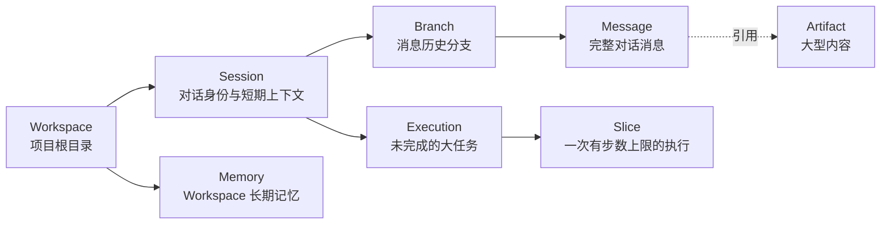

# 本地优先 Session 状态设计

> 文档状态：Current
> 权威范围：本地优先 Session 状态、响应关键路径和后台派生处理
> 维护触发：Session 权威状态、提交时机或后台维护边界变化

## 本文负责

- Session、Message、Branch 和本地权威状态之间的领域关系。
- 普通 Turn 响应关键路径与后台派生状态的边界。

## 本文不负责

- 不维护完整 Schema 字段；见本地状态 Schema 参考。
- 不解释跨库 Saga 细节；见数据库一致性文档。


关于为什么从对话卡顿问题引出本地优先设计、SQLite 不能保证无卡顿、当前真实关键路径和设计原则审查，见
[`/docs/decisions/local-first-rationale-and-review.md`](/docs/decisions/local-first-rationale-and-review.md)。

如果需要理解数据库表、外键、事务、WAL、Unit of Work、Transactional Outbox、CAS、Saga 和恢复协调器，
请先阅读 [`/docs/architecture/database-state-and-consistency.md`](/docs/architecture/database-state-and-consistency.md)。本文只从 Session 和消息
组织方式说明数据模型。

## 优化目标

本轮优化首先解决三个实际问题：

1. 普通对话不应因为远程数据库写入而卡住。
2. Core 重启后，Session 历史、短期上下文和长期记忆不能丢失。
3. 后续需要支持对话分支、历史版本和大内容管理，数据模型不能只是一张线性消息表。

因此，系统将用户机器上的 SQLite 作为业务状态的权威来源。这里的“权威来源”是指：当本地状态与其他副本不一致时，以本地 SQLite 为准。

PostgreSQL 不再是普通对话必须依赖的组件。它可以在未来用于跨设备同步、分析查询或服务端投影，但不能阻塞本地对话。

最终响应、持久化后台维护和两个 SQLite 数据库的恢复一致性见
[`/docs/architecture/response-finalization-and-checkpoint-consistency.md`](/docs/architecture/response-finalization-and-checkpoint-consistency.md)。

## 文件布局

默认数据位于操作系统提供的用户数据目录：

```text
learn-agent/
  state/
    state.db          # Session、消息、长期记忆、执行记录
    checkpoints.db    # LangGraph 执行断点
    artifacts/        # 大型工具结果或文件内容
    telemetry/
      events.db       # 默认结构化 Telemetry，保留期可配置
      events.jsonl    # 可选 JSONL 兼容输出
```

可使用 `LEARN_AGENT_STATE_DIR` 覆盖 `state/` 所在目录。

`state.db` 和 `checkpoints.db` 分离的原因是职责不同：

- `state.db` 保存用户可理解的业务事实，例如消息、记忆和 Session。
- `checkpoints.db` 保存 LangGraph 内部恢复执行所需的状态。
- `telemetry/events.db` 保存 best-effort 诊断事件；它不参与恢复，并通过独立写锁避免影响业务提交。
- 即使以后替换 LangGraph，也不需要重写 Session 数据模型。

## 主要数据结构

下面的结构图表达“谁属于谁”，不表达事务提交顺序。一次 Turn 如何原子提交，以及两个 SQLite 数据库
如何恢复一致，请参阅[本地数据库设计与一致性机制](/docs/architecture/database-state-and-consistency.md)。



### Session 与 Branch

Session 是用户看到的对话，例如 Workspace 中的 `default`。Session 使用内部 UUID 标识，因此不同 Workspace 都可以拥有自己的 `default`。

Session 支持两种清理方式：

- 归档：默认的 `session.delete` 行为。系统设置 `sessions.archived_at`，让该 Session 不再接受新的
  `chat/resume/discard`，但保留完整消息、Execution、任务计划和维护记录。
- 硬删除：显式传入 `--hard` 时才执行。系统删除 `sessions` 行，并通过数据库外键级联删除关联的本地状态。

归档适合“这个会话不再使用，但以后可能还要查历史”的场景；硬删除适合“确认不再需要任何相关内容”的场景。
详细表结构和级联边界见[本地数据库设计与一致性机制](/docs/architecture/database-state-and-consistency.md)。

Branch 表示消息历史的一条分支。目前每个 Session 自动创建 `main` 分支。表结构已经为“从历史消息派生新分支”预留了：

- `head_message_id`：当前分支最后一条消息。
- `created_from_message_id`：未来创建分支时的起点。
- `parent_message_id`：消息的直接前驱。

当前 CLI 尚未提供创建和切换分支的命令。

### 完整历史与短期上下文

两者不能混为一谈：

- `messages` 保存完整消息历史，用于恢复、审计和未来分支操作。
- `sessions.summary + recent_messages` 是发送给模型的有限上下文。

上下文压缩只改变 Session 的有限上下文，不删除完整消息历史。

### Artifact

Artifact 是大型内容的独立存储。它使用内容哈希去重，并压缩写入 `artifacts/`。

这样设计是为了避免把几十万字符的文件内容或工具结果重复写进消息、事件和数据库。当前已实现 Artifact 存储、引用和显式垃圾回收：

```powershell
learn-agent-core gc-artifacts
```

大型消息和工具结果自动转为 Artifact 引用仍属于后续工作；当前不能假设所有大内容都已经自动外置。

## 一轮对话如何保存

配置模型后，一轮成功对话按以下顺序执行：

1. Core 根据 Workspace 路径解析 Session。
2. 获取 Session UUID 对应的锁，避免同一 Session 并发覆盖。
3. 从 `state.db` 加载摘要、近期消息和长期记忆。
4. 执行 Agent。
5. `CompletedTurnCommitter` 在一个 SQLite 事务中追加消息、更新 Session 和 Execution，并写入维护任务。
6. 返回最终响应。
7. `MaintenanceScheduler` 在后台执行摘要、长期记忆提取和 checkpoint 清理。

第 5 步是响应前的最小耐久性屏障。消息、Session、Execution 和维护任务要么全部成功，要么
全部回滚，避免出现“回答已声明成功但消息未保存”或“Execution 已完成但清理任务丢失”的半完成状态。

SQLite 使用 WAL 模式。WAL 可简单理解为“先把变更追加到日志，再合并到主文件”，它允许读操作与短写事务更好地并行。受限文件系统不支持 WAL 时会降级为 DELETE journal 模式。

WAL 不是异步保存，也不能让 SQLite 同时执行多个写事务。真正缩短响应延迟的是：响应前只执行短小的
最小业务事务，把摘要、记忆提取和 checkpoint 清理移到持久化后台任务。

## PostgreSQL 投影边界

`projection_outbox` 表预留了把本地业务变化投影到 PostgreSQL 的入口。投影是“从权威数据生成可查询副本”的过程。

当前状态：

- 本地 SQLite 已是 Session、消息和记忆的权威来源。
- PostgreSQL Telemetry 可选，默认关闭。
- 完整业务投影 worker 尚未实现。
- `LEARN_AGENT_POSTGRES_PROJECTION_ENABLED` 默认关闭；关闭时不会累积无消费者的 outbox。
- 开启该配置只会记录待投影事实，不代表已经同步到 PostgreSQL；在投影 worker 实现前不应开启。

该边界避免为了追求“双写”而重新把远程数据库延迟带回普通对话路径。

测试边界与尚未自动化的故障场景见
[`/docs/quality/local-first-testing.md`](/docs/quality/local-first-testing.md)。

## 当前限制

- 最终响应仍等待一次短小的 `state.db` 原子提交；磁盘异常或长写锁仍可能延迟响应。
- 上下文摘要、长期记忆提取和 checkpoint 清理已在后台执行，但当前只有一个维护 worker。
- `state.db` 与 `checkpoints.db` 采用恢复协调实现最终一致，不提供跨库原子事务。
- 大型消息尚未自动转为 Artifact。
- Branch 数据结构已存在，但 CLI 尚无分支命令。
- SQLite 是单机用户级状态，不提供多设备实时一致性。
