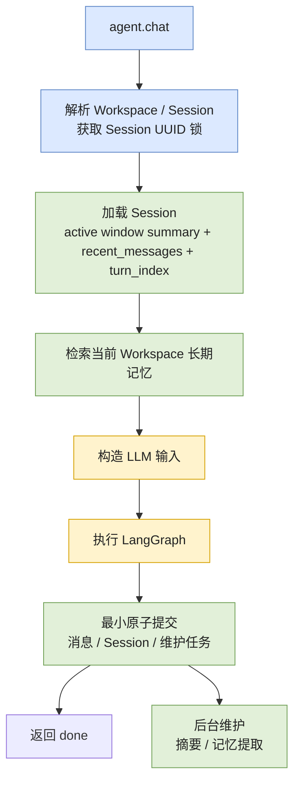

# 记忆管理与加载机制

> 文档状态：Current
> 权威范围：完整消息、短期上下文、长期记忆的生成、保存和加载
> 维护触发：记忆策略、检索、摘要或相关状态表变化

本文中的完整消息、Session 上下文和长期记忆都存储在 `state.db`。数据库表、事务边界、维护任务和
跨 `state.db` / `checkpoints.db` 的一致性机制见
[`/docs/architecture/database-state-and-consistency.md`](/docs/architecture/database-state-and-consistency.md)。

## 本文负责

- 完整消息、短期上下文和长期记忆三者的领域职责。
- 每轮上下文与记忆如何加载、压缩、提取和注入。
- Workspace 记忆隔离、触发策略、过滤和保存规则。

## 本文不负责

- 不维护数据库表、字段、外键或索引；见 [本地状态数据库 Schema 参考](/docs/reference/local-state-schema.md)。
- 不维护后台任务、Outbox、CAS 和跨库一致性通用规则；见数据库一致性架构文档。
- 不维护完整事件字段清单；见 [Telemetry Event 系统](/docs/architecture/event-system.md)。
- 不维护产品路线图；见 [路线图与已知限制](/docs/product/roadmap-and-known-limitations.md)。

## 三类数据不能混为一谈

当前项目将记忆相关数据分为三层：

| 数据 | 存储位置 | 用途 | 是否直接加载给 LLM |
|---|---|---|---|
| 完整消息归档 | `state.db.messages` | 历史审计、来源追踪、未来恢复 | 否 |
| Session 短期上下文 | `state.db.context_windows.summary_text`、`sessions.recent_messages` | 构造当前 Session 的有限输入窗口 | 是 |
| Workspace 长期记忆 | `state.db.memories` | 跨 Session 保存稳定事实、偏好和决策 | 按需检索后注入 |

完整消息归档负责“不能丢”；短期上下文负责“当前模型需要看什么”；长期记忆负责“未来其他
Session 仍值得知道什么”。完整历史不会在每轮全部发送给模型，否则输入会持续膨胀，并增加
成本、延迟和模型失准风险。

## 隔离模型

记忆的默认边界是 Workspace：

```text
Workspace
  ├── Session A
  │    ├── active context window
  │    ├── recent_messages
  │    └── 完整消息归档
  ├── Session B
  │    ├── active context window
  │    ├── recent_messages
  │    └── 完整消息归档
  └── 长期记忆
       └── 可被 A、B 检索，但不能被其他 Workspace 检索
```

- 短期上下文和完整消息归档绑定 `workspace_id + session_id`。
- 长期记忆绑定 `workspace_id`，同一 Workspace 的新 Session 可以继承相关项目知识。
- 当前没有跨 Workspace 的全局用户记忆。
- `memory_sources` 的记忆侧使用 Workspace 复合外键；消息侧当前只校验全局唯一 `message_id`。
  正常写入路径只使用当前 Session 的来源消息，但数据库层尚未完全强制消息来源属于同一 Workspace。

## 数据归属

记忆相关数据的所有权保持不变：

- 完整消息和短期上下文绑定 Session。
- 长期记忆绑定 Workspace，可被同一 Workspace 的多个 Session 检索。
- 记忆来源关联已提交消息，用于审计提取依据。

完整表关系、字段和约束统一维护在
[本地状态数据库 Schema 参考](/docs/reference/local-state-schema.md)。
## 每轮如何加载

### 正常 Agent Turn



构造给模型的消息顺序是：

```text
active context window 的 summary_text（如果存在）
  -> 本轮检索到的 Workspace 长期记忆（如果存在）
  -> recent_messages 最近若干条
  -> 当前用户消息
```

长期记忆以合成 `SystemMessage` 注入，只存在于本轮模型输入中。更新短期上下文时会移除该合成
消息，不会反复写入 `recent_messages` 或完整消息归档。

### 新 Session 的 Bootstrap Memory

新 Session 第一轮没有历史上下文，只按当前问题做关键词检索可能漏掉重要项目背景。因此第一轮
会合并：

- 当前 Workspace 最多 `MEMORY_BOOTSTRAP_LIMIT=4` 条高重要度近期记忆。
- 最多 `MEMORY_RETRIEVAL_LIMIT=6` 条与当前问题相关的记忆。

结果按记忆 ID 去重，并受 `MEMORY_CONTEXT_CHAR_LIMIT=6000` 总字符限制。后续轮次只检索与当前
问题相关的记忆，不再加载 bootstrap 集合。

当前实现通过 `turn_index == 0` 判断新 Session。无 LLM 诊断请求不会递增 `turn_index`，因此
无论重复诊断多少次，首次真实 LLM Turn 仍会触发 bootstrap memory。

### 无 LLM 配置诊断 Turn

没有配置模型 API 密钥时，系统仍会解析或创建 Workspace 和 Session，并读取 Session 来验证
数据库链路。该路径允许首次访问时创建 Workspace/Session 行并记录诊断事件，但不会归档诊断
消息、更新 Session 对话状态、递增 `turn_index`、检索或提取长期记忆，也不会执行上下文总结。
诊断事件使用独立的 `diagnostic_started/diagnostic_finished` 类型，不会污染真实 Agent Turn
的事件统计。

## 短期上下文管理

`AgentContextState` 仍向上层暴露两个核心值：

```python
summary: str
recent_messages: list
```

但 `summary` 的权威来源已经不是 `sessions.summary`，而是 `sessions.active_context_window_id`
指向的 `context_windows.summary_text`。`sessions.summary` 只保留为兼容缓存。这样每次压缩都会留下
一个新的不可变窗口，旧摘要不会被覆盖，后续可以追溯压缩血统。

### 压缩触发与后台执行

满足任一条件时触发上下文总结：

- 未压缩 Turn 数大于 `SUMMARY_TRIGGER_TURN_LIMIT=40`。
- 总内容字符数大于 `SUMMARY_TRIGGER_CHAR_LIMIT=24000`。
- 调用方显式要求强制总结。

成功 Turn 会在最小提交中写入一个 `context_summary` 维护任务。后台 handler 达到任一阈值时才调用
摘要模型：

- 旧消息压缩到最多 `SESSION_SUMMARY_MAX_CHARS=4000` 字符的 `summary_text`。
- 最近 `RECENT_TURN_LIMIT=12` 个完整 Turn 继续保留原文；一个 Turn 可以包含 user、assistant 和多条 tool message。
- 发给总结模型的来源文本最多 `SUMMARY_SOURCE_CHAR_LIMIT=12000` 字符。
- 摘要结果写入新的 `context_windows` 行，并推进 `sessions.active_context_window_id`。

这里的 CAS 是“比较后再更新”。摘要任务开始时记录旧的 active window；写回时要求
`sessions.active_context_window_id` 仍然等于旧窗口 ID。如果其他任务已经生成更新窗口，本次写回会失败并放弃，
而不是用完成时间更晚的旧任务覆盖新结果。它比较的是上下文窗口血统，不是时间戳。

如果总结失败，任务会有限重试并保留之前的 active window。完整消息始终保留在 `messages`；在摘要任务
完成前，模型只会看到旧窗口摘要和近期消息。

## 长期记忆如何加载

当前使用 `state.db` 中的轻量关键词检索，不使用 embedding：

1. 将问题规范化为最多 20 个中英文词元。
2. 读取当前 Workspace 未归档的记忆，并按重要度、更新时间排序。
3. 使用规范化词元对记忆内容做包含匹配。
4. 所有查询必须包含 `workspace_id`。

对于明确回忆问题，如果关键词检索没有结果，会退回当前 Workspace 的高重要度近期记忆。

当前关键词策略对语义改写不敏感。未来可增加 pgvector 混合检索，但仍必须保留 Workspace
过滤、去重和字符预算。

## 长期记忆如何产生

### 提取触发策略

系统不会每轮都调用 LLM 提取长期记忆。满足任一条件才触发：

- 用户明确要求记住，命中 `MEMORY_EXTRACTION_HINT_KEYWORDS`。
- 当前轮次是每 `MEMORY_EXTRACTION_INTERVAL_TURNS=5` 轮一次的周期轮次。
- 本轮消息总字符数达到 `MEMORY_EXTRACTION_MIN_CHARS=1200`。

普通短轮次会跳过提取，避免浪费模型调用。

### 持久化后台提取

- 用户明确要求“记住”、周期触发和大内容触发都写入 `maintenance_jobs`。
- 任务与本轮消息、Session 和 Execution 在同一个 `state.db` 事务中入队。
- CLI 对显式记忆请求返回 `memory_status=pending`，不能声称已保存成功。
- `MemoryExtractionHandler` 从已提交的 Turn 消息读取来源，提取并保存记忆。
- 任务失败会有限重试；Core 重启后可重新认领过期租约。

### 候选过滤与保存

提取模型只应返回稳定的用户偏好、项目事实、架构决策、任务状态或可复用排障记录。保存前还会：

- 丢弃空内容和低于 `MEMORY_MIN_IMPORTANCE=3` 的候选。
- 拒绝看起来包含 API key、密码、token、`.env` 等敏感信息的候选。
- 在同一 Workspace、同一 `kind` 内按完整内容或前 160 字符查找相似记忆。
- 相似记忆存在时更新，不存在时创建。
- 在同一数据库事务中写入记忆及来源关系。
- 数据库提交成功后才发布 `memory_saved` 事件。

## 事件与可观测性

记忆检索、提取、保存、失败以及上下文摘要都会发布 Telemetry Event，并继承当前
`workspace_id / session_id / turn_index / run_id` 上下文。

事件名称、payload 白名单、Sink 和可靠性边界统一维护在
[Telemetry Event 系统](/docs/architecture/event-system.md)。本篇只规定：`memory_saved` 必须在记忆事务
提交成功后发布，观测事件不能成为业务成功条件。

## 持久化与恢复边界

Core 重启后会从 `state.db` 重新加载 Session 的摘要、近期消息、轮次和当前 Workspace 的长期记忆，
不依赖进程内消息列表。完整消息仍保存在消息归档中。

成功 Turn 的消息、近期上下文和维护任务必须原子提交；摘要和长期记忆允许后台滞后并重试。
通用事务、checkpoint 和恢复规则见
[本地数据库设计与一致性机制](/docs/architecture/database-state-and-consistency.md)。

当前未支持的全局记忆、语义检索、记忆管理命令和冲突衰减策略统一登记在
[路线图与已知限制](/docs/product/roadmap-and-known-limitations.md)，本篇不再维护独立路线图。

## 代码入口与测试

| 关注点 | 主要实现 |
|---|---|
| 单轮上下文与记忆装配 | `src/core/context/loader.py::ConversationContextLoader` |
| 前台记忆读取端口 | `src/core/ports/state.py::MemoryRetrievalStore` |
| SQLite 记忆召回 adapter | `src/core/adapters/sqlite/memory_store.py::SQLiteMemoryRetrievalStore` |
| SQLite 记忆写入 adapter | `src/core/adapters/sqlite/memory_write_store.py::SQLiteMemoryWriteStore` |
| 摘要策略与执行 | `src/core/context/manager.py`、`summary_policy.py`、`summary_executor.py` |
| 后台摘要与记忆提取 | `src/core/maintenance/handlers.py` |
| 长期记忆提取策略 | `src/core/memory/policy.py`、`extractor.py` |
| 成功 Turn 最小提交 | `src/core/finalization/` |
| Schema 事实 | `src/core/state/schema.sql`、`docs/reference/local-state-schema.md` |

兼容 `LocalStateStore` 仍存在，但不再作为新记忆能力的首选扩展点。新增检索或存储实现应通过
`MemoryRetrievalStore` 等端口接入。

关键测试：

- `tests/unit/test_agent_context.py`：合成长记忆消息不会污染短期历史。
- `tests/optional/test_memory_store.py`：真实 PostgreSQL 下的 Workspace 隔离、bootstrap 和来源外键。
- `tests/unit/test_memory_extraction_policy.py`：长期记忆提取触发策略。
- `tests/integration/test_finalization_and_maintenance.py`：原子提交、后台任务、摘要 CAS 和恢复协调。
