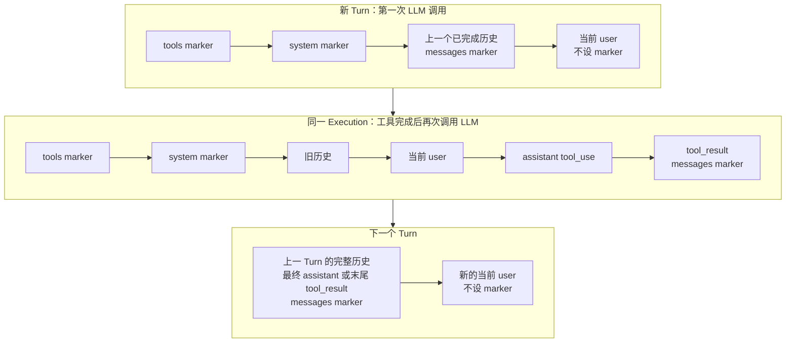

# Anthropic 前缀缓存控制

> 文档状态：Current
> 权威范围：LangChain `ChatAnthropic` 请求中的 `cache_control` 注入、断点移动、缓存观测与排查
> 维护触发：修改 `src/core/llm/prompt_cache.py`、`src/core/llm/provider.py`、缓存配置或 LLM usage 提取逻辑时必须同步更新

## 本文负责

- 说明缓存配置如何进入 `ChatAnthropic` 请求。
- 说明 tools、system 和 messages 三类缓存断点如何选择。
- 说明普通对话、多步工具调用和无 text block 时断点如何移动。
- 说明缓存创建、命中和未命中的判断方法。

## 本文不负责

- 不定义服务商价格、最小可缓存 token 数或缓存 SLA。
- 不定义 Session、checkpoint 或 SQLite 消息格式。
- 不实现本地响应缓存；本文讨论的是模型服务商的 prompt prefix cache。

## 先理解：缓存的是什么

Anthropic 前缀缓存不是“缓存某条回答”，而是缓存请求中某个断点之前的完整稳定前缀。请求顺序可简化为：

```text
tools
  -> system
  -> messages[0]
  -> messages[1]
  -> ...
  -> 当前输入
```

`cache_control` 表示“允许服务商把截至此处的前缀作为缓存边界”。下一次请求只有在该前缀内容和顺序保持一致时，才可能命中。仅添加 marker 不等于已经创建或命中缓存，最终必须查看服务商返回的 cache usage。

<a id="prompt-cache-marker-map"></a>

### 缓存断点如何随 Execution 推进



marker 标记的是“从请求开头到这里”的完整前缀，不是只缓存 marker 所在 block。因此工具循环中
断点落到最新 `tool_result` 后，当前 user、`tool_use` 和 `tool_result` 都包含在缓存前缀内。
Execution 暂停后恢复时，消息从 checkpoint 还原，策略会基于恢复后的完整消息重新计算最深稳定断点。

## 实现调用链

```text
Agent / Summary / Memory
  -> ModelProvider.create_chat_model()
  -> AnthropicProvider
       1. 构造 ChatAnthropic(max_retries=0)
       2. convert_to_anthropic_tool(tools)
       3. PromptCachePolicy.apply_tools()
       4. ChatAnthropic.bind_tools()
  -> PromptCacheRunnable.invoke(messages)
       5. PromptCachePolicy.apply_messages()
       6. ChatAnthropic.invoke()
  -> LlmTraceCallback
       7. 读取 input/output/cache token usage
```

`PromptCachePolicy` 只改写本次请求的副本，不修改数据库消息、LangGraph checkpoint 或 Session 历史。

上下文摘要使用同一缓存注入边界，但采用独立的静态 summary system prompt。上一代摘要、Memory 和
待压缩来源位于 user content，因此一次超大历史的并行 Map 请求可以共享 system 前缀缓存，不能
复用 Parent Agent 的完整消息缓存。压缩成功会使正常 Agent 的旧历史前缀失效一次；新摘要随后成为
新的稳定前缀。完整来源可放入摘要模型窗口时只发起一次摘要请求，不会为了缓存而人为拆块。

## 配置

```text
LEARN_AGENT_PROMPT_CACHE_ENABLED=true
LEARN_AGENT_PROMPT_CACHE_TTL=5m
LEARN_AGENT_PROMPT_CACHE_TOOLS=true
LEARN_AGENT_PROMPT_CACHE_SYSTEM=true
LEARN_AGENT_PROMPT_CACHE_MESSAGES=true
```

- `PROMPT_CACHE_ENABLED` 是总开关。关闭后不注入 marker，也不为缓存改写 content block。
- `PROMPT_CACHE_TTL` 只接受 `5m`、`1h` 或空值。`5m` 是标准缓存时长；`1h` 是 Anthropic 官方扩展缓存并会提高缓存写入费用；空值表示省略 `ttl`，由服务商采用默认值。其他值会在创建缓存策略时被拒绝。
- 其余三个开关分别控制 tools、system、messages。
- 配置在 daemon 启动时读取，修改 `.env` 后需要重启 daemon。

默认 marker：

```json
{"cache_control": {"type": "ephemeral", "ttl": "5m"}}
```

## 唯一 marker 管理者

`PromptCachePolicy` 是项目内唯一的 marker 管理者。每次注入前会递归清除输入副本中已有的 `cache_control`，再按当前策略重建断点。这保证：

- 重试或重复包装不会不断累积 marker。
- 旧 TTL 不会残留。
- tools 中只保留最后一个项目定义的断点。
- system/messages 中只保留当前策略选择的断点。

项目没有安装 LangChain `AnthropicPromptCachingMiddleware`，也不向模型传递顶层 `cache_control`。新增代码不得绕过 `PromptCachePolicy` 自行添加 marker。

## Tools 缓存断点

工具先由 `convert_to_anthropic_tool()` 转成 Anthropic schema。策略清除已有 marker，然后只在最后一个工具 schema 上添加一个 marker：

```json
[
  {"name": "read_file", "input_schema": {}},
  {
    "name": "get_weather",
    "input_schema": {},
    "cache_control": {"type": "ephemeral", "ttl": "5m"}
  }
]
```

因为工具定义位于请求前缀最前面，最后一个工具上的断点覆盖前面全部工具。工具集合、顺序或 schema 变化后，旧工具前缀通常无法命中，需要重新创建缓存。

## System 缓存断点

策略找到第一个 `SystemMessage`：

- 字符串 content 会转换为 `[{'type': 'text', 'text': '...'}]`。
- block list 会保留原字段。
- marker 添加到最后一个允许缓存的 block。

示例：

```json
[
  {
    "type": "text",
    "text": "You are the parent agent...",
    "cache_control": {"type": "ephemeral", "ttl": "5m"}
  }
]
```

System prompt、skill manifest、Workspace 信息或其他被拼入 system 的内容发生变化时，system 前缀也会变化。

## Messages 缓存断点

### 选择规则

1. 如果消息列表最后一条是当前普通 `HumanMessage`，先排除它。
2. 从后向前查找最近一条包含可缓存 block 的非 System 消息。
3. 优先给该消息最后一个非空 text block 添加 marker。
4. 没有 text 时，给最后一个允许的结构化 block 添加 marker。
5. 找不到可缓存消息时，不建立 messages 断点。

这不是“只缓存某条消息”。marker 放在一条消息上，表示缓存从请求开头到该消息的完整前缀。

### 普通多轮对话

第二轮用户输入前：

```text
system       [system marker]
user1
assistant1  [messages marker]
user2       [当前输入，不标记]
```

messages marker 覆盖 `user1 + assistant1`，不会把变化中的 `user2` 当成稳定边界。

### 当前轮发生工具调用

第一次模型调用：

```text
user1       [当前输入，不标记]
```

模型返回 `tool_use`，工具执行后再次调用模型：

```text
user1
assistant(tool_use)
tool_result [messages marker]
```

此时末尾是 `ToolMessage`，不属于“当前普通 HumanMessage”，因此 marker 直接落在工具结果上。缓存前缀覆盖当前用户输入、assistant tool call 和 tool result。

### 多步工具调用

```text
user1
assistant(tool_use A)
tool_result A
assistant(tool_use B)
tool_result B [messages marker]
```

每次模型再次调用前，断点移动到最新稳定工具结果，不会永久停留在早期 user message。因此 messages 区域可以随工具循环增长。

### 上一轮以工具结果结束

```text
user1
assistant(tool_use)
tool_result [messages marker]
user2       [当前输入，不标记]
```

策略排除 `user2` 后，仍会选中上一条 tool result。即使上一轮没有最终 assistant 文本，前缀也不会回退到更早的 user message。

## 无 text block 的处理

允许作为 fallback 的结构化 block 包括普通 `tool_use`、`tool_result`、`thinking`、`redacted_thinking` 等 Anthropic block。选择顺序仍是“最后一个允许的 block”。

以下 block 不作为缓存断点：

- `input_json_delta`
- `thinking_delta`
- `signature_delta`
- `code_execution_tool_result`
- `bash_code_execution_tool_result`
- `text_editor_code_execution_tool_result`
- `caller.type` 以 `code_execution` 开头的 `tool_use`
- 与上述 code execution tool ID 对应的 `tool_result`

这些限制与 `langchain-anthropic` 的 code-execution 安全规则对齐，避免服务商拒绝请求。

注意：当 `AIMessage.tool_calls` 与 content 中同 ID 的 `tool_use` 重叠时，LangChain 会以 `tool_calls` 重新生成 provider block，content 上的扩展字段可能被丢弃。因此工具循环中最可靠的 messages 断点是后续 `ToolMessage/tool_result`。

## Content 格式归一化

缓存开启时，字符串 content 会在请求副本中转成：

```json
[{"type": "text", "text": "..."}]
```

`{"text": "..."}` 会补齐 `"type": "text"`。未知 block 保留原字段。该处理同时满足部分 Anthropic-compatible 服务对 content list 和 block `type` 的严格校验。

旧原生 Anthropic 试验版本产生的非 LangChain raw message 不由本策略迁移，应由消息存储 legacy decoder 处理。

## 如何看到缓存是否生效

当前 CLI/TUI 不直接显示 cache creation/read token。真实统计写入 LLM Trace 的 `llm.response_finished` 记录，字段为：

```json
{
  "input_tokens": 1200,
  "output_tokens": 180,
  "cache_creation_input_tokens": 900,
  "cache_read_input_tokens": 0
}
```

Trace 默认位于本地状态目录的 `traces/<UTC日期>/daemon.jsonl`；设置 `LEARN_AGENT_TRACE_DIR` 后使用指定目录。

判断方式：

- `cache_creation_input_tokens > 0`：服务商本次创建了缓存。
- `cache_read_input_tokens > 0`：本次读取并命中了已有缓存。
- 两者都为 `0`：可能是前缀变化、TTL 过期、内容未达到服务商阈值、服务商未返回字段，或该请求没有合适断点。
- 配置已开启但 usage 为 `0`，不能直接认定代码没有注入 marker。

项目兼容从以下位置读取 usage：

- `AIMessage.usage_metadata`
- `AIMessage.response_metadata['usage']`
- `AIMessage.response_metadata['token_usage']`

## 排查步骤

1. 重启 daemon，确认新环境变量已加载。
2. 确认总开关和对应 tools/system/messages 开关为 `true`。
3. 用内容完全相同的稳定前缀连续发起至少两次请求。
4. 检查 Trace 中第一次请求是否有 `cache_creation_input_tokens`。
5. 检查后续请求是否有 `cache_read_input_tokens`。
6. 若工具场景为 `0`，确认第二次模型调用前已经存在 `ToolMessage/tool_result`。
7. 检查工具集合、system prompt、skill manifest、摘要和历史消息顺序是否发生变化。
8. 检查服务商是否要求最低 token 数或仅支持特定 TTL。

## 扩展约束

- 所有缓存断点必须集中在 `PromptCachePolicy`。
- 不得同时安装 `AnthropicPromptCachingMiddleware`。
- 不得在失败后静默删除 `cache_control` 重试。
- 新增 block 类型时必须明确它是否允许缓存，并补充测试。
- 修改断点选择规则时必须覆盖普通对话、当前轮 tool result、上一轮以 tool 结束、无 text block 和 code execution 排除场景。
