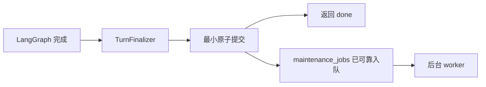
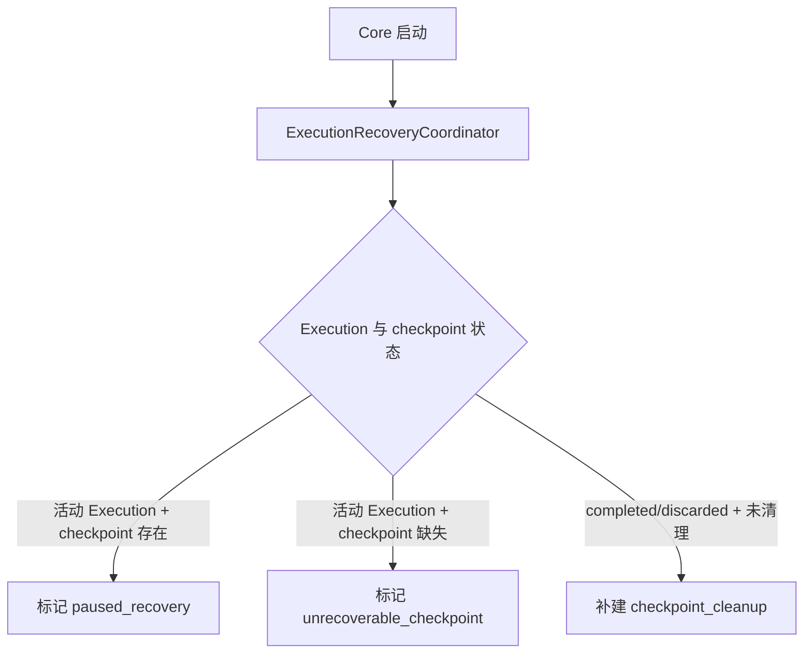

# 最终响应、后台维护与 Checkpoint 一致性

本文按时间顺序说明：模型回答结束后，Core 为什么不能立即返回，哪些工作必须等待，哪些工作必须放到
后台，以及两个 SQLite 数据库发生不一致时如何恢复。

数据库表、约束、迁移和术语的完整说明见
[本地数据库设计与一致性机制](/docs/architecture/database-state-and-consistency.md)。

## 1. 我们要解决什么问题

旧流程在最后一个 token 之后继续同步执行摘要、长期记忆提取和 checkpoint 删除。任何一步变慢，
CLI 都无法恢复输入，看起来像程序卡住。

但直接在最后一个 token 后返回也不可靠：Core 可能在回答展示后、消息保存前崩溃，导致用户看见的
回答不在历史记录中。

因此当前流程把收尾分成两段：

```text
前台最小提交：不可丢失，必须完成后才能返回成功。
后台派生维护：允许滞后，可以重试，不得延迟用户响应。
```

## 2. 什么必须在响应前完成

一次成功 Turn 返回 `done` 前，`CompletedTurnCommitter` 会在一个 `state.db` 原子事务中：

1. 追加本轮完整消息，并关联 `execution_id`。
2. 更新 Session 的 `recent_messages`、`turn_index` 和分支头。
3. 完成最终 Slice 和 Execution，清除 `pending_execution_id`。
4. 写入之后必须执行的 `maintenance_jobs`。



这次事务称为耐久性屏障：只有提交成功，Core 才能声明本轮成功。如果任一步失败，整个事务回滚，
客户端会收到错误而不是虚假的成功。

## 3. 什么在后台执行

当前后台维护任务包括：

- `context_summary`：压缩旧上下文。
- `memory_extract`：从已提交消息中提取长期记忆。
- `checkpoint_cleanup`：删除已完成 Execution 的 LangGraph checkpoint。

这些任务都可以从已经提交的业务事实重新执行，因此不需要阻塞最终响应。

显式“请记住”也采用后台提取。响应会返回：

```json
{
  "durability": "committed",
  "maintenance_status": "pending",
  "memory_status": "pending"
}
```

`pending` 只表示任务已可靠入队，不表示记忆已经保存成功。用户可以通过 `session.status` 查看当前
Session 的待处理和失败维护任务数量。

## 4. 后台任务为什么不会因重启丢失

维护任务不只存在于内存队列，而是保存在 `state.db.maintenance_jobs`。

worker 认领任务时会把它改为 `running` 并设置租约到期时间。如果 Core 在执行中崩溃，租约到期后，
下一次启动可以把任务重新变为 `pending` 并继续执行。

失败任务使用有限重试和指数退避：

```text
pending -> running -> succeeded
                  \-> pending，稍后重试
                  \-> failed，达到最大尝试次数
```

任务必须具有幂等性，即重复执行不会制造重复结果。去重键、摘要 CAS 和可重复 checkpoint 删除都服务于
这个要求。

## 5. 摘要为什么使用 CAS

后台摘要可能与下一轮对话同时发生。较早启动的摘要任务可能更晚完成，如果直接写回，就可能覆盖较新
摘要。

CAS，即“比较后再更新”，通过 `sessions.summary_through_turn` 防止这种覆盖：

```text
任务开始时读取 summary_through_turn = 10
写回时要求数据库中的值仍然等于 10
如果其他任务已经推进到 15，本次更新影响 0 行并被放弃
```

这里不使用“谁的时间戳更新就覆盖谁”，因为完成时间晚不代表数据更新。业务轮次边界比时间戳更可靠。

## 6. 为什么 checkpoint 使用另一个数据库

`state.db` 保存用户可理解的业务状态；`checkpoints.db` 由 LangGraph `SqliteSaver` 保存图内部断点。

即使两者都使用 SQLite，也不能共享一个事务，因为 LangGraph saver 有自己的连接和提交边界。当前项目
不自研 Checkpointer，而是通过恢复协调器实现最终一致。

Execution 使用 `checkpoint_state` 明确记录关系：

```text
uninitialized -> available -> cleanup_pending -> cleaned
                       \-> missing
```

- `available`：存在可用于恢复的断点。
- `cleanup_pending`：业务已经完成，只等待删除断点。
- `cleaned`：断点已清理。
- `missing`：业务状态需要断点，但断点不存在，不能安全恢复。

## 7. Core 启动时如何恢复

`ExecutionRecoveryCoordinator` 是 Saga 恢复协调器。Saga 的含义是：不假装跨数据库操作具有原子事务，
而是记录中间状态，并在启动时通过幂等操作修复。



恢复规则：

| 状态 | 处理 |
|---|---|
| `running` 且 checkpoint 存在 | 改为 `paused_recovery`，等待用户恢复 |
| 活动 Execution 但 checkpoint 缺失 | 改为 `unrecoverable_checkpoint`，禁止自动恢复 |
| `completed/discarded` 且尚未清理 | 补建或重试清理任务 |

checkpoint 删除失败不会撤销已成功提交的回答，因为业务完成事实以 `state.db` 为准。

## 8. 关键代码调用链

```text
AgentTurnService._stream_locked_turn()
  -> TurnCoordinator.finalize()
  -> TurnFinalizer.finalize()
       -> AgentContextManager.build_fast_state()
       -> CompletedTurnCommitter.commit()
            -> LocalStateStore.append_messages_in_transaction()
            -> LocalStateStore.save_fast_session_in_transaction()
            -> ExecutionRepository.finish_slice_in_transaction()
            -> ExecutionRepository.complete_in_transaction()
            -> MaintenanceRepository.enqueue_in_transaction()
       -> MaintenanceScheduler.wake()

Core 启动
  -> AgentTurnService.initialize()
       -> state.db 初始化与迁移
       -> checkpoints.db 初始化
       -> ExecutionRecoveryCoordinator.reconcile()
       -> MaintenanceScheduler.start()
```

`build_fast_state()` 只做内存计算，不调用 LLM。真正的摘要由后台 `ContextSummaryHandler` 完成。

## 9. 当前保证与限制

已保证：

- 成功返回的 Turn 已写入 `state.db`。
- 消息、Session、Execution 和维护任务一起提交或一起回滚。
- 摘要、记忆提取和 checkpoint 清理不会延迟最终响应。
- 过期摘要不能覆盖新摘要。
- 维护任务和跨库中间状态可以在重启后恢复。

当前限制：

- 最终响应仍需等待一次短小的本地事务；磁盘异常或长写锁仍会造成延迟。
- 两个 SQLite 数据库只能最终一致，不能实现真正的跨库原子提交。
- 维护队列当前只有一个 worker，慢任务可能造成后台积压。
- 当前没有面向用户的失败任务详情和手动重试命令。
- 完整 TCP/CLI 的 p95/p99 延迟基准仍需在稳定机器上执行。

## 10. 验证入口

关键自动测试位于 `tests/integration/test_finalization_and_maintenance.py`，覆盖：

- 最小提交任一步失败时整体回滚。
- 慢后台维护不延迟响应和同 Session 下一轮。
- 慢最小提交仍会阻止 `done` 提前返回。
- 维护任务去重、租约恢复、重试和 worker 异常生存。
- 摘要 CAS 冲突不覆盖更新状态。
- Core 启动时对账存在、缺失和待清理 checkpoint。
- 本地 Schema 加法迁移、失败回滚和新版本拒绝。
