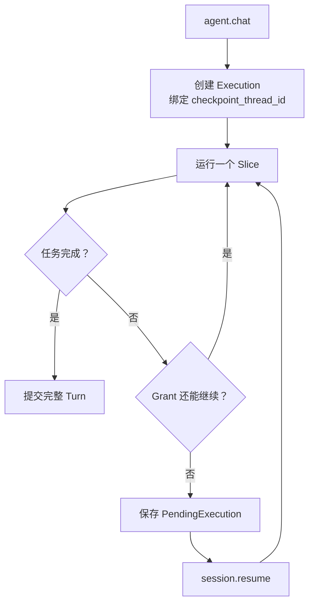

# 可恢复执行与预算控制

> 文档状态：Current
> 权威范围：Execution、Grant、Slice、预算和 checkpoint 恢复
> 维护触发：执行状态机、预算模型、暂停或恢复行为变化

本文聚焦 Execution、Grant、Slice 和 checkpoint 如何支持大任务继续执行。`state.db` 与
`checkpoints.db` 为什么分离、`checkpoint_state` 如何对账，以及 Saga/恢复协调器的含义，见
[`/docs/architecture/database-state-and-consistency.md`](/docs/architecture/database-state-and-consistency.md)。

## 为什么不能只设置“最大 12 步”

一个大任务可能需要多次读取、修改和验证。如果图达到固定步数后直接失败，并且不保存执行断点，下一轮只能重新开始，任务可能永远无法完成。

本项目把执行拆成三个层次：

```text
Turn       用户提出的一项请求
  Grant    一次 chat 或 resume 允许自动执行的工作额度
    Slice  一次设置 recursion_limit 的 LangGraph 调用
```

- **Slice**：短而有界，防止图无限循环。
- **Grant**：可以自动运行多个 Slice，但总资源仍有限。
- **PendingExecution**：Grant 用尽后保存的待恢复执行，不要求用户重新描述整个任务。

## 默认预算

| 配置 | 默认值 | 含义 |
|---|---:|---|
| `LEARN_AGENT_MAX_GRAPH_STEPS_PER_SLICE` | 20 | 单个 Slice 的图步骤上限 |
| `LEARN_AGENT_MAX_AUTO_SLICES_PER_GRANT` | 3 | 一次 chat/resume 最多自动继续多少个 Slice |
| `LEARN_AGENT_MAX_GRANT_WALL_SECONDS` | 600 | Grant 的协作式总时长上限 |
| `LEARN_AGENT_MAX_PARALLEL_TOOL_CALLS` | 4 | 同一 Grant 同时执行的工具数 |
| `LEARN_AGENT_MAX_CONTROLLED_EXECUTIONS_PER_GRANT` | 12 | 命令、容器等受控执行额度 |
| `LEARN_AGENT_MAX_DELEGATIONS_PER_GRANT` | 6 | 委派子 Agent 的额度 |
| `LEARN_AGENT_HARD_MAX_TOOL_CALLS_PER_GRANT` | 100 | 所有工具调用的紧急硬上限 |

“协作式总时长”表示系统在 Slice 边界检查时间。它不会在一个正在执行的 LLM 请求或工具函数中强制杀线程，避免破坏文件和状态。

## 为什么不再把所有工具都算成同一种调用

读取一个小文件和执行一个容器命令的成本与风险不同。统一限制会产生两个问题：

- 限制过小：安全的读取操作很快耗尽额度，大任务无法完成。
- 限制过大：高风险执行操作获得过多机会。

工具注册时声明风险类别：

```text
READ_ONLY             只读操作
CONTROLLED_EXECUTION  命令或容器执行
DELEGATION            委派子 Agent
```

`ObservedToolNode` 在统一工具边界进行计数和并行控制，因此不需要每个工具函数自己实现预算逻辑。

## 暂停与恢复的数据流



LangGraph checkpoint 使用独立的 `checkpoints.db`。恢复时使用相同 `checkpoint_thread_id` 并以 `input=None` 继续，而不是重新发送原始问题从头执行。

可使用：

```powershell
learn-agent session status --session default
learn-agent session resume --session default
learn-agent session resume --session default --instruction "先只完成测试修复"
learn-agent session discard --session default
```

当 Session 存在 PendingExecution 时，新普通 chat 会被拒绝。这样可以避免未完成任务与新请求同时修改同一 Session。

## 客户端断开

客户端断开后：

1. Core 停止向该连接发送通知。
2. 当前 Slice 允许收尾。
3. 如果任务还需下一个 Slice，Core 将其暂停为 `client_disconnected`。
4. 用户重新连接后显式执行 `session resume`。

这样既不在工具执行中途粗暴终止，也不会在无人观察时无限执行。

## 子 Agent 的边界

子 Agent 被视为一次 `DELEGATION` 工具调用：

- 生命周期只存在于该工具调用。
- 不能继续创建子 Agent。
- 不单独创建 Session。
- 父 Agent 只保存子 Agent 返回的总结和必要工具结果。

## 当前限制

- Grant 时间限制不能中断一个已经开始的阻塞工具调用。
- 工具调用账本表已经预留，但尚未为每次工具调用写入完整账本。
- PendingExecution 保存 checkpoint 和预算摘要，不是面向用户的任务管理系统。

对应的自动回归与人工故障测试方案见
[`/docs/quality/local-first-testing.md`](/docs/quality/local-first-testing.md)。
