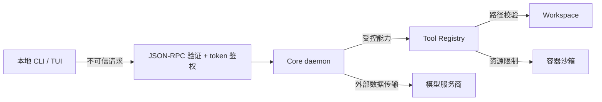

# 安全模型

> 文档状态：Current
> 权威范围：信任边界、资产、威胁、控制措施与残余风险
> 维护触发：新增工具、RPC、外部服务、权限模型或数据存储

## 1. 安全目标

当前项目是单用户、本地开发型 Agent。安全目标是降低 Agent 或本地客户端误操作造成的风险，而不是
提供面向公网、多租户环境的完整安全保证。

需要保护的资产：

- 模型 API key、daemon token 和用户级配置。
- Workspace 外的本地文件。
- Session、消息、长期记忆和 checkpoint。
- Docker daemon、宿主机命令执行能力和数据库。
- Trace、Telemetry 和日志中的敏感信息。

## 2. 信任边界

信任假设：

- 操作系统用户账户本身可信。
- daemon 只绑定 loopback，不暴露公网。
- 已认证客户端仍不能被视为业务输入可信；请求必须继续通过严格参数验证。
- 模型输出和工具参数均不可信，必须由工具边界限制。
- 模型服务商会接收发送给模型的消息，用户必须理解其数据处理政策。

## 3. 已实现控制

### RPC 与 daemon

- Core 只允许绑定回环地址。
- 每个特权 RPC 请求必须携带随机 daemon token。
- token 使用常量时间比较，并尽可能限制文件权限。
- Pydantic 模型拒绝未知字段和不合法长度。
- Parse Error、鉴权失败和 Handler 异常不会直接执行 Agent。

### daemon token 生命周期

- `learn-agent start` 每次准备启动新 daemon 时都会覆盖生成随机 token；CLI 与新 Core 使用同一文件。
- `learn-agent stop` 在确认 daemon 退出后删除 PID 和 token 文件。
- 直接运行 `learn-agent-core serve` 时，若 token 文件已存在会继续复用；不存在时才创建。
- token 没有独立过期时间、客户端身份或分级权限；轮换依赖停止后重新启动 daemon。

### Workspace 与文件

- CLI 识别 Git 根目录或显式 Workspace。
- 文件工具绑定不可变 Workspace 根目录。
- 路径经过规范化和边界检查。
- 环境文件和符号链接逃逸受到限制。
- Session、消息、记忆和工具运行时均绑定 Workspace。

### 命令执行

- 命令在短生命周期 Docker 容器中运行。
- Workspace 副本以只读方式提供给容器。
- 配置 CPU、内存、超时和输出上限。
- 命令工具具有受控执行风险等级和调用预算。

### 敏感数据与观测

- Trace 和 Telemetry 对 token、password、secret、authorization、`.env` 等字段脱敏。
- 默认不记录完整 Prompt、用户消息、模型响应、文件内容或工具结果。
- Provider 错误解析只向用户返回安全摘要。

## 4. 残余风险

| 风险 | 当前限制 |
|---|---|
| 已认证本地客户端可以请求任意本地目录成为 Workspace | 当前没有 Workspace allowlist |
| 高风险工具没有人工批准流程 | 依赖容器沙箱、风险预算和本地用户信任 |
| Docker daemon 权限较高 | 能访问 Docker 的进程通常具有较强宿主机能力 |
| Workspace 副本可能包含敏感代码 | 用户必须决定是否允许发送相关上下文给模型服务商 |
| 模型可能生成危险或错误操作 | 工具边界只能限制能力，不能保证意图正确 |
| Trace/Telemetry 脱敏不是合规审计保证 | 禁止将其视为绝对无敏感信息 |
| daemon token 是单一共享凭据 | 当前没有客户端身份、角色和权限分级 |

## 5. 当前不支持的安全能力

- 多用户身份认证和授权。
- 工具调用人工审批 UI。
- Workspace allowlist 与管理员策略。
- TLS、远程访问和网络层访问控制。
- 密钥托管系统与自动轮换。
- daemon token 的独立过期策略、定期轮换命令和多客户端撤销机制。
- 合规审计日志和不可篡改存储。
- 自动恶意代码检测或依赖供应链扫描。

这些能力在实现前，Core 不应绑定非回环地址，也不应作为远程共享服务部署。

## 6. 新能力安全检查

新增 Tool、RPC、Provider 或数据 Sink 时必须回答：

1. 输入来自哪里，是否经过严格验证？
2. 能访问哪些文件、网络、进程或数据库？
3. 是否会扩大 Workspace 或宿主机权限？
4. 是否可能把敏感数据发送到外部服务？
5. 输出是否可能进入 Prompt、日志、Trace 或 Telemetry？
6. 是否有超时、大小限制、并发限制和失败隔离？
7. 是否有路径逃逸、命令注入或 SQL 注入风险？
8. 是否增加对应安全测试和文档？

扩展实现流程见[扩展开发指南](/docs/api/extension-guide.md)。
