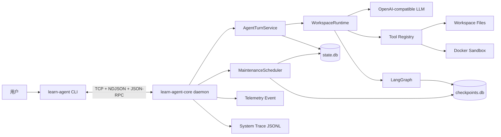
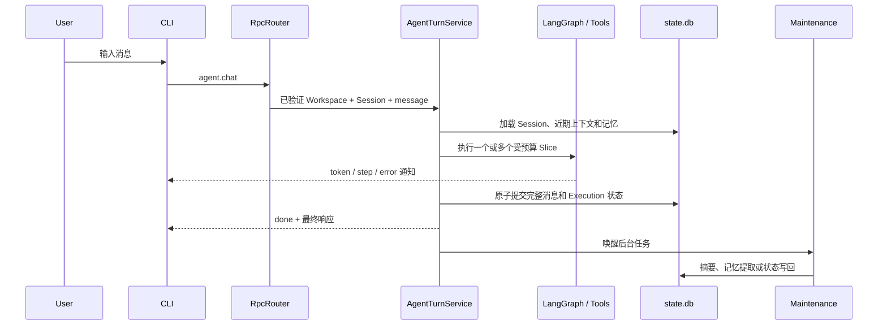

# 系统架构总览

> 文档状态：Current
> 权威范围：系统级组件、进程、存储和主要数据流
> 维护触发：新增核心进程、权威存储或跨层调用关系

本文是架构文档的首要入口。它只描述全局结构；函数级调用链和专项机制通过链接下钻。

## 1. 系统组成



## 2. 进程职责

### CLI 进程

负责：

- 命令解析、Workspace 发现和用户输入。
- 读取 daemon token，构造 JSON-RPC 请求。
- 展示 token、步骤、错误和最终结果。
- 管理 daemon 的启动、停止与状态。

不负责：

- 直接调用模型或工具。
- 直接读取或修改 Session 数据库。
- 决定任务恢复、记忆或上下文策略。

### Core daemon 进程

负责：

- 验证、鉴权和路由 JSON-RPC。
- 执行 Agent、工具、子 Agent 和 Skill。
- 管理 Session、上下文、记忆、Execution 和 checkpoint。
- 运行后台维护、Telemetry 和 Trace。

Core daemon 是唯一允许执行 Agent 与工具的进程。

## 3. 核心运行路径



关键边界：

- JSON-RPC 请求验证成功后才能进入 Agent。
- 同一 Session 通过内部 UUID 锁串行执行。
- 最终响应必须等待最小业务提交，但不等待摘要、记忆和 checkpoint 清理。
- Trace、Telemetry 和 PostgreSQL 可选能力不得成为业务成功条件。

## 4. 状态与存储

| 存储 | 角色 | 是否权威 | 典型内容 |
|---|---|---:|---|
| `state.db` | 本地业务状态 | 是 | Workspace、Session、消息、记忆、Execution、维护任务 |
| `checkpoints.db` | LangGraph 恢复断点 | 辅助 | 未完成 Slice 的图状态 |
| `artifacts/` | 大内容存储 | 辅助 | 去重的大型工具内容 |
| `telemetry/` | 领域观测事件 | 否 | 工具、记忆、上下文等事件 |
| `traces/` | 跨层诊断时间线 | 否 | IPC、Agent、LLM、Tool 调用摘要 |
| PostgreSQL | 可选迁移来源与 Event Sink | 否 | 旧数据、可选事件 |

状态路径和配置见[配置参考](/docs/reference/configuration-reference.md)，事务与恢复机制见
[本地数据库与一致性](/docs/architecture/database-state-and-consistency.md)。

## 5. Agent 执行模型

一次用户请求形成一个 `run_id`。复杂任务可以附着到一个跨请求存在的 `execution_id`，并被拆成多个
受预算限制的 Slice。

```text
Run：一次 chat 或 resume 请求
Execution：一个可跨多次 Run 恢复的任务
Slice：一次受 LangGraph 步数限制的执行片段
```

Agent 由 LangGraph 控制模型与工具节点循环；应用层负责并发、状态、恢复和最终提交。详细流程见
[Agent 执行架构](/docs/architecture/agent-execution-architecture.md)。

## 6. 后台维护

`maintenance_jobs` 是 `state.db` 中的持久化任务队列。当前处理：

- 上下文摘要。
- 长期记忆提取。
- checkpoint 清理。

任务与 Turn 状态在同一事务入队，Core 崩溃后可以通过租约和重试恢复。后台维护允许滞后，但不得阻塞
用户的普通响应。

## 7. 观测通道

- **Telemetry Event**：描述领域事件，例如工具完成、记忆保存和上下文摘要。
- **System Trace**：按时间顺序串联 IPC、Agent、LLM、Tool 和响应写回。

二者均为 best-effort 诊断数据，不能用于业务恢复、计费或合规审计。

## 8. 下钻阅读

| 需要理解的问题 | 文档 |
|---|---|
| Agent 具体调用哪些函数 | [Agent 执行架构](/docs/architecture/agent-execution-architecture.md) |
| CLI 与 Core 如何解耦 | [CLI 架构](/docs/architecture/cli-architecture.md) |
| Core 如何组装与关闭组件 | [Core 架构](/docs/architecture/core-architecture.md) |
| 数据库表与事务如何工作 | [本地数据库与一致性](/docs/architecture/database-state-and-consistency.md) |
| 长任务如何暂停恢复 | [可恢复执行](/docs/architecture/resumable-execution.md) |
| 安全边界与威胁 | [安全模型](/docs/architecture/security-model.md) |
