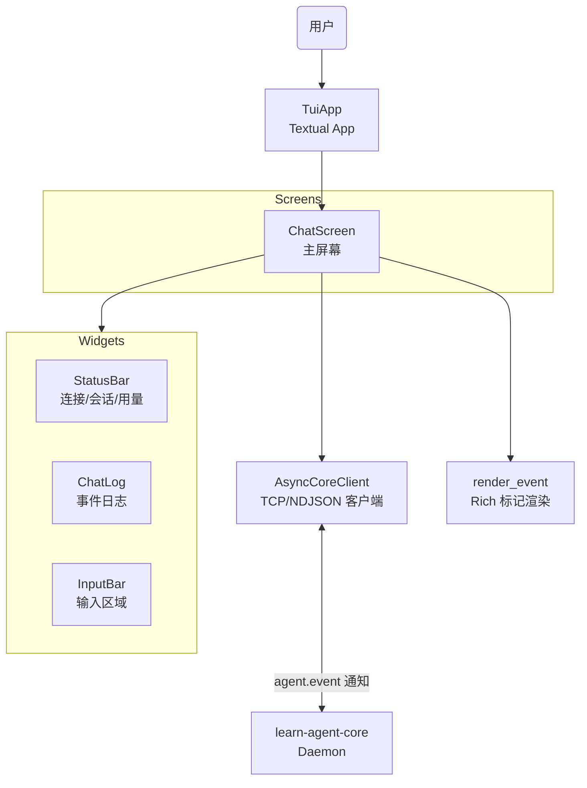

# TUI 架构

> 文档状态：Current
> 权威范围：TUI 客户端的组件设计、内部数据流、错误分层和扩展边界
> 维护触发：新增 UI 组件、修改事件渲染逻辑、变更通信协议

## 本文负责

- Textual App、Screen、Widget、异步 client 和 renderer 的内部职责。
- TUI 内部事件流、错误分层、测试边界和扩展规则。

## 本文不负责

- 不维护用户命令和当前能力清单；见 [TUI 使用与命令参考](/docs/api/tui-reference.md)。
- 不定义 RPC 和流式事件字段；见 `/docs/api/`。
- 不解释 Core 内部 Agent、状态库或恢复策略；见 `/docs/architecture/`。
- 不记录历史修复过程；见 [TUI 实现问题与修复记录](/docs/history/tui-implementation-fixes.md)。

## 1. 概览

TUI（Terminal UI）是基于 [Textual 8.x](https://textual.textualize.io/) 构建的终端交互客户端，作为 `learn-agent tui` 命令启动。它与 CLI 共享相同的 JSON-RPC 协议和 daemon 通信机制，但提供实时流式展示、状态栏、富文本日志等交互体验。

### 设计目标

| 目标 | 说明 |
|---|---|
| 实时流式响应 | 每个 token chunk 到达后立即展示，不等待完整回复 |
| 感知状态 | 状态栏显示 daemon 连接、session、上下文用量 |
| 暂停恢复 | 检测已暂停的 execution，支持 `/resume` 和 `/discard` |
| Goal 模式 | 通过 `/goal` 发送任务规划请求，展示完成标记 |
| 可维护性 | 复用 `src/cli/render.py` 的脱敏和截断语义，不重复实现 |

## 2. 组件架构



### 目录结构

```
src/tui/
  __init__.py          # 导出 TuiApp
  __main__.py          # python -m src.tui 入口
  app.py               # TuiApp — Textual App 主类
  config.py            # TuiConfig — 主机、端口、超时等配置
  client.py            # AsyncCoreClient — 异步 TCP/NDJSON JSON-RPC 客户端
  renderer.py          # 事件 → Rich 标记字符串转换
  screens/
    chat.py            # ChatScreen — 主聊天屏幕，组合所有 widget
  widgets/
    __init__.py
    status_bar.py      # StatusBar — 状态栏（连接状态、session、上下文额度）
    chat_log.py        # ChatLog — 事件日志（RichLog 子类，支持流式 token 渲染）
    input_bar.py       # InputBar — 输入区域（TextArea 子类，多行输入、/ 命令）
```

### 2.1 TuiApp ([`app.py`](/src/tui/app.py))

Textual `App` 子类，最简单的容器：

```python
class TuiApp(App):
    TITLE = "Learn Agent TUI"
    
    def on_mount(self) -> None:
        self.push_screen(ChatScreen(self._config))
```

不负责任何业务逻辑，只负责加载配置和推入主屏幕。

### 2.2 ChatScreen ([`screens/chat.py`](/src/tui/screens/chat.py))

核心编排器，职责：

- **生命周期管理**：on_mount 时加载鉴权 token、发现 workspace、连接 daemon、检查 session 状态。
- **输入分发**：根据用户输入决定是 `/` 命令还是普通聊天消息，dispatch 到对应 handler。
- **事件回调**：作为 `AsyncCoreClient.request()` 的 `on_event` 参数，将 agent.event 通知转发到 renderer。
- **状态同步**：收到 `done` 事件后更新 StatusBar（上下文额度、暂停状态、goal 模式）。

关键状态变量：

| 变量 | 类型 | 含义 |
|---|---|---|
| `_client` | `AsyncCoreClient \| None` | 当前连接的客户端 |
| `_session_name` | `str` | 当前 session 名称（默认 "default"） |
| `_goal_mode` | `bool` | 是否处于 goal 模式 |
| `_paused_execution` | `bool` | 是否有已暂停的 execution |
| `_busy` | `bool` | 是否有请求正在执行 |
| `_streamed_response_active` | `bool` | 当前 token 流是否活跃 |

### 2.3 AsyncCoreClient ([`client.py`](/src/tui/client.py))

纯异步 TCP/NDJSON JSON-RPC 客户端。与 CLI 的同步 `CoreClient`（`src/cli/client.py`）不同，它使用 `asyncio.open_connection()` 避免阻塞 TUI 事件循环。

#### 协议处理流程

```python
# 发送 JSON-RPC 请求
writer.write((json.dumps(request) + "\n").encode("utf-8"))
await writer.drain()

# 循环读取响应
while True:
    raw = await reader.readline()
    message = json.loads(raw)
    
    if message.get("method") == "agent.event":
        # 流式通知 → 调用回调
        await on_event(message["params"])
        continue
    
    if message.get("id") == request_id:
        # 最终响应 → 返回结果或抛出异常
        if "error" in message:
            raise CoreRequestError(...)
        return message["result"]
```

#### 错误分类

| 异常 | 触发条件 |
|---|---|
| `CoreUnavailableError` | 连接被拒绝、超时、OSError |
| `CoreAuthenticationError` | JSON-RPC 错误码 = -32001 |
| `CoreConnectionInterruptedError` | 读取超时、连接关闭、写入失败 |
| `CoreProtocolError` | 无效 JSON、非 JSON 对象、意外消息结构 |
| `CoreRequestError` | 其他 JSON-RPC 错误响应 |

所有异常继承自 `IpcError`，与 CLI 的 `CoreClient` 保持一致的错误分类。

### 2.4 Renderer ([`renderer.py`](/src/tui/renderer.py))

将服务端 `agent.event` 参数转换为 Rich 标记字符串供给 ChatLog 展示。

#### 复用关系

```
src/cli/render.py
  ├── _preview()          ← 截断
  ├── _sanitize_arg_value()  ← 脱敏（api_key, token, password → [REDACTED]）
  ├── _task_plan_lines()     ← 任务计划格式化
  ├── _task_update_line()    ← 任务更新格式化
  ├── TASK_TOOLS             ← 任务工具集合
  ├── VISIBLE_RESULT_TOOLS   ← 可见结果工具集合
  └── ARG_PREVIEW_LIMIT      ← 参数预览长度上限

src/tui/renderer.py
  ├── render_event()      ← 分发入口，返回 Rich 标记字符串
  ├── _render_step()      ← step.agent_message / tool_call_start / tool_call_result
  ├── _render_tool_call_start()
  ├── _render_tool_call_result()
  ├── _render_done()      ← completed / paused / goal_completed
  ├── _render_error()
  └── _render_paused()
```

#### 事件渲染对照表

| 服务端事件 | TUI 标记 | 说明 |
|---|---|---|
| `token` | 返回纯文本，由 ChatLog 缓冲 | 不在 renderer 中加标记 |
| `step.agent_start` | `[bold blue]▶ Agent turn started.` | 蓝色粗体 |
| `step.agent_message` | 原始内容 | 仅在无 token 时作为 fallback |
| `step.tool_call_start` | `[bold green]▶ tool: read_file` | 绿色粗体，参数脱敏后 preview |
| `step.tool_call_result` | `[green]✓ tool: read_file` | 绿色，仅 task 工具显示内容 |
| `done.status=ok` | `[green]■ completed` 或 `[bold green]★ goal completed` | 普通/目标模式 |
| `done.status=paused` | `[yellow]■ execution paused: budget_limit` | 黄色 |
| `error` | `[red]✗ error: ...` | 红色 |

### 2.5 StatusBar ([`widgets/status_bar.py`](/src/tui/widgets/status_bar.py))

Textual `Label` 子类，一行式状态展示：

```
● 127.0.0.1:18765 [default] ctx: 3K/128K (2%)  goal  paused
```

| 区域 | 来源 | 颜色规则 |
|---|---|---|
| 连接指示 ● | TCP 连接状态 | 绿=connected，黄=connecting，红=disconnected/error |
| 地址端口 | TuiConfig | — |
| Session 名称 | 默认或 `/session <name>` | 灰色 dim |
| 上下文额度 `ctx: XK/Y (Z%)` | `set_usage(context_tokens)` | 灰色 dim，Y=MODEL_CONTEXT_LIMIT |
| Goal 标记 | `set_goal_mode(enabled)` | 青色 bold |
| Paused 标记 | `set_paused(paused)` | 黄色 bold |

### 2.6 ChatLog ([`widgets/chat_log.py`](/src/tui/widgets/chat_log.py))

Textual `RichLog` 子类，核心挑战是**流式 token 渲染不产生额外换行**。

#### 数据模型

```
_entries: list[str]    # 已提交的日志条目（事件、工具调用、用户消息等）
_token_buf: str        # 当前流式回复的累积内容
```

#### 三种写入操作

| 方法 | 何时调用 | 行为 |
|---|---|---|
| `write_token(content)` | 每个 token chunk | 追加到 `_token_buf` 后触发渲染 |
| `write_event(markup)` | 非 token 事件（step、done、error） | 先 flush tokens，再将事件加入 entries 并全量重绘 |
| `flush_tokens()` | agent_message 在 token 流之后 | 将 `_token_buf` 转为正式 entry |

渲染策略见 §3.1。

### 2.7 InputBar ([`widgets/input_bar.py`](/src/tui/widgets/input_bar.py))

Textual `TextArea` 子类，多行输入：

| 按键 | 行为 |
|---|---|
| `Ctrl+Enter` | 提交输入（触发 `action_submit`） |
| `Enter` | 插入换行 |
| `Escape` | 清空输入 |

提供三个便捷属性用于外部判断：

- `is_command` — 输入是否以 `/` 开头
- `command_name` — 提取命令名（如 `"resume"`）
- `command_args` — 提取命令参数

## 3. 用户接口与历史问题

TUI 的用户命令、快捷键、当前能力和限制统一维护在
[TUI 使用与命令参考](/docs/api/tui-reference.md)。

流式 token 换行、认证参数遗漏和 Schema 迁移防御等历史修复记录已迁移到
[TUI 实现问题与修复记录](/docs/history/tui-implementation-fixes.md)。

本篇不再维护用户接口清单或历史修复过程。
## 4. 错误处理策略

TUI 遵循与 CLI 一致的错误分层：

```
底层异常（socket、JSON、Pydantic）
  → IPC 领域异常（CoreUnavailableError 等）
  → ChatScreen 捕获并渲染到 ChatLog
```

| 场景 | 用户看到的内容 |
|---|---|
| Auth token 不可用 | `[red]Auth token not available — cannot send.[/red]` |
| Daemon 未运行 | 状态栏变红，显示 `daemon not running` |
| 连接中断 | `[red]Connection lost mid-stream.[/red]` |
| 认证失败 | `[red]Authentication failed. Restart the daemon.[/red]` |
| 请求被拒 | `[red]Request failed: [-32001] ...[/red]` |
| 请求中再次提交 | `Busy — wait for the current request to finish.` |

## 5. 测试

TUI 测试位于 `tests/unit/test_tui_chat_log.py`，使用 `ChatLog.__new__()` + `MethodType` 模拟 widget 行为，避免依赖 Textual 的完整事件循环。

```python
def _fake_log(self):
    log = ChatLog.__new__(ChatLog)
    log._entries = []
    log._token_buf = ""
    log._size_known = True
    log.lines = []
    log.refreshed = 0

    def clear(self):
        self.lines.clear()
        return self
    # ... more mocks ...
    log.clear = MethodType(clear, log)
    return log
```

核心测试场景：

- token 累积为一行 → 刷新次数正确。
- event 在 token 后追加 → 内容不重复。
- agent_message 在 token 流后不重复显示。

## 6. 扩展规则

1. 新增 widget 放入 `src/tui/widgets/`，在 `widgets/__init__.py` 中导出。
2. 新增 screen 放入 `src/tui/screens/`。
3. 事件格式化逻辑放入 `renderer.py`，不写在 widget 中。
4. 通信逻辑放入 `client.py`，不写在 screen 中。
5. 不得导入 `src.core.*`（与 CLI 规则一致）。
6. 新增 `/` 命令时在 `ChatScreen._dispatch_command()` 中添加分支，并在 `/help` 中登记。
