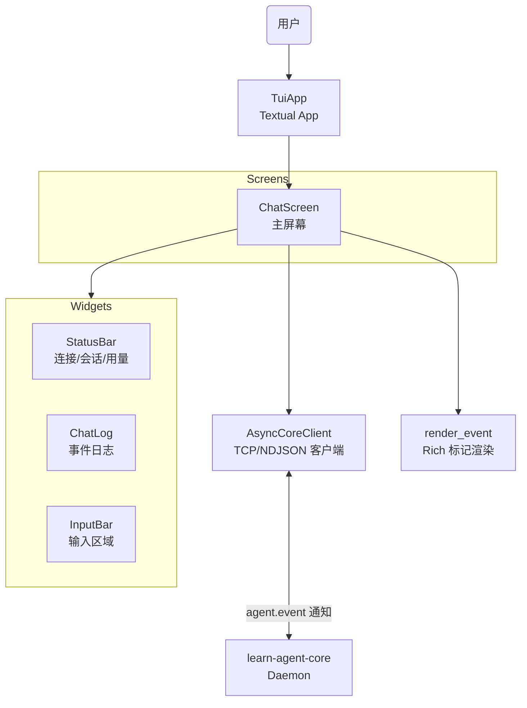

# TUI 架构

> 文档状态：Current
> 权威范围：TUI 客户端的组件设计、内部数据流、错误分层和扩展边界
> 维护触发：新增 UI 组件、修改事件渲染逻辑、变更通信协议

## 本文负责

- Textual App、Screen、Widget、异步 client 和 renderer 的内部职责。
- TUI 内部事件流、错误分层、测试边界和扩展规则。

## 本文不负责

- 不维护用户命令和当前能力清单；见 [TUI 使用与命令参考](/docs/api/tui-reference.md)。
- 不定义 RPC 和流式事件字段；见 `/docs/api/`。
- 不解释 Core 内部 Agent、状态库或恢复策略；见 `/docs/architecture/`。
- 不记录历史修复过程；见 [TUI 实现问题与修复记录](/docs/history/tui-implementation-fixes.md)。

## 1. 概览

TUI（Terminal UI）是基于 [Textual 8.x](https://textual.textualize.io/) 构建的终端交互客户端，作为 `learn-agent tui` 命令启动。它与 CLI 共享相同的 JSON-RPC 协议和 daemon 通信机制，但提供实时流式展示、状态栏、富文本日志等交互体验。

### 设计目标

| 目标 | 说明 |
|---|---|
| 实时流式响应 | 每个 token chunk 到达后立即展示，不等待完整回复 |
| 感知状态 | 状态栏显示 daemon 连接、session、上下文用量 |
| 暂停恢复 | 检测已暂停的 execution，支持 `/resume` 和 `/discard` |
| Goal 模式 | 通过 `/goal` 发送任务规划请求，展示完成标记 |
| 可维护性 | 复用 `src/cli/render.py` 的脱敏和截断语义，不重复实现 |

## 2. 组件架构



### 目录结构

```
src/tui/
  __init__.py          # 导出 TuiApp
  __main__.py          # python -m src.tui 入口
  app.py               # TuiApp — Textual App 主类
  config.py            # TuiConfig — 主机、端口、超时等配置
  client.py            # AsyncCoreClient — 异步 TCP/NDJSON JSON-RPC 客户端
  renderer.py          # 事件 → Rich 标记字符串转换
  screens/
    chat.py            # ChatScreen — 主聊天屏幕，组合所有 widget
  widgets/
    __init__.py
    status_bar.py      # StatusBar — 状态栏（连接状态、session、上下文额度）
    chat_log.py        # ChatLog — 事件日志（RichLog 子类，支持流式 token 渲染）
    input_bar.py       # InputBar — 输入区域（TextArea 子类，多行输入、/ 命令）
```

### 2.1 TuiApp ([`app.py`](/src/tui/app.py))

Textual `App` 子类，最简单的容器：

```python
class TuiApp(App):
    TITLE = "Learn Agent TUI"
    
    def on_mount(self) -> None:
        self.push_screen(ChatScreen(self._config))
```

不负责任何业务逻辑，只负责加载配置和推入主屏幕。

### 2.2 ChatScreen ([`screens/chat.py`](/src/tui/screens/chat.py))

核心编排器，职责：

- **生命周期管理**：on_mount 时加载鉴权 token、发现 workspace、连接 daemon、检查 session 状态。
- **输入分发**：根据用户输入决定是 `/` 命令还是普通聊天消息，dispatch 到对应 handler。
- **事件回调**：作为 `AsyncCoreClient.request()` 的 `on_event` 参数，将 agent.event 通知转发到 renderer。
- **状态同步**：收到 `done` 事件后更新 StatusBar（上下文额度、暂停状态、goal 模式）。

关键状态变量：

| 变量 | 类型 | 含义 |
|---|---|---|
| `_client` | `AsyncCoreClient \| None` | 当前连接的客户端 |
| `_session_name` | `str` | 当前 session 名称（默认 "default"） |
| `_goal_mode` | `bool` | 是否处于 goal 模式 |
| `_paused_execution` | `bool` | 是否有已暂停的 execution |
| `_busy` | `bool` | 是否有请求正在执行 |
| `_streamed_response_active` | `bool` | 当前 token 流是否活跃 |

### 2.3 AsyncCoreClient ([`client.py`](/src/tui/client.py))

纯异步 TCP/NDJSON JSON-RPC 客户端。与 CLI 的同步 `CoreClient`（`src/cli/client.py`）不同，它使用 `asyncio.open_connection()` 避免阻塞 TUI 事件循环。

#### 协议处理流程

```python
# 发送 JSON-RPC 请求
writer.write((json.dumps(request) + "\n").encode("utf-8"))
await writer.drain()

# 循环读取响应
while True:
    raw = await reader.readline()
    message = json.loads(raw)
    
    if message.get("method") == "agent.event":
        # 流式通知 → 调用回调
        await on_event(message["params"])
        continue
    
    if message.get("id") == request_id:
        # 最终响应 → 返回结果或抛出异常
        if "error" in message:
            raise CoreRequestError(...)
        return message["result"]
```

#### 错误分类

| 异常 | 触发条件 |
|---|---|
| `CoreUnavailableError` | 连接被拒绝、超时、OSError |
| `CoreAuthenticationError` | JSON-RPC 错误码 = -32001 |
| `CoreConnectionInterruptedError` | 读取超时、连接关闭、写入失败 |
| `CoreProtocolError` | 无效 JSON、非 JSON 对象、意外消息结构 |
| `CoreRequestError` | 其他 JSON-RPC 错误响应 |

所有异常继承自 `IpcError`，与 CLI 的 `CoreClient` 保持一致的错误分类。

### 2.4 Renderer ([`renderer.py`](/src/tui/renderer.py))

将服务端 `agent.event` 参数转换为 Rich 标记字符串供给 ChatLog 展示。

#### 复用关系

```
src/cli/render.py
  ├── _preview()          ← 截断
  ├── _sanitize_arg_value()  ← 脱敏（api_key, token, password → [REDACTED]）
  ├── _task_plan_lines()     ← 任务计划格式化
  ├── _task_update_line()    ← 任务更新格式化
  ├── TASK_TOOLS             ← 任务工具集合
  ├── VISIBLE_RESULT_TOOLS   ← 可见结果工具集合
  └── ARG_PREVIEW_LIMIT      ← 参数预览长度上限

src/tui/renderer.py
  ├── render_event()      ← 分发入口，返回 Rich 标记字符串
  ├── _render_step()      ← step.agent_message / tool_call_start / tool_call_result
  ├── _render_tool_call_start()
  ├── _render_tool_call_result()
  ├── _render_done()      ← completed / paused / goal_completed
  ├── _render_error()
  └── _render_paused()
```

#### 事件渲染对照表

| 服务端事件 | TUI 标记 | 说明 |
|---|---|---|
| `token` | 返回纯文本，由 ChatLog 缓冲 | 不在 renderer 中加标记 |
| `step.agent_start` | `[bold blue]▶ Agent turn started.` | 蓝色粗体 |
| `step.agent_message` | 原始内容 | 仅在无 token 时作为 fallback |
| `step.tool_call_start` | `[bold green]▶ tool: read_file` | 绿色粗体，参数脱敏后 preview |
| `step.tool_call_result` | `[green]✓ tool: read_file` | 绿色；task 工具结果还会更新独立任务进度块 |
| `done.status=ok` | `[green]■ completed` 或 `[bold green]★ goal completed` | 普通/目标模式 |
| `done.status=paused` | `[yellow]■ execution paused: budget_limit` | 黄色 |
| `error` | `[red]✗ error: ...` | 红色 |

### 2.5 StatusBar ([`widgets/status_bar.py`](/src/tui/widgets/status_bar.py))

Textual `Label` 子类，一行式状态展示：

```
● 127.0.0.1:18765 [default] ctx: 3K/128K (2%)  goal  paused
```

| 区域 | 来源 | 颜色规则 |
|---|---|---|
| 连接指示 ● | TCP 连接状态 | 绿=connected，黄=connecting，红=disconnected/error |
| 地址端口 | TuiConfig | — |
| Session 名称 | 默认或 `/session <name>` | 灰色 dim |
| 上下文额度 `ctx: XK/Y (Z%)` | `set_usage(context_tokens)` | 灰色 dim，Y=MODEL_CONTEXT_LIMIT |
| Goal 标记 | `set_goal_mode(enabled)` | 青色 bold |
| Paused 标记 | `set_paused(paused)` | 黄色 bold |

### 2.6 ChatLog ([`widgets/chat_log.py`](/src/tui/widgets/chat_log.py))

Textual `VerticalScroll` 子类，负责把 Core 推送的流式事件展示成用户可读日志。

#### 关键问题

服务端到前端的 token 事件是 JSON-RPC notification，token 内容位于 JSON 字段中：

```json
{"event":"token","data":{"content":"..."}}
```

因此换行、空格和普通文本不会因为 TCP/NDJSON 传输天然丢失。之前出现“长输出卡顿、空格或标记显示异常”的主要原因在 TUI 渲染层：

1. `RichLog` 适合追加日志，但没有稳定的公开 API 用来替换最后一条已写入内容。
2. 为了避免每个 token 独立成行，旧实现采用 `clear()` + 重放全部历史 + `refresh()`；长回答会变成近似 `O(N^2)` 的重绘成本。
3. 如果流式中间态直接交给 Rich markup/Markdown 解析，`[bold]`、JSON 片段或特殊空白可能被当作格式语法解释。
4. 单纯依赖 timer 节流也不可靠：当 token notification 密集到达时，事件循环可能一直忙于读取和处理事件，timer 回调要等到流结束附近才运行，用户仍然看不到中间态。

#### 当前渲染策略

ChatLog 使用 append-only widget 模型：

| 阶段 | 数据状态 | 渲染方式 | 目的 |
|---|---|---|---|
| 流式尾部 | 回答正在生成 | 一个活动 `Static` widget，内容用 `rich.text.Text` 原地更新 | 每个 token 到达后立即更新当前尾部，同时保留空格和原始字符 |
| 阶段性稳定块 | 已形成完整段落或尾部过长 | 将稳定前缀提交为 `rich.markdown.Markdown` widget | 在回答未结束前就显示列表、标题、代码块等 Markdown 结构 |
| 最终态 | 收到完整 agent message 或 `flush_tokens()` | 将剩余尾部提交为 Markdown/纯文本 entry | 完整回答结束后补齐最后一段排版 |
| 超长最终块 | 单块内容超过渲染阈值 | 继续使用纯文本 | 避免极长 Markdown 一次性解析导致 UI 卡顿 |
| 结构事件 | 工具调用、错误、状态 | 新增独立 `Static` widget，使用 TUI renderer 产生的 Rich markup | 保持事件样式，不混入普通 token 文本 |

这意味着：

- 用户在生成过程中能看到内容持续更新，而不是等完整回答结束。
- 已完成段落会阶段性变成 Markdown，当前仍在生成的尾部保持纯文本，避免解析半截语法。
- 完整回答到达后，剩余尾部会再提交一次，得到最终排版。
- 已提交历史不再因为新 token 到来而反复重绘。
- 只有用户已经位于底部时才自动跟随新输出；用户向上滚动查看历史后，流式刷新不会把滚动条强行拉回底部。

#### 数据模型

```python
_entries: list[_LogEntry]        # 已提交日志条目，每条记录自己的渲染 mode
_token_buf: str                  # 当前流式回复的累积内容
_active_token_widget: Static | None  # 正在更新的回答尾部
_stream_committed_length: int      # 已阶段性提交为 Markdown 的前缀长度
```

`_LogEntry.mode` 有三种：

| mode | 用途 |
|---|---|
| `markup` | TUI renderer 生成的可信 Rich 标记，例如工具调用、错误、状态 |
| `plain` | 流式中间态或失败草稿，按字面显示 |
| `markdown` | 完整 AI 回复，完成后一次性 Markdown 渲染 |

#### 三种写入操作

| 方法 | 何时调用 | 行为 |
|---|---|---|
| `write_token(content)` | 每个 token chunk | 追加到 `_token_buf`，必要时提交稳定 Markdown 前缀，再更新当前尾部 widget |
| `write_event(markup)` | 非 token 事件（step、done、error） | 先提交当前 token，再把整段 markup 作为一个事件 widget 追加；不能按换行拆分 |
| `flush_tokens()` | agent_message 到达或其他事件前 | 将剩余尾部提交为最终 Markdown/纯文本 entry |

非 token 事件可以包含多行 Rich markup。例如 task 工具会把标题和任务清单放在同一个事件中，其中 `[dim]...[/dim]` 这类样式可能跨越多行。`ChatLog.write_event()` 必须把这段 markup 当作一个 Rich 解析单元；如果按 `\n` 拆成多个 widget，后续行会丢失样式，最后一行还可能因为只有闭合标签而触发 Rich 解析错误。

工具过程默认折叠，避免 goal 模式下被 `task_update`、文件读取、命令执行等工具事件刷屏。用户可以用 `Ctrl+O` 在 TUI 中切换工具过程明细；该开关只影响普通工具调用日志，不影响 token 输出、错误提示和任务进度块。任务进度块由 `task_plan`、`task_update`、`task_list` 的结果驱动，是一个可替换状态块：第一次出现时追加到日志，后续任务清单变化时原地更新，因此界面只保留最新计划状态，而不是每次 update 都追加一份完整清单。发送新的 goal 时会开始新的任务进度块，保留旧 goal 的最终状态用于回看。

#### 性能与滚动边界

TUI 不应让每个 token 都触发完整历史重绘和整段 Markdown 解析，也不能让 Textual 的消息处理器直接等待完整流式 RPC。当前实现分三层解耦：`action_submit()` 只创建后台输入任务并立即返回，让鼠标和键盘消息可以继续被 Textual 派发；
- `ChatScreen._on_event()` 再把 Core notification 放入 TUI 事件队列，由后台 consumer 渲染，避免 socket 读取循环直接驱动 UI；
- `ChatLog.write_token()` 只追加到内存缓冲，`ChatLog` 再以固定帧率批量 `render_pending_tokens()`，因此 Core 的推送速率不会直接决定 layout 次数。
- 渲染帧只更新当前尾部 widget，并在段落边界或尾部过长时提交稳定 Markdown 前缀；
- 长回答不会重放已提交历史，也不会等到最后才出现所有 Markdown 排版。如果单块超过阈值，则回退纯文本以保证交互性。

自动滚动遵循 follow-tail 规则：
- 如果用户正在底部，新增 token 会继续跟随到底部；如果用户通过鼠标滚轮、键盘、触控板或拖动滚动条向上查看历史，ChatLog 会先记录“暂停自动跟随”的意图，然后把滚轮事件继续交给 Textual/ScrollView 的真实滚动处理；
- 如果滚轮发生在输入框等非日志区域，ChatScreen 会把滚动转发给 ChatLog。暂停状态优先级高于底部采样，避免滚动刚发生但 layout 还没更新时被下一帧 token 重新拉回底部。
- 实现上有两个短窗口：用户滚动后设置“暂停自动跟随”窗口，窗口内即使布局临时报告“已经在底部”，`scroll_end()` 也不会执行；
- 发送新消息或 resume 时设置“强制跟随”窗口，因为 Textual 的 `scroll_end()` 需要等后续 layout 才会稳定，不能让紧随其后的旧 `scroll_y/max_scroll_y` 采样把 follow-tail 误关掉。强制跟随不是永久锁，只要用户在这之后滚动，`watch_scroll_y()` 会立即取消强制跟随并以用户滚动为准。
- 底部判断优先使用 `scroll_y/max_scroll_y` 数值，因为 `is_vertical_scroll_end` 在布局未稳定时可能出现滞后。
- 用户手动回到底部后，下一次输出会恢复自动跟随；每次发送新消息或 resume 时会显式回到底部并重新开启 follow-tail。这样长输出期间用户可以自由查看前文。

后续若要进一步优化，可在活动 widget 内做更细的分段或虚拟滚动，但不应回到每个 token 全量重绘的实现。

#### 为什么不直接回到 RichLog

`RichLog` 是 Textual 的高性能追加日志控件，适合结构事件、系统日志和不可变行追加。但当前 AI 回复需要一个“正在生成的活动块”：同一条回答在流式阶段不断增长，完成后还要转成 Markdown。`RichLog` 没有稳定的公开 API 来替换最后一条已写入记录；如果每个 token 都 `write()`，会重新引入碎片行和排版错位。因此当前折中方案是：

- 使用 Textual `VerticalScroll` 管理真实滚动。
- 使用 `set_interval()` 作为渲染泵，限制 UI 刷新频率。
- 只把当前回答尾部作为可变 widget，历史条目保持 append-only。
- 不覆盖 Textual 的滚动 action/watch；滚动快捷键由 `ChatScreen` 统一转发到日志区域。

这不是把框架能力重写一遍，而是在 Textual 原语之上补足“活动流式回答块”这一 RichLog 不直接支持的交互。


### 2.7 InputBar ([`widgets/input_bar.py`](/src/tui/widgets/input_bar.py))

Textual `TextArea` 子类，多行输入：

| 按键 | 行为 |
|---|---|
| `Ctrl+Enter` | 提交输入（触发 `action_submit`） |
| `Ctrl+O` | 展开或收起工具调用过程（任务进度块始终显示最新状态） |
| `Enter` | 插入换行 |
| `Ctrl+O` | 展开或收起工具调用明细，任务进度块不受影响 |
| `Escape` | 清空输入 |

提供三个便捷属性用于外部判断：

- `is_command` — 输入是否以 `/` 开头
- `command_name` — 提取命令名（如 `"resume"`）
- `command_args` — 提取命令参数

## 3. 用户接口与历史问题

TUI 的用户命令、快捷键、当前能力和限制统一维护在
[TUI 使用与命令参考](/docs/api/tui-reference.md)。

流式 token 换行、认证参数遗漏和 Schema 迁移防御等历史修复记录已迁移到
[TUI 实现问题与修复记录](/docs/history/tui-implementation-fixes.md)。

本篇不再维护用户接口清单或历史修复过程。
## 4. 错误处理策略

TUI 遵循与 CLI 一致的错误分层：

```
底层异常（socket、JSON、Pydantic）
  → IPC 领域异常（CoreUnavailableError 等）
  → ChatScreen 捕获并渲染到 ChatLog
```

| 场景 | 用户看到的内容 |
|---|---|
| Auth token 不可用 | `[red]Auth token not available — cannot send.[/red]` |
| Daemon 未运行 | 状态栏变红，显示 `daemon not running` |
| 连接中断 | `[red]Connection lost mid-stream.[/red]` |
| 认证失败 | `[red]Authentication failed. Restart the daemon.[/red]` |
| 请求被拒 | `[red]Request failed: [-32001] ...[/red]` |
| 请求中再次提交 | `Busy — wait for the current request to finish.` |

## 5. 测试

TUI 测试位于 `tests/unit/test_tui_chat_log.py`，使用 `ChatLog.__new__()` + `MethodType` 模拟 widget 行为，避免依赖 Textual 的完整事件循环。

```python
def _fake_log(self):
    log = ChatLog.__new__(ChatLog)
    log._entries = []
    log._token_buf = ""
    log._size_known = True
    log.lines = []
    log.refreshed = 0

    def clear(self):
        self.lines.clear()
        return self
    # ... more mocks ...
    log.clear = MethodType(clear, log)
    return log
```

核心测试场景：

- token 累积为一行 → 刷新次数正确。
- event 在 token 后追加 → 内容不重复。
- agent_message 在 token 流后不重复显示。

## 6. 扩展规则

1. 新增 widget 放入 `src/tui/widgets/`，在 `widgets/__init__.py` 中导出。
2. 新增 screen 放入 `src/tui/screens/`。
3. 事件格式化逻辑放入 `renderer.py`，不写在 widget 中。
4. 通信逻辑放入 `client.py`，不写在 screen 中。
5. 不得导入 `src.core.*`（与 CLI 规则一致）。
6. 新增 `/` 命令时在 `ChatScreen._dispatch_command()` 中添加分支，并在 `/help` 中登记。
