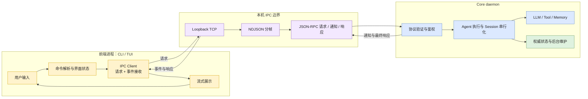
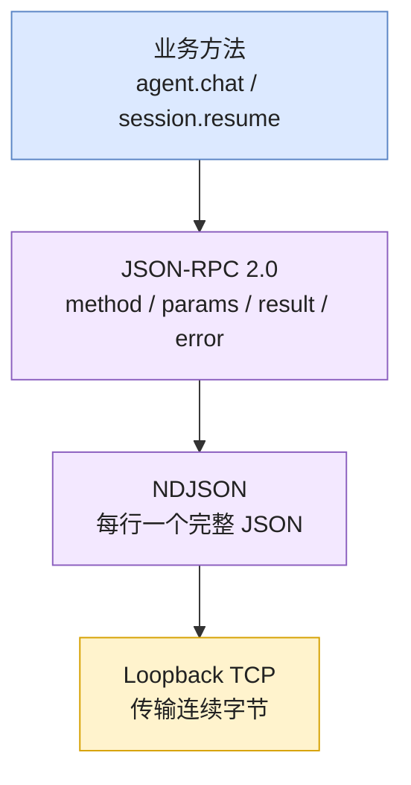
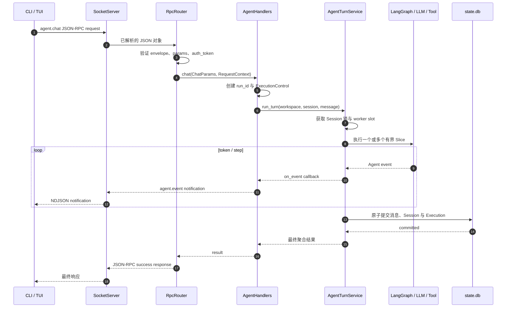
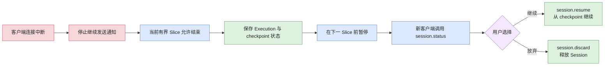

# CLI / Core 双进程与 JSON-RPC 设计决策

> 文档类型：当前设计决策
> 面向读者：希望理解双进程架构原因的开发者
> 具体接口字段请查阅 [IPC 协议](/docs/api/ipc-protocol.md) 和
> [RPC 方法参考](/docs/api/rpc-reference.md)。

本文解释项目为什么将前端与 Agent 执行拆成两个进程，以及 TCP、NDJSON、JSON-RPC、
本地鉴权和 Workspace 参数分别解决什么问题。

## 1. 优化目标

项目最初采用单进程结构：

```text
用户输入 -> CLI 循环 -> Agent -> Tool / Memory -> CLI 输出
```

这种结构适合快速学习，但 CLI、Agent、工具和持久化共享一个生命周期。随着功能增加，会产生：

1. CLI 退出会终止同进程中的后台任务。
2. CLI、TUI 和其他前端必须重复集成 Agent 业务。
3. 用户界面容易被模型、工具或数据库工作阻塞。
4. 多个前端无法共享同一个 Session 和执行状态。
5. 前端可以直接接触工具和数据库，安全边界不清晰。

因此项目拆分为：

```text
前端进程：CLI / 未来 TUI
    负责输入、展示、发送请求和处理连接错误

后台进程：Core daemon
    负责 Agent、工具、Session、状态、记忆和后台维护
```

核心原则：

> 前端发起并观察执行；Core daemon 拥有并执行任务。

### 双进程职责总览

这张图只回答“哪些能力属于前端，哪些能力属于 Core”，不展开单次请求内部细节。



## 2. 为什么 Core 是 daemon

daemon 是独立于某一个终端窗口、长期运行的后台进程。Core 启动后：

1. 初始化本地状态库、checkpoint、Agent 服务和后台维护任务。
2. 监听本机 TCP loopback 地址。
3. 验证并处理前端请求。
4. 推送流式事件并返回最终响应。
5. 接受显式的优雅关闭请求。

关闭 CLI 不等于关闭 Core。后续 CLI 或 TUI 可以连接同一个用户级 Core。

Core 是用户级服务，而不是某个项目目录下的服务。每次 Agent 请求显式携带
`workspace_root`，Core 再将 Session、工具和记忆绑定到该 Workspace。

## 3. 为什么选择本地 TCP

可选的进程间通信方式包括：

- TCP；
- Unix Domain Socket；
- Windows Named Pipe；
- 标准输入输出管道；
- HTTP / WebSocket；
- Redis 或消息队列。

当前选择本机 TCP 的原因：

1. Python `asyncio` 原生支持，Windows、Linux 和 macOS 行为相近。
2. CLI、TUI 和测试客户端都容易接入。
3. daemon 可以同时接受多个独立连接。
4. Transport 与 Agent 业务解耦，未来可以增加其他传输适配器。

Core 只允许绑定 loopback 地址。TCP 在这里是本机 IPC，不是远程服务接口；项目当前没有 TLS、
远程用户鉴权或公网暴露能力。

## 4. NDJSON 与 JSON-RPC 分别解决什么

TCP 是连续字节流，不提供消息边界。连续发送两个 JSON 对象时，接收端无法仅靠 TCP 判断它们
在哪里分隔。

NDJSON 规定“一行是一个完整 JSON 值”：

```text
{"jsonrpc":"2.0","id":"1","method":"core.ping","params":{...}}\n
{"jsonrpc":"2.0","id":"2","method":"agent.chat","params":{...}}\n
```

两者职责不同：

| 技术 | 解决的问题 |
|---|---|
| TCP | 两个进程如何传输字节 |
| NDJSON | 字节流中的一条消息在哪里结束 |
| JSON-RPC | 请求、响应、方法和错误如何表达 |

### 通信协议分层

这张图强调 TCP、NDJSON 和 JSON-RPC 不是三个相互替代的方案，而是依次建立在下层能力之上。



JSON-RPC 请求示例：

```json
{
  "jsonrpc": "2.0",
  "id": "client-1",
  "method": "core.ping",
  "params": {"auth_token": "..."}
}
```

成功响应使用相同的 `id`：

```json
{
  "jsonrpc": "2.0",
  "id": "client-1",
  "result": {"status": "ok"}
}
```

## 5. 为什么 Core 必须验证所有请求

CLI 只是客户端，不是可信边界。本机其他进程同样可以尝试连接 daemon。

请求进入业务层前必须经过：

```text
TCP frame 大小限制
  -> UTF-8 与 JSON 解析
  -> JSON-RPC 外层验证
  -> method 注册检查
  -> 严格参数模型验证
  -> auth_token 鉴权
  -> Handler
  -> Agent / Tool / State
```

只有通过全部验证后，Core 才能执行 Agent、工具或关闭操作。

职责分布：

| 模块 | 职责 |
|---|---|
| `src/ipc/models.py` | CLI 与 Core 共享的严格 wire model |
| `src/ipc/auth.py` | 用户级 daemon token 的创建、读取和验证 |
| `src/core/transport/` | TCP 与 NDJSON 分帧、连接和写回 |
| `src/core/bus/router.py` | 方法注册、参数验证、鉴权和分发 |
| `src/core/handlers/` | 将 RPC 调用适配到应用服务 |

协议模型放在中立的 `src/ipc`，使依赖方向保持：

```text
CLI -> IPC <- Core
```

CLI 不得导入 Core 的 Agent、Memory、Tool 或数据库实现。

## 6. 为什么 Agent 需要服务层

`AgentTurnService` 提供不依赖终端和 TCP 的应用服务边界。它负责：

- 解析 Workspace 与 Session；
- 串行化同一 Session 的执行；
- 调度 Agent worker；
- 创建 Execution 和 Slice；
- 执行 LangGraph、模型和工具；
- 提交最小业务状态；
- 安排后台摘要、记忆和 checkpoint 清理。

它不读取 `stdin`，不直接打印用户输出，也不依赖 CLI。

这使 CLI、TUI、测试程序或未来其他 Transport 都可以复用同一个 Agent 服务。

## 7. 为什么需要流式 notification

Agent 请求可能持续较长时间。只返回一个最终响应会使界面在执行期间没有反馈。

当前协议使用：

```text
一个 agent.chat 或 session.resume 请求
  -> 0..N 条 agent.event notification
  -> 一条最终 JSON-RPC response
```

其中：

- `request_id` 关联原始 JSON-RPC 请求；
- `run_id` 标识 Core 内部的一次 chat/resume；
- `execution_id` 标识可能跨多次 resume 的长期任务。

事件结构和顺序见[流式事件参考](/docs/api/streaming-events.md)。

## 8. 一次对话的调用链

这张图按时间顺序展示一个 `agent.chat` 请求。请求只发送一次，中间可以产生多条通知，最后
只有一条与原始请求 ID 对应的最终响应。



更详细的函数级流程见
[Agent 执行架构](/docs/architecture/agent-execution-architecture.md)。

## 9. 并发、断线与恢复

### 同一 Session 串行

同一 Session 的两个 Turn 若同时读取和保存上下文，可能互相覆盖。因此同一内部 Session UUID
必须串行；不同 Session 可以在 Core worker 上并行。

### 客户端断线

客户端断线后，Core 不会立即粗暴取消正在执行的当前 Slice：

1. 当前有界 Slice 可以结束。
2. Core 停止向断开的客户端发送通知。
3. Core 不再自动开始下一 Slice，而是暂停 Execution。
4. 新客户端通过 `session.status` 查询，再选择 `session.resume` 或 `session.discard`。

这样既避免半途破坏当前工具或模型调用，也避免客户端已经无法观察时无限继续执行。

### 断线与恢复流程



### daemon 重启

Execution 状态保存于本地 `state.db`，LangGraph checkpoint 保存于独立 checkpoint 数据库。Core
重启时通过恢复协调器对账，能够识别可恢复、待清理和 checkpoint 缺失状态。

详细机制见[可恢复执行](/docs/architecture/resumable-execution.md)。

## 10. daemon 生命周期和本地鉴权

CLI 提供：

```text
learn-agent start
learn-agent status
learn-agent stop
```

用户级 runtime 目录保存 PID、token 和 daemon 日志。实际路径由 `platformdirs` 和配置决定，
不再绑定启动命令所在目录。

仅监听 `127.0.0.1` 不能阻止本机其他进程访问，因此每个 RPC 都必须携带随机 token。Token：

- 由 daemon 生命周期管理逻辑创建；
- 保存于用户级 runtime 目录；
- 使用恒定时间比较验证；
- 不得写入普通日志、Telemetry 或 Trace。

路径和配置项见[配置参考](/docs/reference/configuration-reference.md)。

## 11. 当前公开接口与限制

当前 RPC 方法：

```text
core.ping
core.shutdown
agent.chat
session.status
session.resume
session.discard
```

`agent.event` 是服务端 notification，不是客户端可调用的 RPC 方法。

当前限制：

- 不支持执行中取消；
- 不支持断线后的旧事件续传；
- 不支持同一连接并发多个请求；
- 不支持 Session 列表和历史查询 RPC；
- 不支持远程网络访问；
- 尚未实现协议版本和 capabilities 协商。

前端开发者应以 [API 文档](/docs/README.md#api对外接口契约) 为准，不得读取 SQLite 或导入
Core 私有模块绕过这些限制。

## 12. 设计原则检查

| 原则 | 当前体现 |
|---|---|
| 单一职责 | CLI 展示、Transport 通信、Router 验证、Service 执行业务 |
| 依赖倒置 | CLI 和 Core 共同依赖中立 IPC 模型 |
| 接口隔离 | Handler 只依赖最小 Agent 服务协议 |
| 组合优于继承 | `CoreApp` 作为 Composition Root 注入组件 |
| 权威状态唯一 | Core 的本地状态库负责业务事实，前端不保存权威执行状态 |
| 失败隔离 | 坏请求、断线和观测写入失败不得导致 daemon 整体崩溃 |

双进程和 JSON-RPC 增加了连接、版本兼容和故障恢复复杂度。只有持续维护 API 契约、测试和
错误恢复规则，这些额外层次才有价值。
