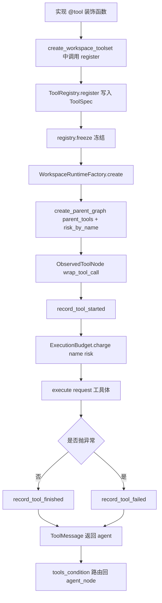

# 新增工具指南

> 文档状态：Current
> 权威范围：在 Core 中从零添加一个 LangChain tool 到跑通测试的完整工程步骤与契约约束
> 维护触发：`src/core/tools/catalog.py`、`src/core/tools/registry.py`、`src/core/tools/observed.py`、`src/core/workspace/resolver.py`、`src/core/agent/budget.py` 任一变化时

[Agent Runtime 扩展指南](/docs/development/agent-runtime-extension.md) 在“增加工具”一节给出 5 行概览步骤。本文档是该概览的端到端展开：补全代码骨架、注册 API 形态、audience 与 risk 选型、观测层职责边界、测试模式和反模式清单。读者应在读完概览后，按本文完成实现、注册、测试与提交检查。

## 目标与读者

读者是第一次给本仓库添加 LangChain tool 的开发者，应当已经掌握 Python 与 LangChain 基础，但不必熟悉本仓库内部结构。读完后应能独立完成“实现 → 注册 → 集成测试 → 提交检查”四步，并知道每一步应改哪些文件、查哪些参考、避开哪些常见反模式。

本文不重复 Agent Runtime 分层、LangGraph 编排细节、Provider 抽象、RPC / 流式契约，这些都链接到对应权威文档。

## 本文负责

新增工具必须在 `ToolSpec` 中声明 `capabilities`、`approval`、`sandbox`、`network` 和 `timeout_seconds`，并由 `ToolExecutionPipeline` 执行。禁止把未经注册的 LangChain tool 直接注入图中。涉及文件写入、命令、网络或内部状态的工具必须增加权限与边界测试。系统级 Hook 的扩展方式见 [Agent 生命周期 Hook 架构](/docs/architecture/agent-lifecycle-hooks.md)；Hook 修改参数后仍需经过 schema、策略和硬边界校验。

- 选择正确的工具实现模式（无状态单例 / Workspace 工厂 / ToolRuntime 注入）。
- 编写 `@tool` 函数时正确生成 schema、docstring、参数注解。
- 通过 `resolve_workspace_path` 与 `is_workspace_path_blocked` 实施路径安全。
- 选择 `audiences`（`ToolAudience`）与 `risk`（`ToolRisk`）并理解其对预算与路由的影响。
- 使用 `ToolRuntime` / `InjectedState` 注入 Execution 与 graph 状态，且这些参数不出现在 LLM 可见 schema 中。
- 在 `create_workspace_toolset()` 中注册新工具，让 `ObservedToolNode` 自动接管观测与预算。
- 编写单元测试断言 audience / risk / schema / 路径安全 / 错误返回。
- 提交前完成对应的文档同步与变更检查。

## 本文不负责

- Agent Runtime 整体分层与 StateGraph 拓扑：见 [Agent 执行架构](/docs/architecture/agent-execution-architecture.md) 与 [Agent 调用链](/docs/architecture/agent-execution-call-chain.md)。
- `ModelProvider` 抽象与模型用途：见 [LLM Provider 边界](/docs/architecture/llm-provider-boundary.md) 与 `agent-runtime-extension.md` 的“增加新的模型用途”。
- CLI / RPC / 流式事件字段：见 [/docs/api/](/docs/api/)。
- Skill / Telemetry / Maintenance / EventBus 的扩展：见 [Core 平台扩展指南](/docs/development/platform-extension.md)。
- 已实现但本文不再展开的 5 行概览步骤：见 [Agent Runtime 扩展指南](/docs/development/agent-runtime-extension.md) 第 34–40 行。

## 当前实现

### 4.1 三段式边界

仓库的工具系统由三段独立边界组成，理解它们是写好工具的前提：

1. **实现**：每个工具位于 `src/core/tools/` 下独立模块（`weather.py` / `workspace.py` / `commands.py` / `skills.py` / `summarization.py` 等），也可以位于其他子模块内自带工厂的 `tools.py`（如 `src/core/tasks/tools.py`、`src/core/subagent/graph.py`）。
2. **注册**：[`src/core/tools/registry.py`](/src/core/tools/registry.py) 的 `create_workspace_toolset()` 是唯一集中注册入口。内部 `register()` 闭包把所有 `ToolSpec` 写入 [`ToolRegistry`](/src/core/tools/catalog.py)，随后调用 `freeze()` 冻结，禁止运行期再注册。
3. **观测**：[`src/core/tools/observed.py`](/src/core/tools/observed.py) 的 `ObservedToolNode` 继承 `langgraph.prebuilt.ToolNode`，在 `wrap_tool_call` 中统一完成 telemetry 起点 / 终点事件与 `ExecutionBudget.charge()` 扣费。工具体内部不应再做观测埋点。

LangGraph 在 [`src/core/agent/graph.py`](/src/core/agent/graph.py) 与 [`src/core/subagent/graph.py`](/src/core/subagent/graph.py) 通过 `tools_condition` 自动把 `ToolMessage` 路由回 agent，工具体本身不写循环。

### 4.2 三种工具实现模式

| 模式 | 代表 | 关键特征 | 何时选用 |
|---|---|---|---|
| 无状态单例 | [`weather.py::get_weather`](/src/core/tools/weather.py) | `@tool` 装饰普通函数，无外部依赖 | 工具逻辑与 workspace / graph 状态完全无关（如纯计算、固定字典查询） |
| Workspace 绑定工厂 | [`create_workspace_file_tools(root)`](/src/core/tools/workspace.py) 、[`create_run_command_in_container(root)`](/src/core/tools/commands.py) 、[`create_summarize_large_file(root, provider)`](/src/core/tools/summarization.py) 、[`create_skill_tools(root)`](/src/core/tools/skills.py) | 工厂闭包捕获 `root: Path`（或 `provider`），返回 1..N 个 `@tool` | 工具需要访问 workspace 文件、子进程、模型 provider |
| ToolRuntime / InjectedState 注入 | [`create_task_tools(service)`](/src/core/tasks/tools.py) 、[`create_delegate_tool(...)`](/src/core/subagent/graph.py) | 签名含 `runtime: ToolRuntime` 或 `state: Annotated[dict, InjectedState()]`，LangChain 自动从 LLM schema 隐藏 | 工具需要读 graph 当前 Execution / workspace 身份或裁剪消息历史 |

如果不确定选哪种，Workspace 工厂是默认安全选项：强制根绑定 + 路径解析，且不依赖任何 graph 上下文，单元测试最简单。

### 4.3 注册 API 形态

入口函数 [`create_workspace_toolset()`](/src/core/tools/registry.py) 返回 `WorkspaceToolset`（含 `registry` / `base_tools` / `parent_tools` / `skill_manifest`）。内部 `register` 闭包签名：

```python
def register(tool, audiences, risk, description=""):
    registry.register(
        ToolSpec(
            name=tool.name,
            tool=tool,
            audiences=frozenset(audiences),
            risk=risk,
            description=description or getattr(tool, "description", ""),
        )
    )
```

关键约束：

- `name` 自动取 `tool.name`（LangChain 由函数名派生）。函数改名等于工具改名，会破坏现有 prompt 调用。
- `description` 缺省时回退到 `tool.description`（即 `@tool` 从 docstring 提取的版本）。**不要**在 `register` 中显式传与 docstring 不一致的 `description`，否则模型会看到两份冲突描述。
- 同名注册抛 `ValueError("Tool already registered: ...")`，在启动期暴露问题。
- `ToolRegistry.freeze()` 后再注册抛 `RuntimeError("Tool registry is frozen")`。同一 Workspace 的 `WorkspaceRuntime` 复用缓存，因此重复装配成本低。

### 4.4 audience / risk 枚举事实

来源：[`src/core/tools/catalog.py`](/src/core/tools/catalog.py)。

- `ToolAudience = {PARENT, SUBAGENT}`，决定哪些 agent 角色能看到该工具。
- `ToolRisk = {READ_ONLY, INTERNAL_STATE, CONTROLLED_EXECUTION, DELEGATION}`，影响预算类目与限流：
  - `READ_ONLY` 仅计入 `hard_max_tool_calls`（`HARD_MAX_TOOL_CALLS_PER_GRANT`）。
  - `INTERNAL_STATE` 同上，且语义上不应暴露给 SUBAGENT（父级 Execution 私有状态）。
  - `CONTROLLED_EXECUTION` 受 `MAX_CONTROLLED_EXECUTIONS_PER_GRANT` 子限制。
  - `DELEGATION` 受 `MAX_DELEGATIONS_PER_GRANT` 子限制，且仅用于 [`create_delegate_tool()`](/src/core/subagent/graph.py) 注册的 `delegate_to_subagent`（见 [`registry.py:76`](/src/core/tools/registry.py)），普通工具不应选这个值。

budget 计费逻辑见 [`src/core/agent/budget.py`](/src/core/agent/budget.py) 的 `ExecutionBudget.charge()`，工具体不应自行扣费。

## 数据流或操作流程

### 5.1 端到端时序



### 5.2 操作流程（7 步）

把 [`agent-runtime-extension.md`](/docs/development/agent-runtime-extension.md) 第 34–40 行的 5 行概览展开为 7 步：

1. **决定模式**：阅读 4.2 的决策表；若拿不准，Workspace 工厂是默认安全选项。
2. **实现工具**：
   - 单例：直接 `@tool` 装饰器，docstring 用一句中文自然语言描述输入输出。
   - 工厂：写 `def create_my_tools(root: Path): @tool def my_tool(...): ...; return my_tool`（或多工具元组）；所有 `path` 参数必须先 `resolve_workspace_path(root, path)`，再 `is_workspace_path_blocked(root, target)` 校验。
   - 注入：`@tool` 签名追加 `runtime: ToolRuntime`（或 `state: Annotated[dict, InjectedState()]`）；**绝不**把这些参数暴露给 LLM schema。
3. **选择 audience**：见 6.3。
4. **选择 risk**：见 6.4。
5. **在 `create_workspace_toolset()` 中调用 `register(...)`**：如果是工厂，先 `factory = create_my_tools(workspace.root)`；紧接现有 register 行；如果工厂返回多个工具就循环 register，共享同一份 risk + description。
6. **让 `ObservedToolNode` 自动接管**：不要在新工具里写 telemetry；不要在工具内再次扣 `ExecutionBudget`；只需要保证返回值是 `str` 或 `ToolMessage`，领域错误以字符串返回（`ObservedToolNode._tool_error_message` 仅兜底未捕获异常）。
7. **编写测试 + 跑全量单测**：见第 7 节与第 11 节。

### 5.3 三种模式代码骨架

#### 5.3.1 无状态单例骨架

放置位置：`src/core/tools/<feature>.py`。

```python
from langchain_core.tools import tool


@tool
def my_feature_tool(arg_a: str, arg_b: int = 0) -> str:
    """用一句中文说明输入输出契约。第一句作为 description。"""
    # ... 纯计算或固定字典查询 ...
    return result
```

要点：

- 函数签名注解全部用 Python 类型（`str` / `int` / `list[dict[str, Any]]`），LangChain 自动派生 JSON schema。
- docstring 首句必须给出**模型可读的输入输出契约**（不是给维护者看的实现说明）。
- 异常一律 `return "..."`（见 6.5）。

#### 5.3.2 Workspace 工厂骨架

放置位置：`src/core/tools/<feature>.py`，工厂闭包捕获 `root: Path`。

```python
from pathlib import Path

from langchain_core.tools import tool

from src.config.settings import MY_FEATURE_OUTPUT_LIMIT
from src.core.tools.workspace import is_workspace_path_blocked
from src.core.workspace.resolver import resolve_workspace_path


def create_my_feature_tools(root: Path):
    """Create workspace-bound feature tools."""

    @tool
    def my_feature_tool(path: str) -> str:
        """用一句中文说明对 workspace 内 path 的处理契约。"""
        try:
            target = resolve_workspace_path(root, path)
            if is_workspace_path_blocked(root, target):
                return "Workspace path rejected: blocked by sandbox policy"
            # ... 实际读取 target ...
            return result[:MY_FEATURE_OUTPUT_LIMIT]
        except (OSError, ValueError) as exc:
            return f"Workspace feature rejected: {exc}"

    return my_feature_tool
```

要点：

- 工具体前两行必须依次：`target = resolve_workspace_path(root, path)` → `if is_workspace_path_blocked(root, target): return ...`。
- 输出长度受 [`src/config/settings.py`](/src/config/settings.py) 中相应 `*_OUTPUT_LIMIT` 约束（命名约定：`FILE_READ_OUTPUT_LIMIT` / `PARENT_FILE_READ_OUTPUT_LIMIT` / `DOCKER_OUTPUT_LIMIT` / `LARGE_FILE_SUMMARY_LIMIT` / `SKILL_READ_OUTPUT_LIMIT`）。
- 工厂只接收 `root: Path` 等参数，**绝不**读 `Path.cwd()`。

#### 5.3.3 ToolRuntime 注入骨架

放置位置：`src/core/tools/<feature>.py`，签名末尾追加 `runtime: ToolRuntime`。

```python
from types import SimpleNamespace

from langchain_core.tools import tool
from langgraph.prebuilt import ToolRuntime


def _context_from_runtime(runtime: ToolRuntime):
    """Extract a typed context object from the LangGraph ToolRuntime."""
    return runtime.context  # 实际项目按需要转为领域 dataclass


def create_my_injected_tools(service):
    """Create tools that depend on the graph Execution context."""

    @tool
    def my_injected_tool(payload: str, runtime: ToolRuntime) -> str:
        """用一句中文说明依赖 Execution 上下文的处理契约。"""
        try:
            context = _context_from_runtime(runtime)
            return service.handle(context, payload)
        except ValueError as exc:
            return f"Injected tool rejected: {exc}"

    return my_injected_tool
```

要点：

- `runtime: ToolRuntime` 放在**参数末尾**或**关键字参数位置**，避免与 LLM 可见参数交错。
- 复用 `_context_from_runtime(runtime) -> <领域 dataclass>` 这种辅助函数（参考 [`src/core/tasks/tools.py`](/src/core/tasks/tools.py)），把 `runtime.context` 抽取成本工具领域的 dataclass，不在工具体内直接访问 runtime 属性。
- 测试时若绕过 graph 直接调用，用 `SimpleNamespace(context=...)` 充当 runtime 替身。
- 错误处理：`except ValueError as exc: return _tool_error(exc)` 模式（参考 [`tasks/tools.py`](/src/core/tasks/tools.py)），仅对**领域校验错**返回字符串；真正的运行时异常让 `ObservedToolNode` 兜底。

### 5.4 完整端到端示例 `count_loc`

下面用虚构的 `count_loc`（统计 workspace 文件行数）贯穿“实现 → 注册 → 集成测试”三段。**这是教程示例**，不要求真的提交到代码库；如果想立即上手，跳过本节即可。

#### 5.4.1 实现

放置位置：`src/core/tools/count_loc.py`。

```python
"""示例：统计 workspace 文件行数。教程使用，不进入仓库。"""

from pathlib import Path

from langchain_core.tools import tool

from src.config.settings import FILE_READ_OUTPUT_LIMIT
from src.core.tools.workspace import is_workspace_path_blocked
from src.core.workspace.resolver import resolve_workspace_path


def create_count_loc(root: Path):
    @tool
    def count_loc(path: str) -> str:
        """统计 workspace 内单个文件的总行数，输出受 FILE_READ_OUTPUT_LIMIT 约束。"""
        try:
            target = resolve_workspace_path(root, path)
            if is_workspace_path_blocked(root, target):
                return "count_loc rejected: blocked by sandbox policy"
            text = target.read_text(encoding="utf-8", errors="replace")
            return f"{path}: {len(text.splitlines())} lines"[:FILE_READ_OUTPUT_LIMIT]
        except (OSError, ValueError) as exc:
            return f"count_loc rejected: {exc}"

    return count_loc
```

#### 5.4.2 注册

在 [`src/core/tools/registry.py`](/src/core/tools/registry.py) 的 `create_workspace_toolset()` 内紧邻现有 register 行追加：

```python
count_loc = create_count_loc(workspace.root)
register(count_loc, {ToolAudience.SUBAGENT}, ToolRisk.READ_ONLY)
```

#### 5.4.3 集成测试

放置位置：`tests/unit/test_count_loc_tool.py`，参考 [`tests/unit/test_private_tasks.py:237-262`](/tests/unit/test_private_tasks.py) 的断言风格。

```python
from langchain_core.utils.function_calling import convert_to_openai_tool
from src.core.tools.catalog import ToolAudience, ToolRisk
from src.core.tools.count_loc import create_count_loc
from src.core.tools.registry import create_workspace_toolset


def test_count_loc_returns_line_count(workspace):
    tool = create_count_loc(workspace.root)
    result = tool.invoke({"path": "src/core/__init__.py"})
    assert "lines" in result


def test_count_loc_rejects_path_escape(workspace):
    tool = create_count_loc(workspace.root)
    result = tool.invoke({"path": "../../etc/passwd"})
    assert result.startswith("count_loc rejected:")


def test_count_loc_is_subagent_read_only(workspace):
    toolset = create_workspace_toolset(workspace, FakeProvider())
    specs = [s for s in toolset.registry.specs() if s.name == "count_loc"]
    assert len(specs) == 1
    spec = specs[0]
    assert spec.audiences == frozenset({ToolAudience.SUBAGENT})
    assert spec.risk == ToolRisk.READ_ONLY


def test_count_loc_schema_does_not_leak_root(workspace):
    tool = create_count_loc(workspace.root)
    schema = convert_to_openai_tool(tool)["function"]["parameters"]
    assert "root" not in str(schema)
```

## 关键决策表与约束

### 6.1 工具模式决策表

| 模式 | 触发条件 | 闭包绑定 | 测试重点 |
|---|---|---|---|
| 无状态单例 | 工具函数体不依赖 workspace / graph 状态 | 无 | docstring 中文契约清晰，schema 字段名是英文 |
| Workspace 工厂 | 工具需要读写 workspace 文件 / 调子进程 / 调模型 | `root: Path` | 路径越界、沙箱排除、输出截断、audience / risk |
| ToolRuntime / InjectedState | 工具需要当前 Execution / workspace / session 身份或最近消息 | graph 注入 | runtime 上下文缺失时返回字符串错误、`InjectedState` 不出现在 schema |

### 6.2 audience × risk 决策表

| audiences \ risk | READ_ONLY | INTERNAL_STATE | CONTROLLED_EXECUTION | DELEGATION |
|---|---|---|---|---|
| `{SUBAGENT}` only | 允许 — 子 agent 调研类读 | **不允许**（父私有 Execution 状态） | 允许（谨慎） | **不允许**（禁止递归委托） |
| `{PARENT}` only | 允许 — 父速览 | 允许 — 任务规划与私有状态编辑 | 不推荐（应改为 SUBAGENT） | 允许 — `delegate_to_subagent` 入口 |
| `{PARENT, SUBAGENT}` | 允许 — 通用读（weather、skills） | **不允许**（语义冲突） | 允许 — `run_command_in_container` 现状 | **不允许**（任何受众可见会引发递归） |

冲突单元格说明：

- `INTERNAL_STATE` 与 `SUBAGENT` 互斥，因为子 agent 没有“父级 Execution 私有任务表”的概念。
- `DELEGATION` 只能由 `PARENT` 持有，且不能与 `SUBAGENT` 同时注册。
- `CONTROLLED_EXECUTION` 同时暴露给两侧时，预算扣减在两侧共享（已由 `ExecutionBudget` 单例保证，见 [`budget.py`](/src/core/agent/budget.py)）。

### 6.3 audience 选择决策点

按以下问题顺序判断：

1. 工具是否会修改“父 agent 的私有 Execution 状态”（任务计划、记忆索引等）？是 → 仅 `PARENT`。
2. 工具是否会消耗“控制执行类”预算且子 agent 不该触发？是 → 仅 `PARENT`（或反向）。
3. 是否所有用户角色（父 + 子）都该看到？是 → `{PARENT, SUBAGENT}`。
4. 工具是否会启动另一段 graph（仅 `delegate_to_subagent`）？是 → `DELEGATION`，且仅 `PARENT`。

### 6.4 risk 选择决策点

- 只读、不可逆更改只发生在用户文件 → `READ_ONLY`。
- 修改 Execution 内部状态（任务计划、记忆索引等）→ `INTERNAL_STATE`。
- 在沙箱内执行命令或写文件 → `CONTROLLED_EXECUTION`。
- 工具本身会启动另一段 graph（仅 `delegate_to_subagent`）→ `DELEGATION`。

### 6.5 异常处理策略

| 异常类型 | 处理方式 | 示例 |
|---|---|---|
| 领域校验错（`ValueError` / 路径越界） | `try/except` 内 `return "xxx rejected: {exc}"` | 路径越界、沙箱排除、空输入 |
| 容器 / 子进程不可恢复错 | 同上，字符串错误中给出原因 | [`commands.py`](/src/core/tools/commands.py) 中 FileNotFoundError |
| 真正的运行时异常（网络断、模型挂） | **不捕获**，让 `ObservedToolNode._tool_error_message` 统一兜底 → 生成 `status="error"` 的 ToolMessage | [`summarization.py`](/src/core/tools/summarization.py) 中 provider 调用 |
| 预算耗尽（`ToolBudgetExceeded`） | **不捕获**，让 `ObservedToolNode` 重新 `raise` | 由 `_observe_tool_call` 显式处理 |

原则：**领域错返回字符串，基础设施错抛给观测层**，避免在工具体内重复实现边界语义。参考 [`src/core/tools/workspace.py:80-81`](/src/core/tools/workspace.py) 的 `try/except (OSError, ValueError) → return f"Workspace file read rejected: {exc}"` 写法。

### 6.6 路径安全约束

- **唯一入口**：[`src/core/workspace/resolver.py::resolve_workspace_path(root, relative_path)`](/src/core/workspace/resolver.py)。该函数先 `canonicalize_workspace` 校验 root 存在且为目录，再 `Path(relative_path)` 后 `is_absolute()` 拒绝绝对路径，再 `(root / value).resolve(strict=True)` 后用 `relative_to(root)` 拒绝逃逸（含 symlink 逃逸）。
- **沙箱排除清单**：[`src/core/tools/workspace.py::SANDBOX_EXCLUDES`](/src/core/tools/workspace.py) 与 `is_sandbox_name_excluded`：

```python
SANDBOX_EXCLUDES = {
    ".env",
    ".git",
    ".vscode",
    "__pycache__",
    ".ipynb_checkpoints",
}
```

- **禁止**：`root / user_path`（不校验）、`os.path.join(root, user_path)`（不处理绝对路径注入）、`Path(user_path).resolve()`（不校验逃逸）。
- 命令类工具（[`run_command_in_container`](/src/core/tools/commands.py)）在 copy workspace 时再次过滤敏感条目，工具内只接收字符串命令，**不接收路径参数**。

### 6.7 观测层职责边界

工具体**禁止**做以下事项，全部由 [`ObservedToolNode`](/src/core/tools/observed.py) 在工具边界统一执行：

- 调用 `record_tool_started` / `record_tool_finished` / `record_tool_failed` 或等价 telemetry 接口。
- 调用 `ExecutionBudget.charge(name, risk)`（计费）。
- 构造 `ToolMessage(status="error", ...)`（错误标准化）。
- 字符串预览截断、并发 slot 申请（`ExecutionBudget.tool_slot`）。

如果工具需要记录特殊事件，应该扩展 `ObservedToolNode` 的 wrap 钩子，让所有工具共享，而不是在单个工具内重复实现。

### 6.8 反模式清单

| 反模式 | 表现 | 后果 | 正确做法 |
|---|---|---|---|
| 硬编码路径 | 工具体里写 `Path("/Users/...")` 或 `os.path.join(root, user_path)` | 路径逃逸、跨 workspace 泄漏 | 走 `resolve_workspace_path` + `is_workspace_path_blocked` |
| 维护平行工具列表 | 在多处 `if audience == "parent"` 拼出 tool list | 与 `ToolRegistry` 不一致、audience 漂移 | 全部走 `register(..., audiences, risk)` |
| 工具内做 telemetry | 工具体里调 `record_tool_*` 或写日志 | 重复事件、与中央 `ObservedToolNode` 冲突 | 让观测层统一做 |
| ToolRuntime 写成可见参数 | 签名首参数是 `runtime`，没依赖注入魔法 | LLM 看到 `runtime` 字段、会乱传值 | 必须用 `ToolRuntime` 类型注解，LangChain 自动隐藏 |
| 重复扣预算 | 工具体里 `budget.charge(...)` | 双扣预算 | 让 `ObservedToolNode._observe_tool_call` 统一扣 |
| raise ValueError 给 LLM | 工具体里 `if not x: raise ValueError(...)` | 变成 ToolMessage error，模型收到错误栈 | 改成 `return "xxx rejected: ..."` |
| 注册时写死 description | `register(tool, ..., description="My tool")` 与 docstring 漂移 | 模型看到两份不一致描述 | 让 `register` 缺省 description 自动回退到 `tool.description`（已实现） |
| 子 agent 拥有 DELEGATION | 给 SUBAGENT 注册 `ToolRisk.DELEGATION` | 递归委托、预算失控 | DELEGATION 仅 PARENT，且禁止与 SUBAGENT 同时 |
| 路径类工具接受绝对路径 | 工具签名 `path: str`，未限制 | 模型传 `/etc/passwd` | `resolve_workspace_path` 已拒绝绝对路径，不要绕开 |
| 工厂里读 `Path.cwd()` | 工厂闭包用 `Path.cwd()` 而非参数 `root` | 多 workspace 串味 | 工厂只接收 `root: Path`，绝不读 cwd |

## 失败模式与恢复

| 失败模式 | 触发 | 现象 | 恢复 | 测试用例 |
|---|---|---|---|---|
| 路径越界 | 模型传 `../../etc/passwd` | 工具返回 `Workspace feature rejected: path escapes the workspace` | 模型收到字符串错误后改用合法路径 | 断言返回值以 `rejected` 开头且含 `path escapes` |
| 沙箱排除命中 | 模型传 `.env` / `.git` | 返回 `blocked by sandbox policy` | 同上 | 用 `path=".env"` 断言返回值含 `blocked by sandbox` |
| 同名工具重复注册 | 误把同一工具 register 两次 | `ToolRegistry.register` 抛 `ValueError("Tool already registered: ...")` | 启动期即失败，定位明确 | 直接调 `create_workspace_toolset` 启动路径 |
| `ToolRegistry` freeze 后再注册 | 测试或并发线程误调 | 抛 `RuntimeError("Tool registry is frozen")` | 启动期失败 | 单测不应触碰；如必要用 mock |
| 预算耗尽（controlled execution） | 一次 Grant 内 `run_command_in_container` 用完 | `ToolBudgetExceeded` → 由 `ObservedToolNode` 记 `record_tool_failed` 并 `raise`，触发父级 `StopReason.BUDGET_LIMIT` | 父 agent 看到 budget 停止，转交用户决定 | 单测调 `ExecutionBudget.charge` 反复触发 |
| 预算耗尽（delegation） | 一次 Grant 内 `delegate_to_subagent` 用完 | 同上，`StopReason.BUDGET_LIMIT` | 同上 | 单测同上 |
| `ToolRuntime` 上下文缺失（测试中） | 测试直接调用工具体绕过 graph | 工具返回字符串 `xxx tool error: ... require graph runtime context.` | 集成测试补 `SimpleNamespace(context=...)` | 单元测试 + 集成测试各一 |
| `ObservedToolNode` 未观测 | 误把工具直接喂给普通 `ToolNode` | telemetry 丢失、预算不扣 | 启动期走 `WorkspaceRuntimeFactory.create` 装配的图，自检脚本断言 | 集成测试断言 telemetry 事件被发出 |
| 工具结果超过输出上限 | 文件巨大 | 字符串被截断到 `*_OUTPUT_LIMIT` | 提示模型改用 `summarize_large_file` | 测一个 10MB 文件，断言结果以 `*_OUTPUT_LIMIT` 截断 |
| LLM 把 `state` / `runtime` 当作可调用参数 | schema 泄漏 | 模型把字符串 `"state"` 当路径传入 | LangChain 自动隐藏，但需 schema 泄漏测试兜底 | `convert_to_openai_tool` 断言不含 `runtime` / `state` |

## 安全、性能与一致性边界

### 8.1 安全边界

- **路径安全**：唯一入口 `resolve_workspace_path` + `is_workspace_path_blocked`，工具体零拼接。
- **沙箱执行**：命令类工具在隔离容器内执行，Docker 参数 `--read-only --network none --cap-drop ALL --user 65534:65534` 位于 [`src/core/tools/commands.py`](/src/core/tools/commands.py)，不得删减。
- **预算**：风险等级决定预算类目，统一由 [`ExecutionBudget.charge`](/src/core/agent/budget.py) 计费，工具体不重计。
- **观测**：失败事件（`record_tool_failed`）统一记录，含 `tool_call_id` 用于跨工具 - 模型追踪。
- **数据离开范围**：工具结果可能进入 Prompt / Artifact / Trace / Telemetry；新增工具时需要在 PR 描述里写明“输出是否包含敏感信息”，变更管理走 [`change-management.md`](/docs/development/change-management.md) 第 2 节“Tool、命令或文件访问”。

### 8.2 性能边界

- 单工具调用受 [`HARD_MAX_TOOL_CALLS_PER_GRANT`](/src/config/settings.py) 总数限制与 [`MAX_PARALLEL_TOOL_CALLS`](/src/config/settings.py) 并发 slot（`ExecutionBudget.tool_slot`）双重控制。
- 控制执行类（`CONTROLLED_EXECUTION`）受 [`MAX_CONTROLLED_EXECUTIONS_PER_GRANT`](/src/config/settings.py) 子限制。
- 委派类（`DELEGATION`）受 [`MAX_DELEGATIONS_PER_GRANT`](/src/config/settings.py) 子限制，子 agent 自身有 `SUBAGENT_MAX_STEPS` 步数上限。
- 输出大小受 [`src/config/settings.py`](/src/config/settings.py) 中相应 `*_OUTPUT_LIMIT` 限制（命名约定：`FILE_READ_OUTPUT_LIMIT` / `PARENT_FILE_READ_OUTPUT_LIMIT` / `DOCKER_OUTPUT_LIMIT` / `LARGE_FILE_SUMMARY_LIMIT` / `SKILL_READ_OUTPUT_LIMIT`）。
- 路径类工具的并发 I/O 已在 [`summarization.py`](/src/core/tools/summarization.py) 演示 `ThreadPoolExecutor(max_workers=LARGE_FILE_MAP_WORKERS)` 模式。

### 8.3 一致性边界

- `ToolRegistry` 在 `WorkspaceRuntime` 装配期内不变（`freeze()`）；同一 Workspace 的 `WorkspaceRuntime` 复用缓存（见 [`WorkspaceRuntimeRegistry`](/src/core/workspace/runtime.py)）。
- `risk_by_name` 由 `create_workspace_toolset` 从 `registry.specs_for(audience)` 派生后传给 `ObservedToolNode` 与 `create_delegate_tool`，不能手工维护平行映射。
- 工具名 = 函数名，register 时以 `tool.name` 为准；函数改名等于工具改名，会破坏现有 prompt 调用。

## 当前限制

下列能力**尚未实现**，标 `Planned` 并链接 [路线图与已知限制](/docs/product/roadmap-and-known-limitations.md)：

- 工具级审批 / 用户授权（Planned）：目前 audience 与 risk 是静态元数据，不参与运行时审批。
- 工具级超时取消（Planned）：`run_command_in_container` 已用 `DOCKER_TIMEOUT_SECONDS`，但其他工具没有统一超时机制。
- 工具动态启用 / 禁用（Planned）：目前 `ToolRegistry.freeze()` 后不可改，Workspace 重启才能换工具集。
- 工具依赖图分析（Planned）：目前没有静态分析工具互依关系。
- 工具调用配额可视化（Planned）：`ExecutionBudget.snapshot()` 已能产出数据，但没有内建可读面板。
- 多模态工具（Planned）：本文三种模式以文本工具为模型；图像 / 音频输入不在本文范围。

## 相关文档

### 必链

- [Agent Runtime 扩展指南](/docs/development/agent-runtime-extension.md) — 5 步概览，与本文并存互补。
- [变更管理与检查清单](/docs/development/change-management.md) — Tool / 命令 / 文件访问类型的完成定义。
- [开发文档索引](/docs/development/README.md) — 本文档在开发文档树中的位置。
- [测试结构与运行指南](/docs/quality/testing-guide.md) — 单元测试归属与运行命令。
- [Agent 执行架构](/docs/architecture/agent-execution-architecture.md) — `ObservedToolNode` 在图中的位置。
- [Agent 调用链](/docs/architecture/agent-execution-call-chain.md) — 工具调用如何被路由回 agent。

### 推荐链

- [Core 平台扩展指南](/docs/development/platform-extension.md) — Tool、Skill、Provider、RPC、Telemetry 全景。
- [面向接口的 Core 设计](/docs/architecture/interface-driven-core.md) — 端口抽象为何重要。
- [本地优先 Session 状态](/docs/architecture/local-first-session-state.md) — Workspace 解析来源。
- [LLM Provider 边界](/docs/architecture/llm-provider-boundary.md) — `ModelProvider` 与工具内的 LLM 调用。
- [配置参考](/docs/reference/configuration-reference.md) — 所有 `*_OUTPUT_LIMIT` / `MAX_*` 默认值。
- [路线图与已知限制](/docs/product/roadmap-and-known-limitations.md) — Planned 项来源。

### 外部参考

- LangChain [`@tool` decorator](https://python.langchain.com/docs/how_to/custom_tools/) — schema 生成规则。
- LangGraph [`ToolRuntime`](https://langchain-ai.github.io/langgraph/concepts/tools/) — 注入参数语义。
- LangGraph [`InjectedState`](https://langchain-ai.github.io/langgraph/concepts/tools/) — 状态注入模式。

## 提交前检查清单

### 11.1 完成定义自检

按 [`change-management.md`](/docs/development/change-management.md) 第 1 节通用完成定义逐项回答：

1. 修改解决了什么问题？（一句话）
2. 哪个模块拥有该职责？（`src/core/tools/<feature>.py` + `create_workspace_toolset` 注册行）
3. 是否改变外部行为 / 状态 / 协议 / 安全边界？
   - 外部行为：新增 tool → LLM 能看到新工具 → 是（影响 Prompt）。
   - 协议：仅当改了 CLI / RPC（不应改）。
   - 安全：走 `resolve_workspace_path` + 选对 audience / risk → 否。
4. 失败时会发生什么？能否恢复？
5. 如何验证？哪些风险暂未覆盖？
6. 哪篇权威文档必须同步更新？ — 本文档 + [`change-management.md`](/docs/development/change-management.md) 第 2 节对应类型。

### 11.2 代码与测试自检

- [ ] 工具用 `@tool`，docstring 中文首句是输入输出契约。
- [ ] 路径类工具走 `resolve_workspace_path` + `is_workspace_path_blocked`，无 `os.path.join` / `Path /` 拼接。
- [ ] 沙箱排除命中时返回字符串而非 raise。
- [ ] 异常处理遵循 6.5 决策表。
- [ ] 没有在工具内做 telemetry / 扣预算 / 构造 error ToolMessage。
- [ ] `register(tool, audiences, risk)` 三参数显式，description 缺省（由 `tool.description` 自动补）。
- [ ] 没有维护平行工具列表（全部走 `registry.specs_for(audience)`）。
- [ ] 单元测试覆盖：路径越界、沙箱排除、audience 集合、risk 字段、schema 不含 `runtime` / `state` / `root`、错误返回字符串、跨 Workspace 隔离（用两个临时目录）。

### 11.3 文档与配置自检

- [ ] 若新增配置（超时、限额），更新 [配置参考](/docs/reference/configuration-reference.md) + `.env.example`。
- [ ] 若修改了 audience / risk 默认值，同步 [Agent 执行架构](/docs/architecture/agent-execution-architecture.md) 中的相关说明。
- [ ] 若工具结果进入 Prompt / Artifact，补充隐私 / 脱敏说明。
- [ ] 在 [文档登记表](/docs/governance/document-register.md) 登记新文档并校验相对路径链接。

### 11.4 合并前命令

```shell
python -B -m unittest discover -s tests -t . -v
git diff --check
```

附加自检：

- 没有提交 `.env` / 数据库 / 日志 / Trace / token。
- 没有覆盖用户未提交修改。
- PR 描述包含“实现 → 注册 → 测试”截图或日志片段，以及残余风险列表。

## 维护触发清单

任何以下变化都需更新本文：

- `src/core/tools/catalog.py` 中 `ToolAudience` / `ToolRisk` 增删成员。
- `src/core/tools/registry.py::create_workspace_toolset` 的 register 闭包签名或新增工厂类型。
- `src/core/tools/observed.py::ObservedToolNode` 新增观测阶段（如新的 wrap 钩子）。
- `src/core/workspace/resolver.py` 中路径解析 API 改名或新增安全入口。
- `src/core/agent/budget.py` 中新增 risk 类目或新的预算限额。
- 引入新工具实现模式（如异步工具、流式工具）需新增第 4 种骨架。
- `agent-runtime-extension.md` 第 34–40 行 5 步概览被改写，本文 5.2 端到端步骤需对齐。
