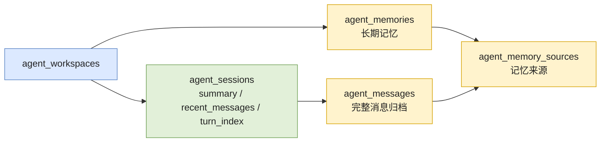
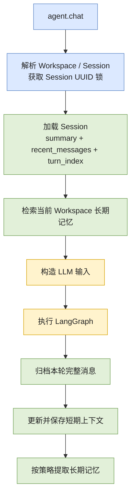

# 记忆管理与加载机制

## 三类数据不能混为一谈

当前项目将记忆相关数据分为三层：

| 数据 | 存储位置 | 用途 | 是否直接加载给 LLM |
|---|---|---|---|
| 完整消息归档 | `agent_messages` | 历史审计、来源追踪、未来恢复 | 否 |
| Session 短期上下文 | `agent_sessions.summary`、`recent_messages` | 构造当前 Session 的有限输入窗口 | 是 |
| Workspace 长期记忆 | `agent_memories` | 跨 Session 保存稳定事实、偏好和决策 | 按需检索后注入 |

完整消息归档负责“不能丢”；短期上下文负责“当前模型需要看什么”；长期记忆负责“未来其他
Session 仍值得知道什么”。完整历史不会在每轮全部发送给模型，否则输入会持续膨胀，并增加
成本、延迟和模型失准风险。

## 隔离模型

记忆的默认边界是 Workspace：

```text
Workspace
  ├── Session A
  │    ├── summary
  │    ├── recent_messages
  │    └── 完整消息归档
  ├── Session B
  │    ├── summary
  │    ├── recent_messages
  │    └── 完整消息归档
  └── 长期记忆
       └── 可被 A、B 检索，但不能被其他 Workspace 检索
```

- 短期上下文和完整消息归档绑定 `workspace_id + session_id`。
- 长期记忆绑定 `workspace_id`，同一 Workspace 的新 Session 可以继承相关项目知识。
- 当前没有跨 Workspace 的全局用户记忆。
- `agent_memory_sources` 使用 Workspace 复合外键，数据库会拒绝把记忆关联到其他 Workspace
  的消息。

## 数据库结构



### `agent_sessions`

每个 Workspace 内的 Session 名称唯一。主要字段：

- `summary`：旧对话的压缩摘要。
- `recent_messages`：近期原始消息，使用 LangChain message JSON 格式。
- `turn_index`：已成功保存的轮次数。

### `agent_messages`

保存每轮完整消息，包括 user、assistant 和 tool 消息。`content` 用于普通查询和审计，`raw`
保存可恢复的 LangChain message 结构，`turn_index` 标识消息属于哪一轮。

上下文压缩只修改 `agent_sessions` 中的有限上下文，不会删除 `agent_messages` 中的完整历史。

当前普通 Agent Turn 只有在 LangGraph 返回 `done` 后才归档消息。如果 Graph 在完成前返回错误，
该失败轮次不会写入完整消息归档。无 LLM 诊断请求不会写入消息归档。

### `agent_memories`

保存从历史轮次提取出的稳定知识：

- `kind`：例如项目事实、用户偏好、架构决策或任务状态。
- `content`：记忆主体。
- `tags`：结构化标签。
- `importance`：重要度。
- `confidence`：置信度。
- `archived_at`：归档标记；检索会排除已归档记忆。

### `agent_memory_sources`

将长期记忆关联到来源消息。它用于追踪记忆来源，并在数据库层阻止跨 Workspace 来源污染。

## 每轮如何加载

### 正常 Agent Turn



构造给模型的消息顺序是：

```text
已有 summary（如果存在）
  -> 本轮检索到的 Workspace 长期记忆（如果存在）
  -> recent_messages 最近若干条
  -> 当前用户消息
```

长期记忆以合成 `SystemMessage` 注入，只存在于本轮模型输入中。更新短期上下文时会移除该合成
消息，不会反复写入 `recent_messages` 或完整消息归档。

### 新 Session 的 Bootstrap Memory

新 Session 第一轮没有历史上下文，只按当前问题做关键词检索可能漏掉重要项目背景。因此第一轮
会合并：

- 当前 Workspace 最多 `MEMORY_BOOTSTRAP_LIMIT=4` 条高重要度近期记忆。
- 最多 `MEMORY_RETRIEVAL_LIMIT=6` 条与当前问题相关的记忆。

结果按记忆 ID 去重，并受 `MEMORY_CONTEXT_CHAR_LIMIT=6000` 总字符限制。后续轮次只检索与当前
问题相关的记忆，不再加载 bootstrap 集合。

当前实现通过 `turn_index == 0` 判断新 Session。无 LLM 诊断请求不会递增 `turn_index`，因此
无论重复诊断多少次，首次真实 LLM Turn 仍会触发 bootstrap memory。

### 无 LLM 配置诊断 Turn

没有配置模型 API 密钥时，系统仍会解析或创建 Workspace 和 Session，并读取 Session 来验证
数据库链路。该路径允许首次访问时创建 Workspace/Session 行并记录诊断事件，但不会归档诊断
消息、更新 Session 对话状态、递增 `turn_index`、检索或提取长期记忆，也不会执行上下文总结。
诊断事件使用独立的 `diagnostic_started/diagnostic_finished` 类型，不会污染真实 Agent Turn
的事件统计。

## 短期上下文管理

`AgentContextState` 只有两个字段：

```python
summary: str
recent_messages: list
```

它是每轮发送给模型的有限上下文，不是完整聊天历史。

### 压缩触发

满足任一条件时触发上下文总结：

- 消息数大于 `SUMMARY_TRIGGER_MESSAGE_LIMIT=40`。
- 总内容字符数大于 `SUMMARY_TRIGGER_CHAR_LIMIT=24000`。
- 调用方显式要求强制总结。

总结时：

- 旧消息压缩到最多 `SESSION_SUMMARY_MAX_CHARS=4000` 字符的 `summary`。
- 最近 `RECENT_MESSAGE_LIMIT=12` 条消息继续保留原文。
- 发给总结模型的来源文本最多 `SUMMARY_SOURCE_CHAR_LIMIT=12000` 字符。
- 当前检索到的长期记忆可作为总结参考，但不会被当作真实会话消息保存。

如果总结失败，系统保留之前的 `summary`，只保留最近消息，并记录
`context_summary_failed`。这会损失部分短期细节，但能防止输入无限增长。

## 长期记忆如何加载

当前使用 PostgreSQL 关键词检索，不使用 embedding：

1. 将问题规范化为最多 20 个中英文词元。
2. 使用 `to_tsvector('simple', content)` 与 `plainto_tsquery` 匹配。
3. 同时使用 `ILIKE` 作为文本包含匹配。
4. 按文本相关度、重要度、更新时间排序。
5. 所有查询必须包含 `workspace_id`。

对于明确回忆问题，如果关键词检索没有结果，会退回当前 Workspace 的高重要度近期记忆。

当前关键词策略对语义改写不敏感。未来可增加 pgvector 混合检索，但仍必须保留 Workspace
过滤、去重和字符预算。

## 长期记忆如何产生

### 提取触发策略

系统不会每轮都调用 LLM 提取长期记忆。满足任一条件才触发：

- 用户明确要求记住，命中 `MEMORY_EXTRACTION_HINT_KEYWORDS`。
- 当前轮次是每 `MEMORY_EXTRACTION_INTERVAL_TURNS=5` 轮一次的周期轮次。
- 本轮消息总字符数达到 `MEMORY_EXTRACTION_MIN_CHARS=1200`。

普通短轮次会跳过提取，避免浪费模型调用。

### 同步与异步提取

- 用户明确要求记住时同步提取，确保本轮完成前尝试保存。
- 周期触发或大内容触发时，默认提交到单线程 `agent-memory` executor 后台执行。
- 后台任务显式恢复 Workspace、Session、Turn 和 Run 事件上下文。
- Core 关闭时会等待记忆 executor 完成。

### 候选过滤与保存

提取模型只应返回稳定的用户偏好、项目事实、架构决策、任务状态或可复用排障记录。保存前还会：

- 丢弃空内容和低于 `MEMORY_MIN_IMPORTANCE=3` 的候选。
- 拒绝看起来包含 API key、密码、token、`.env` 等敏感信息的候选。
- 在同一 Workspace、同一 `kind` 内按完整内容或前 160 字符查找相似记忆。
- 相似记忆存在时更新，不存在时创建。
- 在同一数据库事务中写入记忆及来源关系。
- 数据库提交成功后才发布 `memory_saved` 事件。

## 事件与可观测性

| 事件 | 含义 |
|---|---|
| `memory_retrieved` | 已执行长期记忆检索 |
| `memory_extract_skipped` | 本轮未满足提取策略 |
| `memory_saved` | 记忆事务提交成功 |
| `memory_failed` | 提取或保存失败 |
| `context_summary_skipped` | 未达到压缩阈值或诊断模式跳过 |
| `context_summarize_triggered` | 开始压缩旧上下文 |
| `context_summarized` | 摘要更新成功 |
| `context_summary_failed` | 摘要失败并执行降级 |

Agent Turn 事件携带 `workspace_id / session_id / turn_index / run_id`，用于追踪一次执行中的记忆
活动。

## 重启与恢复

Core 重启后不会依赖进程内消息列表恢复会话。下一轮请求会从 PostgreSQL 加载：

- Session 的 `summary`、`recent_messages` 和 `turn_index`。
- 当前 Workspace 中与本轮问题相关的长期记忆。

完整历史仍保存在 `agent_messages`，但当前 CLI 尚未提供完整历史展示或任意历史消息重新装载到
上下文的命令。

## 当前一致性边界

### 已保证

- 同一 Session 通过 Session UUID 锁串行执行。
- 长期记忆及来源关系在同一个数据库事务中保存。
- `memory_saved` 只在记忆事务提交成功后发布。
- Workspace 复合外键阻止跨 Workspace 消息和记忆来源关联。

### 尚未保证

当前完整消息归档与 Session 上下文更新分别提交：

```text
archive_turn_messages()
  -> update context state
  -> save_session()
```

如果消息归档成功但 Session 保存失败，可能出现消息已存在、`turn_index` 和短期上下文未更新的
部分提交状态。该架构债务只影响会持久化消息的正常 Agent Turn；无状态诊断请求不受影响。

正确的后续方案是引入统一 Turn Unit of Work：

```text
begin transaction
  append turn messages
  update session summary / recent_messages / turn_index
commit
  -> 发布完成事件
  -> 启动长期记忆提取
```

## 当前能力边界与演进方向

当前不支持：

- 全局用户记忆和跨 Workspace 记忆共享。
- pgvector 语义检索。
- 记忆显式查看、编辑、归档和删除命令。
- Session 完整历史列表与恢复命令。
- 消息归档和 Session 更新的统一 Turn 事务。
- 长期记忆冲突检测、过期策略和自动衰减。

推荐演进顺序：

1. 引入 Turn Unit of Work，先解决消息与 Session 状态原子性。
2. 增加 Session 历史查询和记忆查看/删除命令。
3. 抽象 `MemoryRetriever` Strategy，引入 Workspace 过滤后的 pgvector 混合检索。
4. 增加记忆冲突、过期、归档和来源可信度策略。

## 代码入口与测试

| 关注点 | 主要实现 |
|---|---|
| 单轮加载、保存和提取编排 | `src/core/agent/service.py` |
| 短期上下文构造与压缩 | `src/core/context/manager.py` |
| Session、消息与长期记忆 facade | `src/core/memory/store.py` |
| 数据访问 Repository | `src/core/memory/repositories.py` |
| 长期记忆提取策略 | `src/core/memory/policy.py`、`extractor.py` |
| 数据库表和约束 | `src/core/database/sql/schema.sql` |

关键测试：

- `tests/test_agent_context.py`：合成长记忆消息不会污染短期历史。
- `tests/test_memory_store.py`：Workspace 隔离、bootstrap、来源外键和重复诊断无状态行为。
- `tests/test_memory_extraction_policy.py`：长期记忆提取触发策略。
- `tests/test_memory_transaction_events.py`：记忆提交成功后才发布保存事件。
