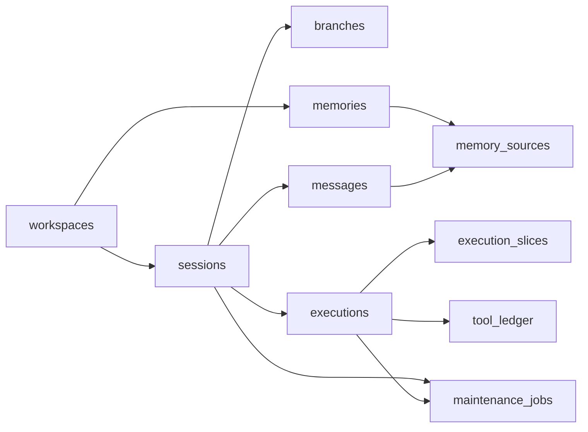

# 本地状态数据库 Schema 参考

> 文档状态：Current
> 权威范围：`state.db` 的核心表关系、字段职责、外键、索引和 Session 删除语义
> 维护触发：本地 Schema、约束、索引或数据归属变化

本文是本地状态 Schema 的事实参考。为什么使用两个 SQLite、如何提交 Turn、Outbox/CAS/Saga 如何工作，
见 [本地数据库设计与一致性机制](/docs/architecture/database-state-and-consistency.md)。

## 本文负责

- `state.db` 核心表和关系。
- Session、Message、Execution、Memory 和 Maintenance 数据归属。
- 外键、复合约束和索引的作用。

## 本文不负责

- 不解释事务、后台维护和跨数据库恢复流程；见数据库一致性架构文档。
- 不解释 Agent 如何执行；见 [Agent 执行架构](/docs/architecture/agent-execution-architecture.md)。
- 不定义 RPC 或用户命令；见 `/docs/api/`。

## 1. `state.db` 的数据模型

### 1.1 总体关系



### 1.2 身份与对话历史

| 表 | 作用 | 为什么存在 |
|---|---|---|
| `workspaces` | 将规范化项目路径映射为稳定 UUID | 隔离不同项目的 Session、记忆和工具 |
| `sessions` | 保存 Workspace 内的一段对话及有限上下文 | 允许快速构造下一轮模型输入 |
| `branches` | 保存消息历史分支和分支头 | 为未来从历史消息派生新分支预留结构 |
| `messages` | 保存完整、不可丢失的消息历史 | 用于恢复、审计、记忆来源和未来分支操作 |

关键设计：

- `UNIQUE(workspace_id, session_name)`：每个 Workspace 可以有自己的 `default`，但同一 Workspace
  内不能出现两个同名 Session。
- `messages.parent_message_id`：消息不只是线性序号，也可以组成分支链。
- `messages.raw`：保留可恢复的 LangChain 消息结构；`content` 用于普通查询和审计。
- `messages.execution_id`：能追踪一条消息由哪次 Execution 产生。
- `sessions.recent_messages`：只保存下一轮需要的近期原文，不等同于完整历史。

### 1.3 Session 生命周期：可用、归档与硬删除

Session 不是只有“存在”和“不存在”两种状态。当前实现区分两种删除语义：

| 操作 | 数据库行为 | 适用场景 |
|---|---|---|
| 归档 Session | 设置 `sessions.archived_at`，清除 `pending_execution_id`，保留消息、Execution、任务计划和维护记录 | 默认删除方式；不再继续使用这个 Session，但仍希望保留审计与历史 |
| 硬删除 Session | 删除 `sessions` 行，并通过外键级联删除关联数据 | 明确不再需要该 Session 的所有本地历史 |

`archived_at` 是软删除标记。它的作用不是隐藏一条消息，而是让整个 Session 变为不可继续对话的历史记录：

- `chat`、`resume` 和 `discard` 不会继续操作已归档 Session。
- `session.status` 会返回 `status=archived`，不会自动创建同名新 Session。
- 归档不会删除 `messages`、`executions`、`execution_tasks` 或 `maintenance_jobs`，因此仍可用于审计、排障和未来历史查看。
- 如果归档前存在待恢复 Execution，Core 会先将其标记为已丢弃，并把 checkpoint 清理任务写入 `maintenance_jobs`。

硬删除才是真正的数据清除。删除 `sessions` 行后，数据库外键会级联删除：

- `branches`
- `messages`
- `executions`
- `execution_slices`
- `execution_tasks`
- `execution_task_dependencies`
- 绑定该 Session 的 `maintenance_jobs`

硬删除还会尽力删除对应的 LangGraph checkpoint thread。checkpoint 位于独立的 `checkpoints.db`，不属于同一个 SQLite
事务；如果 checkpoint 文件清理失败，`state.db` 中的 Session 删除仍然以本地业务事实为准。这一点与本项目的
Saga / 恢复协调原则一致：跨数据库清理是可重试的辅助动作，不应反过来阻止权威业务状态变更。

设计上默认使用归档而不是硬删除，是为了避免误操作导致无法追溯。只有用户明确传入 `hard_delete=true` 或 CLI
`--hard` 时，系统才执行不可恢复的数据删除。

### 1.4 短期上下文与摘要字段

`sessions` 中与上下文有关的字段：

| 字段 | 含义 |
|---|---|
| `summary` | 已压缩的旧对话摘要 |
| `recent_messages` | 最近若干条原始消息 |
| `turn_index` | 已成功提交的最后一轮编号 |
| `summary_through_turn` | 当前摘要已经覆盖到哪一轮 |
| `version` | Session 发生过多少次状态更新，供诊断和未来并发控制使用 |
| `archived_at` | 为空表示 Session 可继续使用；非空表示已归档，只可查询状态，不可继续对话 |

`summary_through_turn` 是摘要 CAS 的比较边界。例如：

```text
当前 summary_through_turn = 10
任务 A 计划把摘要推进到第 15 轮
任务 B 更快，先把摘要推进到第 18 轮
任务 A 写回时仍要求数据库值为 10，因此更新失败，不会覆盖任务 B
```

### 1.5 可恢复执行

| 表 | 作用 |
|---|---|
| `executions` | 保存一项可能跨多个 Slice 的工作状态 |
| `execution_slices` | 保存每次有界 LangGraph 运行的预算和停止原因 |
| `tool_ledger` | 为工具调用审计预留账本结构 |

`executions.status` 表示业务执行状态，例如：

- `running`：正在执行。
- `paused_budget`：达到本次预算边界，可以恢复。
- `paused_error`：发生错误后暂停。
- `paused_confirmation`：等待外部确认。
- `paused_recovery`：Core 重启后发现 checkpoint 仍存在，等待恢复。
- `unrecoverable_checkpoint`：业务状态认为任务未完成，但 checkpoint 已丢失。
- `completed`：任务已完成。
- `discarded`：用户明确放弃。

`checkpoint_state` 单独描述 Execution 与 checkpoint 的关系：

```text
uninitialized -> available -> cleanup_pending -> cleaned
                       \-> missing
```

业务状态和 checkpoint 状态分开，是因为“任务是否完成”和“断点文件是否已清理”是两个不同事实。

### 1.6 长期记忆

| 表 | 作用 |
|---|---|
| `memories` | 保存 Workspace 级稳定知识 |
| `memory_sources` | 记录一条记忆来自哪些原始消息 |

`memory_sources` 是多对多关系。一条记忆可能由多条消息支持，一条消息也可能支持多条记忆。来源关系
用于追踪和审计，不代表每次加载记忆都要加载所有来源消息。

### 1.7 后台维护与投影

| 表 | 作用 | 当前状态 |
|---|---|---|
| `maintenance_jobs` | 可靠执行摘要、记忆提取和 checkpoint 清理 | 已使用 |
| `projection_outbox` | 未来把本地业务变化投影到 PostgreSQL | 已预留，默认不启用 |
| `imported_events` | 保存从旧系统迁移来的事件 | 迁移兼容用途 |

`imported_events` 是一次性迁移快照，不接收 Core 运行期事件。实时结构化 Telemetry 位于独立的
`state/telemetry/events.db.telemetry_events`。它与权威 `state.db` 分离，避免高频诊断写入
争用 Session/Execution 的提交锁；该数据库损坏或写入失败也不得影响 Agent 业务结果。

`maintenance_jobs` 和 `projection_outbox` 不能合并：

- `maintenance_jobs` 会改变本地派生状态，例如写入摘要、记忆或清理 checkpoint，失败后需要在本机重试。
- `projection_outbox` 只描述“把已经存在的本地事实复制到外部查询库”，外部失败不能改变本地业务结果。

两者的消费者、失败语义和保留策略不同，分表可以避免未来投影故障阻塞本地维护。

`maintenance_jobs` 的关键字段：

| 字段 | 含义 |
|---|---|
| `job_type` | 选择哪个 handler 执行 |
| `dedupe_key` | 幂等去重键，防止同一任务重复入队 |
| `priority` | 数字越大越先执行；checkpoint 清理优先级最高 |
| `status` | `pending`、`running`、`succeeded` 或 `failed` |
| `attempts / max_attempts` | 已尝试次数和最大次数 |
| `next_attempt_at` | 失败后何时允许重试 |
| `lease_expires_at` | worker 对任务的临时所有权何时过期 |
| `last_error` | 最后一次失败摘要 |

## 2. 数据库约束为什么重要

应用代码会犯错，数据库约束是最后一道防线。

### 2.1 外键

SQLite 连接都会执行 `PRAGMA foreign_keys=ON`。例如：

- 删除 Session 时，其 Branch、Message 和 Execution 会级联删除。
- `memory_sources` 不能引用不存在的记忆或消息。
- `maintenance_jobs` 不能绑定不存在的 Session。

### 2.2 Workspace 复合外键

Session、Branch、Message 和 Execution 的主要关系同时携带 `workspace_id + session_id`，用于防止把
A 项目的 Session 数据错误关联到 B 项目。

当前 `memory_sources` 的记忆侧使用 `workspace_id + memory_id` 复合外键，但消息侧只通过全局唯一的
`message_id` 外键关联。应用代码只会传入当前 Session 的消息，因此正常路径保持 Workspace 隔离；不过
数据库 Schema 尚未在消息侧强制验证相同 `workspace_id`。后续应为 `messages` 增加适合的复合唯一约束，
并将 `memory_sources` 消息侧升级为复合外键。

### 2.3 索引

索引用于避免数据增长后每次查询都扫描整张表：

- `idx_messages_session`：按 Session 和轮次读取消息。
- `idx_executions_session`：查找 Session 的执行记录。
- `idx_memories_workspace`：按 Workspace 检索重要记忆。
- `idx_maintenance_jobs_ready`：按状态、执行时间和优先级认领任务。
- `idx_maintenance_jobs_session`：查询一个 Session 的待处理和失败任务数量。

