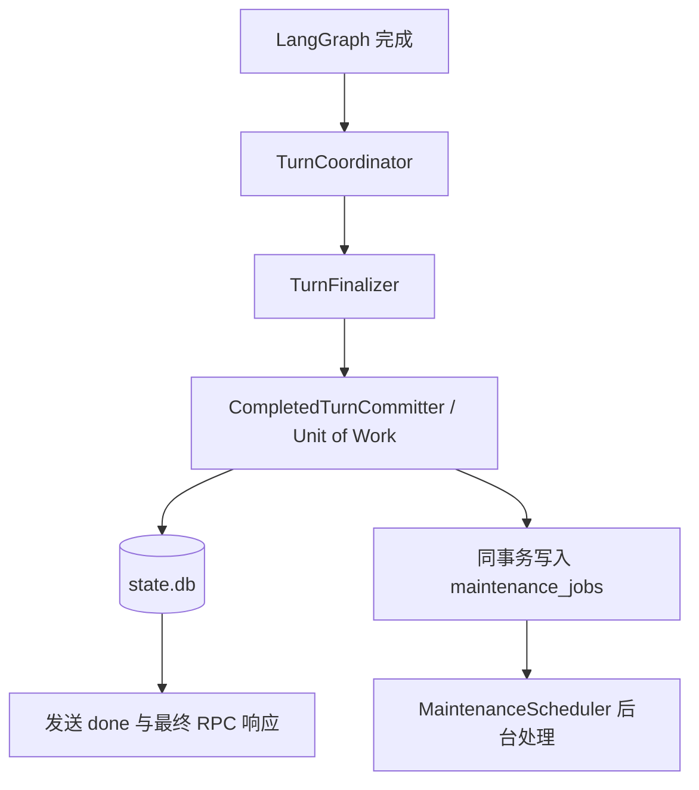
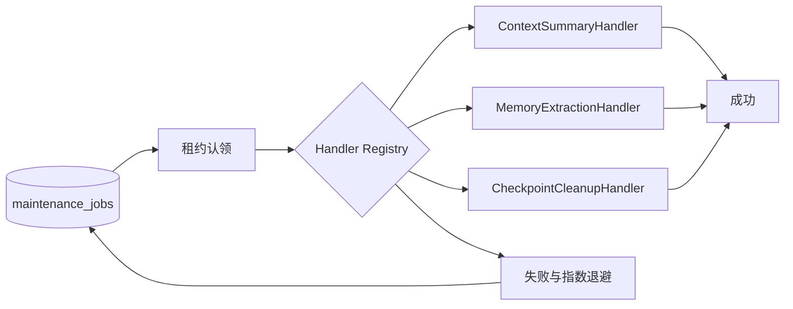
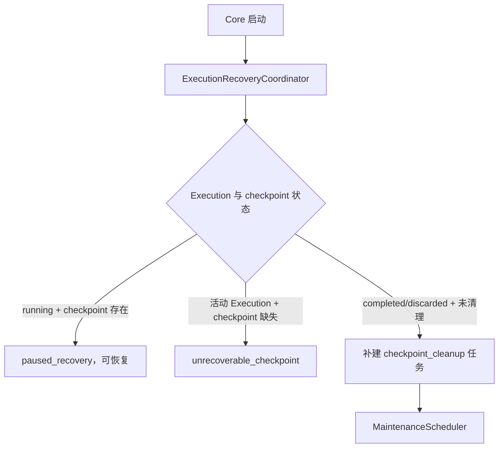

# 最终响应、后台维护与 Checkpoint 一致性

## 1. 解决的问题

模型输出最后一个 token 后，旧实现仍同步执行上下文摘要、长期记忆提取、Execution 完成和
checkpoint 删除。任何一个步骤变慢，CLI 都无法恢复输入。

直接在最后一个 token 后返回也不安全：如果 Core 随后崩溃，用户已经看到的回答可能没有写入
消息历史。

当前方案保留一个很小的 **durability barrier（耐久性屏障）**：

```text
回答生成完成
  -> 在 state.db 原子提交本轮业务事实
  -> 返回 done，CLI 恢复输入
  -> 后台处理派生维护
```

这里的“业务事实”包括完整消息、`turn_index`、近期上下文、分支头和 Execution 完成状态。
摘要、长期记忆和 checkpoint 清理可以根据这些事实重新生成或重试，因此不属于响应前的必要工作。

## 2. 正常响应流程



`CompletedTurnCommitter` 使用一个 `state.db` 事务完成：

1. 追加本轮完整消息，并关联 `execution_id`。
2. 更新近期消息、`turn_index` 和分支头。
3. 完成最终 Slice 和 Execution，清除 `pending_execution_id`。
4. 写入需要执行的后台维护任务。

任意一步失败，整个事务回滚，`done` 不会被误报为成功。

最小提交不会写回 Session 摘要。摘要只能由后台任务通过 CAS 更新，避免下一轮提交把刚生成的
新摘要覆盖成旧值。

## 3. 后台维护流程



`maintenance_jobs` 是 Transactional Outbox。这个术语表示：业务状态和“之后必须做的工作”在
同一事务中保存。Core 即使在返回响应后立即崩溃，任务也不会只存在于内存中。

任务使用状态、租约和有限重试：

- `pending`：等待执行。
- `running`：已被一个 worker 租用。
- `succeeded`：完成。
- `failed`：达到最大重试次数。

Core 重启后，租约过期的 `running` 任务会重新变为 `pending`。不同任务 handler 必须幂等，
即重复执行不会制造重复业务结果。

显式“记住”请求同样进入后台任务。CLI 只提示记忆保存处于 `pending`，模型不得声称已经保存成功。

## 4. 为什么保留两个 SQLite 数据库

`state.db` 保存业务事实，`checkpoints.db` 由 LangGraph `SqliteSaver` 保存图执行断点。

将两组表放进同一个文件仍不能自动获得原子事务，因为 LangGraph saver 使用自己的连接和提交边界。
强行自研 Checkpointer 会增加与 LangGraph 升级兼容的维护成本。因此当前保留两个数据库，并采用
Saga / Process Manager：

> 不假装跨库操作具有一个事务，而是保存明确状态，并通过幂等补偿和启动对账最终收敛。

Execution 的 checkpoint 状态：

```text
uninitialized -> available -> cleanup_pending -> cleaned
                       \-> missing
```

## 5. 崩溃恢复流程



用户可以通过 `learn-agent session status` 查看：

- Execution 是否可恢复。
- checkpoint 状态。
- 当前 Session 的 pending、running 和 failed 维护任务数量。

checkpoint 删除失败不会把已提交回答改成失败。失败任务会重试；达到上限后保留为 `failed`，
供状态查询和后续恢复对账使用。

## 6. 使用的设计模式

| 模式 | 当前职责 |
|---|---|
| Unit of Work | `CompletedTurnCommitter` 原子提交一轮业务事实和后台任务 |
| Transactional Outbox | `maintenance_jobs` 与业务状态同事务入队 |
| Saga / Process Manager | `ExecutionRecoveryCoordinator` 协调两个 SQLite 数据库 |
| Strategy + Registry | MaintenanceScheduler 按 `job_type` 分发独立 handler |
| Repository | 状态、Execution 和维护任务通过明确仓储访问 |
| Protocol / Dependency Inversion | Agent 依赖 `StateStore`、Workspace 能力接口，而非具体数据库 |
| Composition Root | `CoreApp` 创建并连接 committer、scheduler、recovery 和 handlers |

调用层次：

```text
AgentTurnService
  -> TurnCoordinator
      -> TurnFinalizer
          -> CompletedTurnCommitter
              -> state.db Unit of Work
              -> maintenance_jobs

CoreApp
  -> ExecutionRecoveryCoordinator
  -> MaintenanceScheduler
      -> maintenance handlers
```

## 7. 风险与当前边界

- 最终 `done` 仍必须等待本地最小提交；磁盘异常或长写锁仍会延迟响应。
- SQLite 是单写者模型。当前事务很短，但它不适合高并发多用户服务。
- 后台维护当前使用单 worker，慢摘要会延后其他任务；checkpoint 清理通过高优先级降低影响。
- handler 执行时间超过租约时当前不会续租；单 daemon 模式下不会并发认领，未来支持多实例前必须增加租约心跳。
- `succeeded` 维护任务当前作为审计记录保留，长期运行后需要增加保留与清理策略。
- `state.db` 与 `checkpoints.db` 只能最终一致，无法提供真正跨库原子提交。
- 显式记忆是异步确认；用户需要通过 Session 状态或未来的维护任务查询界面确认失败。

## 8. 实施审查

本轮独立审查重点检查了响应关键路径、事务边界、后台 worker 生存性和跨库恢复：

- `CompletedTurnCommitter` 的消息、Session、Execution 和任务入队处于同一事务；关键更新会校验影响行数。
- 本地 Schema 创建和加法迁移处于同一显式事务；迁移失败不会留下错误版本记录。
- 较旧 Core 遇到更高版本的本地 Schema 时拒绝启动，避免旧代码写坏新结构。
- 维护 worker 的认领或状态回写失败不会永久终止线程；过期租约可重新认领。
- worker 关闭超时时保留线程引用，避免提前关闭仍被 handler 使用的 checkpoint 资源。
- 未初始化的 CheckpointManager 不再把删除误报为成功，也不会把所有 Execution 误判为 checkpoint 缺失。
- 后台摘要使用 `summary_through_turn` CAS；下一轮快速提交不会覆盖并发生成的新摘要。
- 前台 Turn、后台维护和 checkpoint 使用独立最小协议，避免一个组件获得不需要的持久化能力。
- `state.db` journal 模式每个 Core 实例只配置一次，普通最小提交连接不重复切换 WAL 模式。

残余风险：

- 当前延迟回归是进程内组件测试；完整 TCP/CLI p95/p99 基准仍需在稳定机器上执行。
- 维护任务只有 Session 级数量查询，尚无面向用户的失败任务详情与手动重试命令。
- 单 worker 不会影响前端响应，但可能形成后台积压，需要后续增加队列年龄指标与告警。

## 9. 验收标准

- 慢摘要、记忆提取和 checkpoint 删除不得延迟最终响应。
- 慢最小提交必须延迟 `done`，不能先向用户声明持久化成功。
- Turn 提交任意中间步骤失败时，消息、Session、Execution 和维护任务全部回滚。
- 后台摘要使用 `summary_through_turn` CAS，旧任务不能覆盖新摘要。
- Core 重启后能识别可恢复、不可恢复和待清理 Execution。
- 同一 Session 下一轮只依赖上一轮最小提交，不等待派生维护。
