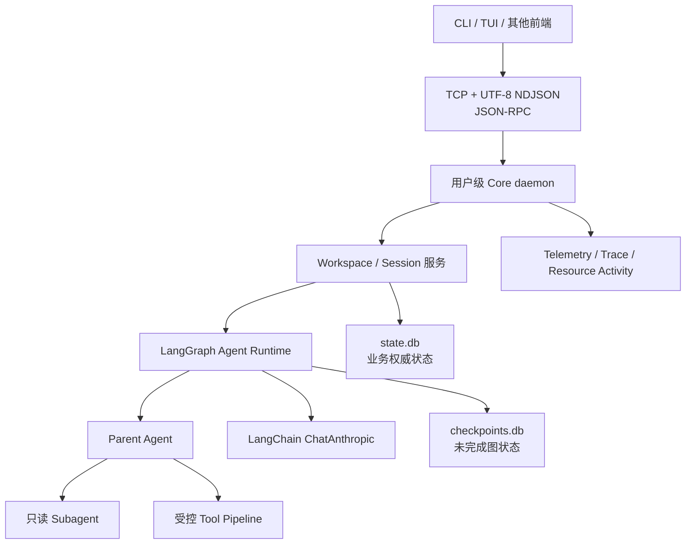
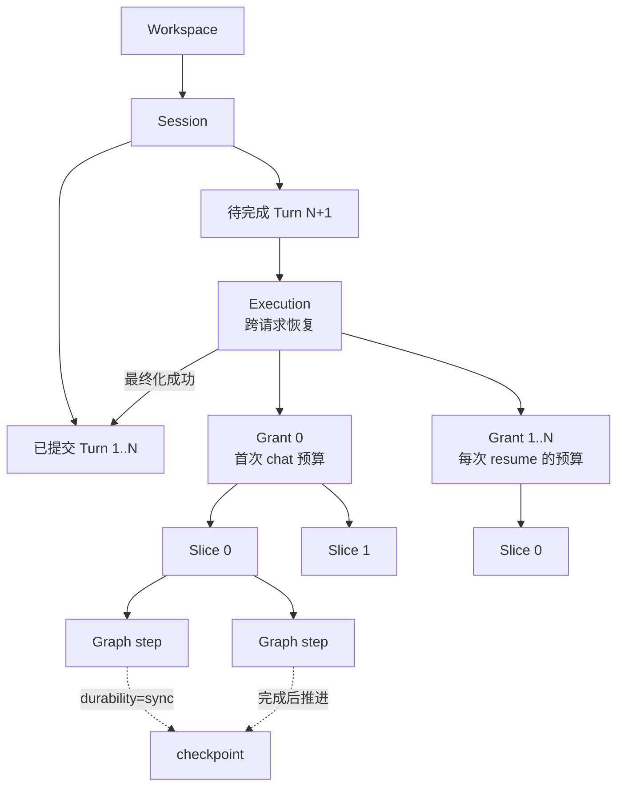
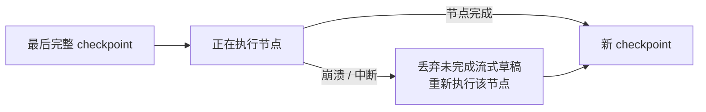
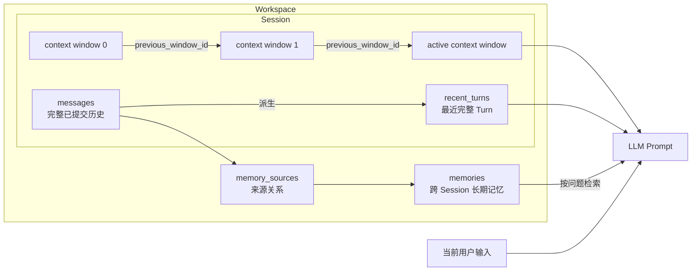
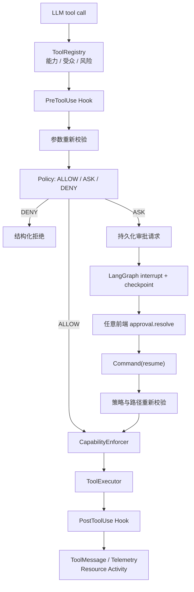
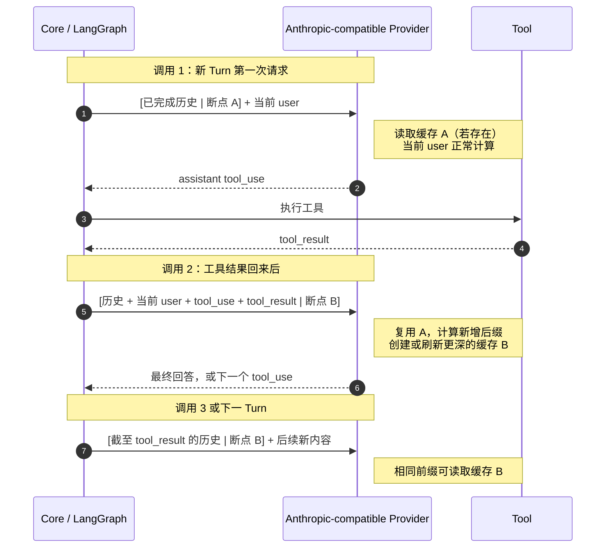
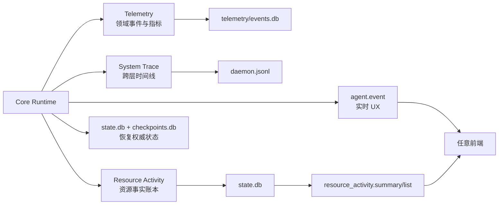

# Coding Agent Runtime 架构图与说明

> 整理日期：2026-08-04
> 用途：面试讲解与项目复习
> 说明：本文负责建立直观关系，具体字段和运行契约以链接的 `docs/` 权威文档为准。

## 阅读顺序

本文档按以下顺序理解项目：

1. 系统总体边界。
2. Session、Turn 与可恢复执行。
3. 上下文、压缩血统与长期记忆。
4. Tool 权限、审批和恢复。
5. Anthropic 前缀缓存。
6. 流式事件、Telemetry、Trace 与资源活动。

## 1. 系统总体架构



### 设计理念

前端只负责交互，Core 统一拥有模型调用、状态、工具权限和恢复语义。这样 CLI、TUI、桌面端或
IDE 插件都可复用相同 RPC，而不会各自实现一套 Agent。

这是一个本地优先的 Coding Agent Runtime，不是单次模型调用 Demo。它把不确定的模型输出放入
可恢复状态机，并用持久状态、权限边界和观测接口约束其执行。

详细说明：[Core 架构](../docs/architecture/core-architecture.md)、
[Agent 执行架构](../docs/architecture/agent-execution-architecture.md)。

## 2. Session、Turn 与可恢复执行



### 概念说明

| 概念 | 含义 |
|---|---|
| Session | 一条长期会话，同一时间只允许一个前台 Execution。 |
| Turn | 用户输入到最终回答的一轮；只有成功完成后才进入正式消息历史。 |
| Execution | 可跨 `chat`、`resume` 和审批恢复的持久任务身份。 |
| Grant | 一次请求授予的有界预算批次，以 `grant_index` 表达，不是独立表。 |
| Slice | Grant 内一次受图步数限制的执行片段，对应持久记录。 |
| Graph step | checkpoint 的实际恢复边界。 |

### 恢复语义



checkpoint 保存的是完整 graph step 后的状态。节点内尚未完成的 thinking、文本 delta 不会作为
上下文继续拼接；恢复时重新执行该节点。已经完成且写入 checkpoint 的 ToolMessage 可以恢复，
但工具副作用与 checkpoint 之间仍需要幂等设计来缩小重复执行风险。

权威说明：[执行身份关系图](../docs/architecture/agent-execution-architecture.md#execution-identity-map)、
[Checkpoint 一致性](../docs/architecture/response-finalization-and-checkpoint-consistency.md)。

## 3. 上下文、压缩血统与长期记忆



### 设计理念

- `messages` 负责完整、可审计的已提交历史。
- `recent_turns` 按完整 Turn 保存短期上下文，避免截断 `tool_use/tool_result` 链。
- `context_windows` 保存不可变摘要版本；`previous_window_id` 连接直接上一代摘要。
- `memories` 按 Workspace 隔离，可供同一 Workspace 的多个 Session 检索。
- `memory_sources` 记录记忆来自哪些正式消息，不复制消息正文。

当前用户输入在 Turn 完成前主要存在于 Execution/checkpoint 中；最终化成功后才进入正式
`messages`。摘要与记忆提取由持久 Maintenance Queue 在后台执行，不阻塞最终回复。

注意：当前 `closed_at_turn` 表达旧摘要被覆盖到的 Turn 边界，可能小于 `opened_at_turn`；判断
摘要覆盖范围应使用 `summary_through_turn` 和 `compacted_*` 字段。

权威说明：[记忆与上下文](../docs/architecture/memory-management.md#context-memory-map)、
[本地 Schema](../docs/reference/local-state-schema.md)。

## 4. Tool 权限、审批与恢复



### 设计理念

ToolSpec 只描述“工具能做什么”；Policy 决定“这次是否允许”；Approval 表达用户意图；
CapabilityEnforcer 强制路径、符号链接、沙箱和网络等不可绕过边界。Hook 可以替换参数或拒绝，
但不能把一次危险调用直接提升为可信调用。

审批请求与 `execution_id + tool_call_id` 绑定。批准后恢复原工具调用，而不是重新开始整个 Turn；
恢复时必须重新校验，因为等待期间 Workspace 和规则可能变化。

权威说明：[Tool 安全与审批](../docs/architecture/tool-security-and-approval.md#tool-approval-map)、
[Hook 架构](../docs/architecture/agent-lifecycle-hooks.md)。

## 5. Anthropic 前缀缓存



### 关键理解

`cache_control` 不是“缓存这一条消息”，而是标记从请求起点到当前位置的完整前缀。上图只画
messages 断点，tools 和 system 还有各自的基础断点。

```text
调用 1： [可复用前缀 A] | 当前 user
调用 2： [可复用前缀 A] + 当前 user + tool_use + tool_result | 新断点 B
调用 3： [可复用前缀 B] | 后续新内容
```

断点并不是在一次请求内部移动。只有工具结束、Core 准备再次调用 LLM 时，策略才基于新的完整
消息列表重新计算断点。于是调用 1 的当前 user，在调用 2 中已经是固定历史的一部分；断点 B 放到
`tool_result` 后，它和 `tool_use` 都进入新的可复用前缀。

完整、稳定的 thinking block 可能位于缓存前缀内；`thinking_delta`、`signature_delta` 和尚未完成的
工具参数增量不作为缓存断点。是否真正创建或命中缓存，只能查看 Provider 返回的
`cache_creation_input_tokens` 和 `cache_read_input_tokens`。

权威说明：[Prompt Cache 策略](../docs/architecture/prompt-cache-strategy.md#prompt-cache-marker-map)。

## 6. 可观测性与资源活动



### 为什么不能合成一种日志

| 通道 | 回答的问题 | 是否用于恢复 |
|---|---|---:|
| `agent.event` | 用户现在应该看到什么？ | 否 |
| Telemetry | 哪类领域事件发生了多少次、耗时多久？ | 否 |
| System Trace | 一次请求经过 IPC、Agent、LLM、Tool 时发生了什么？ | 否 |
| Resource Activity | Agent 读了什么、读了多少、变更了什么？ | 否 |
| `state.db + checkpoints.db` | 系统下一步必须相信并恢复什么？ | 是 |

资源活动使用 `workspace://...` URI，保存读取范围、字节数、摘要/精确观测、变更状态和证据状态，
不保存文件正文。前端只能通过 RPC 查询，不应直接读取 SQLite、Trace 或内部 Tool 对象。

权威说明：[观测通道边界](../docs/architecture/event-system.md#observability-channel-map)、
[System Trace](../docs/architecture/system-tracing.md)、
[前端接入指南](../docs/api/frontend-integration-guide.md)。

## 7. 总结

> 项目把 Coding Agent 设计成一个可恢复运行时。Workspace 下的 Session 保存已完成 Turn，尚未完成的
> 工作由 Execution 表达；每次 chat 或 resume 形成一个有界 Grant，内部再拆成 Slice 和 LangGraph
> step，checkpoint 只在完整 step 后推进。上下文由历史消息、近期完整 Turn、摘要窗口血统和
> Workspace 长期记忆共同组成。模型调用前显式为 tools、system 和最深稳定历史设置 Anthropic
> 前缀缓存。工具调用统一经过 Hook、Policy、审批和 CapabilityEnforcer，需要人工确认时通过
> interrupt 保存原调用并在 resolve 后恢复。最后，流式事件负责交互，Telemetry 负责指标，Trace
> 负责排障，资源活动负责回答 Agent 读写了什么，而真正恢复仍以 state.db 和 checkpoints.db 为准。
